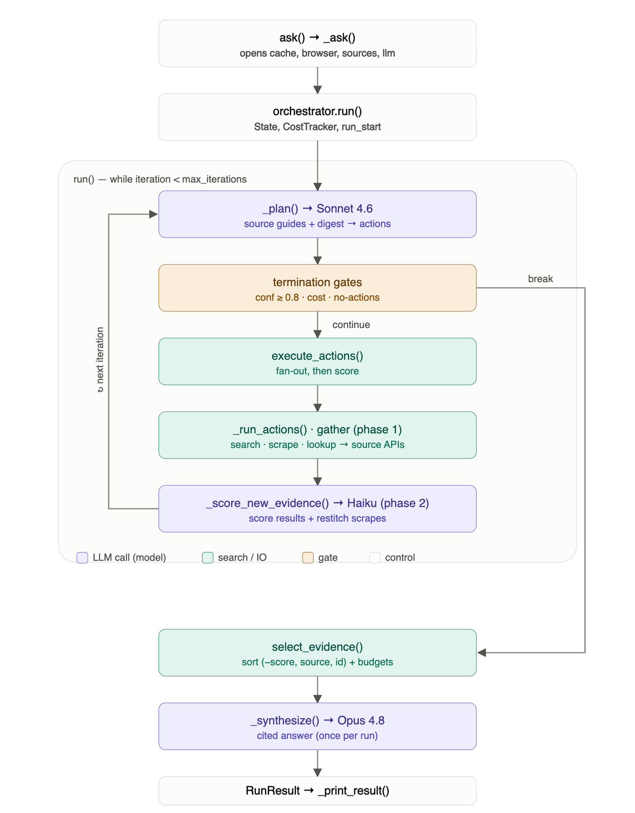

# Columbo

A command-line agent for an enterprise knowledge base spread across Slack,
Confluence, GitHub, Google Drive, and Jira. Given a natural-language
question, Columbo iteratively searches sources, scrapes referenced pages,
scores all retrieved evidence, and synthesizes a cited answer using Claude.

- **No service accounts.** Every source authenticates with a credential the
  user already owns (a GitHub personal access token, an Atlassian API token,
  a Google or Slack OAuth consent grant, or - as a Slack fallback - the user's
  own logged-in browser session). Nothing is provisioned centrally.
- **Self-terminating.** The orchestrator loop stops as soon as its own
  confidence estimate clears a threshold, or when an iteration/cost cap is
  hit - never "runs until someone kills it."
- **Deterministic re-runs.** Identical question + identical accumulated state
  hits four layers of on-disk cache (LLM responses, searches, lookups,
  scrapes) instead of re-querying live sources. The response cache is
  permanent (so re-runs are byte-identical and free); the search/lookup/scrape
  caches carry TTLs so live data doesn't go stale forever.
- **Observable.** Every pipeline step emits a structured JSON event to a
  per-run log that `columbo devtools bench`/`compare` parse directly.
- **Guarded scraping.** Before any page is fetched, its URL passes a skip
  filter (drops open-in-app / meeting / auth-walled links) and a domain gate:
  known hosts pass, unknown hosts trigger a one-time y/N prompt whose answer is
  remembered, and aborting ends the run cleanly.

Non-goals: this is not a real-time UI, does not maintain its own search
index/vector store, and is not a public-facing service - it runs under the
user's own browser profile and credentials only.

## How it works

Columbo runs a **plan → execute → score → synthesize** loop, using a different
Claude model at each tier so cost tracks the stakes:



- **Plan (Sonnet).** Each iteration the planner reads a digest of everything
  gathered so far plus each source's query guide, then emits the next batch of
  searches/scrapes/lookups and a **four-dimension confidence** score:
  explicit evidence, implicit signals, cross-source consistency, and answer
  specificity (each 0–13, against anchored rubrics). Overall confidence is
  their mean over 13; `>= 0.8` ends the loop.
- **Execute (concurrent).** Every search/scrape/lookup from one plan step runs
  in parallel (`asyncio.gather`). Each source is queried in its **own native
  syntax** — CQL for Confluence, JQL for Jira, code-search qualifiers for
  `github_code`, issue qualifiers for `github_issues`, search modifiers for
  Slack — as documented by that source's guide in the plan prompt.
- **Score (Haiku).** Every new result and scraped page is scored 0–13 on
  relevance / answer-potential / context / source-quality by a cheap model,
  in parallel; only what clears the bar becomes evidence.
- **Synthesize (Opus).** When the loop ends, the highest-scoring evidence —
  sorted into a deterministic order so identical state yields an identical
  prompt (and cache hit) — is handed to a single Opus call that writes the
  cited answer.

The loop is self-terminating and cost-bounded: it stops on confidence, an
iteration cap, an empty plan (nothing left to try), or a dollar budget — and
every LLM call (plan/score/restitch/synthesize) counts against that budget.

## Project layout

```
columbo_py/
├── cli/                 # Typer app: ask, interactive, devtools (compare/bench/smoke/demo)
├── config/              # defaults.toml (all tunable knobs) + typed loader (SETTINGS)
├── engine/
│   ├── orchestrator/     # loop.py (plan/execute/score loop), actions.py (fan-out),
│   │                     # state.py (evidence selection), models.py (LLM JSON shapes)
│   ├── llm/               # LLMClient Protocol, ClaudeClient (real), MockLLMClient (tests)
│   ├── prompts/templates/ # Jinja2 prompt templates (orchestrate/score/restitch/synthesize)
│   └── search/            # SearchSource Protocol, Registry (with caching), Result/Options
├── sources/               # slack, confluence, github (code + issues), drive, jira;
│                          # each ships a GUIDANCE.md query guide injected into the plan prompt
├── infra/
│   ├── browser/           # Playwright persistent-context session + WebFetcher
│   ├── cache/              # diskcache-backed CacheStore (4 namespaced caches)
│   ├── domaingate/         # allow/deny + interactive prompt before any scrape
│   └── events/             # structlog JSON event emitter + Playwright CDP listener
└── tests/
```

## Setup

Requires Python 3.11+.

```bash
python3 -m venv .venv
source .venv/bin/activate
pip install -e ".[dev]"
playwright install chromium   # only needed for scraping/Slack token extraction
```

### Credentials

Set only the env vars for the sources you actually want to query - each
source raises a clear error naming the missing variable the first time it's
used, rather than failing at startup.

| Source | Env vars | Notes |
|---|---|---|
| Claude (required) | `ANTHROPIC_API_KEY` | Used by every plan/score/restitch/synthesize call. |
| GitHub | `GITHUB_TOKEN` | Personal access token, `repo` + `read:org` scopes. Registered as two sources the planner picks between: `github_code` (file contents via code search) and `github_issues` (issues/PRs). |
| Slack | `SLACK_CLIENT_ID` + `SLACK_CLIENT_SECRET` (native OAuth), or `SLACK_USER_TOKEN` (+ `SLACK_D_COOKIE` for an `xoxc-` token) | Preferred: register a Slack app with the `search:read` user scope and set the client id/secret — first run opens an OAuth consent screen and caches the `xoxp-` user token to `~/.columbo/slack_token.json` (like Drive). Alternatively paste a user token directly. If none are set, Columbo falls back to extracting an `xoxc-` token from an already-logged-in Slack tab in the shared browser profile. |
| Confluence | `CONFLUENCE_BASE_URL`, `CONFLUENCE_EMAIL`, `CONFLUENCE_API_TOKEN` | API token from `id.atlassian.com/manage-profile/security/api-tokens`. |
| Jira | `JIRA_BASE_URL`, `JIRA_EMAIL`, `JIRA_API_TOKEN` | Same Atlassian API token works for both. |
| Google Drive | `GOOGLE_CLIENT_SECRETS_PATH` | OAuth client secrets JSON (Desktop app type) from the Google Cloud console; first run opens a browser consent screen and caches the refresh token to `~/.columbo/drive_token.json`. |
| Dictionary | `COLUMBO_DICTIONARY_URL`, `COLUMBO_DICTIONARY_DOMAIN`, `COLUMBO_DICTIONARY_TOKEN` (optional) | Acronym lookup at `GET {url}/{abbreviation}/{domain}` (default `https://www.allacronyms.com/{abbreviation}/computing`). `COLUMBO_DICTIONARY_DOMAIN` (default `computing`) restricts results to one field so an acronym resolves to its computing sense; set it empty to query every field. Columbo auto-detects acronyms in the question and search results, resolves them here, and feeds the definitions into later plan prompts. The endpoint may return multiple senses per acronym (expansions, paragraphs, links) — all are kept (numbered, length-bounded) so the planner picks the one that fits. Point the URL at your own service; leave empty to disable. |

### Configuration (optional)

Every tunable default — model tiers, cost pricing, loop/iteration caps,
evidence-selection thresholds, plan-prompt numbers, cache TTLs, HTTP timeouts,
source API endpoints, seed scrape-allow hosts — lives in one shipped file,
[`columbo_py/config/defaults.toml`](columbo_py/config/defaults.toml), loaded
through `columbo_py.config.SETTINGS`. Secrets/credentials are deliberately
**not** in that file; they stay in the env vars from the table above.

Two ways to override the defaults, in increasing precedence:

1. **A user TOML file.** Point `COLUMBO_CONFIG` at your own `.toml` containing
   just the keys you want to change — it is deep-merged over the shipped
   defaults (everything you don't set keeps its default). e.g.
   ```toml
   # my-columbo.toml
   [loop]
   max_iterations = 10
   max_cost_usd = 5.0
   ```
   ```bash
   COLUMBO_CONFIG=~/my-columbo.toml columbo ask "..."
   ```
2. **Environment variables** (below) win over both files, so the overrides
   documented here keep working unchanged.

| Env var | Default | Purpose |
|---|---|---|
| `COLUMBO_CONFIG` | _(unset)_ | Path to a user TOML overriding any key in `defaults.toml` (deep-merged). |
| `COLUMBO_CACHE_DIR` | `~/.columbo/cache` | Root for the four on-disk caches. `rm -rf` a namespace to bust just that layer, or use `columbo devtools clear-cache [namespace]`. |
| `COLUMBO_SEARCH_TTL_S` | `21600` (6h) | Freshness TTL for cached search results. |
| `COLUMBO_LOOKUP_TTL_S` | `86400` (24h) | Freshness TTL for cached lookups. |
| `COLUMBO_SCRAPE_TTL_S` | `86400` (24h) | Freshness TTL for cached scraped pages. |

Scrape approvals persist to `~/.columbo/domains.json` (`{"allow": [...],
"deny": [...]}`); edit or delete it to reset which domains Columbo may fetch.

Run knobs (`--max-iterations`, `--max-cost-usd`, `--headless`) are flags on
`columbo ask` / `columbo interactive`; the cost cap defaults to `$2.00` per run.

## Usage

```bash
columbo ask "How does our auth flow handle token refresh?"
columbo interactive          # keeps one browser session + cache warm across questions
columbo devtools smoke       # full pipeline sanity check - no credentials, no network
columbo devtools plan "..."  # just the initial plan call (needs only ANTHROPIC_API_KEY)
columbo devtools demo        # real pipeline against a canned question
columbo devtools bench       # aggregate metrics across ~/.columbo/runs/*.jsonl
columbo devtools compare RUN_A.jsonl RUN_B.jsonl
columbo devtools clear-cache          # clear all four on-disk caches
columbo devtools clear-cache search   # clear just one namespace
columbo devtools eval                 # LLM-as-judge eval on the sample dataset (needs only ANTHROPIC_API_KEY)
columbo devtools eval mine.jsonl      # ...on your own {question, answer, contexts} samples
```

## Evaluation

Beyond the runtime **self**-confidence score (the agent grading its own work),
Columbo ships a separate, offline **LLM-as-judge** harness — an *independent*
grader for regression-testing prompt/model changes. It reuses Columbo's own
Claude client and response cache (so re-runs are deterministic and free) rather
than pulling in an external eval framework; there are no extra dependencies and
nothing runs inside `ask`.

`columbo devtools eval [samples.jsonl]` scores each sample on three
reference-free metrics, each 0–1:

- **faithfulness** — are the answer's claims grounded in the contexts? (the
  independent hallucination check)
- **answer_relevancy** — does the answer address the question that was asked?
- **context_precision** — is the retrieved+selected evidence actually relevant?
  (a direct check on the Haiku scorer's top selection)

A sample is the reference-free triple the judges need — question, answer, and
the evidence contexts — one JSON object per line:

```json
{"question": "...", "answer": "...", "contexts": [{"source": "slack", "id": "1", "content": "..."}]}
```

Contexts may also be bare strings. An optional `"reference"` field is accepted
for future label-based metrics (context-recall, answer-correctness). The judge
model is configurable via `[models].judge` in
[`config/defaults.toml`](columbo_py/config/defaults.toml) (default Sonnet) or
the `--model` flag. A starter dataset ships at
[`columbo_py/evals/sample_dataset.jsonl`](columbo_py/evals/sample_dataset.jsonl).

## Testing

```bash
pytest columbo_py/tests    # all against MockLLMClient + in-memory fakes - no network
ruff check columbo_py
mypy columbo_py
```

`columbo devtools smoke` is the fastest way to confirm the whole
plan → execute → score → synthesize pipeline is wired correctly without any
of the above credentials.

## Known limitations in this environment

This project was scaffolded and tested without live API keys or SaaS
credentials on hand:

- The orchestrator loop, evidence selection, caching, and event log are
  verified end-to-end against `MockLLMClient` and in-memory fake sources
  (see `columbo_py/tests/` and `columbo devtools smoke`).
- The GitHub integration (`github_issues` / `github_code`) targets the real
  GitHub search APIs; query strings are passed through as the planner writes
  them, and result mapping is unit-tested against captured API payloads.
- Slack, Confluence, Jira, and Google Drive integrations are implemented
  against each service's real REST API and their auth flows are standard,
  well-documented patterns, but have not been exercised against a live
  workspace/instance - set the credentials above and run
  `columbo ask "..."` to validate them against your own tenant.


## Is this agentic?


**Yes, Columbo is agentic — but deliberately on the constrained end of the spectrum.** Here's the honest breakdown.

### What makes it agentic

- **It decides its own next actions.** The planner (Sonnet) reads a digest of everything gathered so far and *emits* the next batch of searches/scrapes/lookups. Nothing hardcodes "search Slack, then Confluence." The model chooses sources, writes queries in each source's native syntax (CQL/JQL/code qualifiers), and picks what to scrape.
- **It runs a genuine perceive→decide→act loop.** plan → execute → score → re-plan, iterating on new evidence. Each iteration's plan is conditioned on the results of the last — that feedback loop is the core of agent behavior, not a fixed pipeline.
- **It self-assesses and self-terminates.** It scores its own confidence (four dimensions) and *decides when it's done* rather than running a fixed number of steps.
- **It uses tools/environment.** Federated search APIs, a real browser for scraping, a dictionary for acronym enrichment — it acts on the outside world, not just text-in/text-out.

### What makes it *deliberately not* fully autonomous

This is where the design is opinionated, and it's a feature:

- **Bounded, never open-ended.** Every exit path is a named, logged reason — confidence reached, iteration cap, empty plan, or dollar budget. The spec explicitly rules out "runs until someone kills it." A fully autonomous agent would self-set its own budget; Columbo's is a hard ceiling.
- **Human-in-the-loop at the risky edge.** Before scraping an unknown host, it stops and asks (the domain gate). It doesn't autonomously reach arbitrary destinations.
- **No self-modification, no persistence of goals.** It doesn't rewrite its own prompts, spawn sub-agents, or carry goals across runs. One question → one bounded investigation → a cited answer.
- **Constrained action space.** It picks *among* a fixed menu of actions (search/scrape/lookup) with a fixed set of sources. It can't invent new tools at runtime.

### The one-line verdict

Columbo is an **agentic workflow / bounded research agent** — model-directed control flow with tool use and self-termination — rather than an *autonomous* agent. On the common "workflow ↔ agent" axis (Anthropic's own framing: workflows orchestrate LLMs through predefined paths; agents direct their own process), Columbo sits clearly on the agent side because the LLM drives the loop, but it's an agent on a short, auditable leash by design: cost-capped, human-gated for scraping, and deterministic on re-runs.

So if someone asks "is it agentic?" — yes. If they ask "is it an autonomous agent?" — no, and intentionally so, because the whole value proposition is a trustworthy, cost-bounded, reproducible investigator rather than a free-running one.


## Is there a need to use Google ADK(or LangGraph, or CrewAI, or AutoGen) to build such a tool?

Short answer: **no, you don't need ADK (or LangGraph, or CrewAI, or AutoGen) to build Columbo — and for this particular tool, hand-rolling it was arguably the better call.** But that's a judgment, not an absolute. Here's the reasoning.

### What ADK-style frameworks actually give you

Agent frameworks (Google ADK, LangGraph, LlamaIndex, CrewAI, etc.) bundle roughly these things:

1. **A control loop** — the plan/act/observe cycle.
2. **Tool abstractions** — a schema + dispatch layer so the model can call functions.
3. **State/session management** — memory across steps.
4. **Multi-agent orchestration** — sub-agents, handoffs, routing.
5. **Model & tracing plumbing** — provider adapters, retries, callbacks, eval hooks.

The question is: how much of that does Columbo need, and how much does it already have better-fitted versions of?

### Why Columbo didn't need one

- **The loop is the easy part.** Columbo's core is ~a `while` loop with a confidence check. That's 40 lines. A framework's loop abstraction saves you almost nothing here and *costs* you the ability to express Columbo's specific exit conditions cleanly (named/logged termination reasons, dollar-budget guard checked *before* each call, empty-plan detection). Those are precisely the "self-terminating, cost-bounded" guarantees in the spec — and they're easier to enforce in your own loop than to bend a framework's loop around.

- **"Tools" here aren't generic function-calling.** Columbo doesn't let the model call arbitrary tools; it plans a *batch* of typed actions (search/scrape/lookup) that then fan out concurrently via `asyncio.gather`, get scored by a cheap model, and filtered. That batch-plan-then-parallel-execute shape is unusual — most frameworks assume sequential single-tool calls per turn. You'd be fighting the abstraction.

- **The hard parts are domain-specific and framework-neutral.** The actual engineering value in Columbo is: per-source query guides (CQL/JQL/code qualifiers) injected into the prompt, four-dimension confidence rubrics, deterministic evidence sorting for byte-identical cache keys, the domain gate, native-syntax source adapters, cost tracking. **No framework ships any of that.** You'd write all of it yourself regardless.

- **Determinism is a first-class requirement, and frameworks fight it.** Columbo's whole caching story depends on identical (system, user, model) → identical prompt → cache hit. Frameworks inject their own prompt scaffolding, hidden reasoning steps, and non-deterministic orchestration that make byte-identical re-runs hard. Owning the prompt string end-to-end is a feature here, not tech debt.

- **It's single-agent.** The biggest reason to reach for ADK/CrewAI/AutoGen is multi-agent coordination — routers, sub-agents, handoffs. Columbo is one agent with tiered models (Sonnet/Haiku/Opus by cost). Model tiering is a one-liner, not an orchestration problem.

### When you *would* reach for ADK

To be fair — a framework earns its keep when:

- **You're going multi-agent** — several specialized agents negotiating, a supervisor routing, parallel researchers with handoffs. That coordination is genuinely tedious to hand-roll and easy to get wrong.
- **You want the ecosystem** — ADK's built-in tracing/eval, Vertex deployment, a big library of prebuilt connectors, guardrail components. If you're already all-in on GCP/Vertex, ADK's deployment story is real leverage.
- **You're prototyping fast and don't care about determinism/cost-control** — frameworks get you to a demo quicker.
- **Team familiarity** — if everyone knows LangGraph, the shared vocabulary can outweigh the abstraction cost.
- **Standardized tool interop (MCP, etc.)** — if you want to plug into a growing set of external tool servers, a framework that speaks those protocols saves integration work.

### The honest verdict for Columbo

The dependencies Columbo *did* pick are the right granularity: `httpx` (async I/O), `pydantic` (typed LLM JSON), `diskcache` (persistence), `structlog` (events), `jinja2` (prompts), Playwright (browser), the Anthropic SDK. Those are **libraries** — they do one thing well and get out of the way. An agent **framework** is a different bet: it wants to own your control flow. For a tool whose core requirements are *determinism, auditable termination, and cost bounds*, owning the control flow yourself is the point.

So: a framework would have added a dependency, an abstraction to fight, and a determinism headache — in exchange for a `while` loop you can write in an afternoon. Rational to skip.

The moment that calculus flips is **multi-agent**. If Columbo grows a supervisor dispatching specialized per-source sub-agents that hand off to each other, that's when the boilerplate of doing it by hand starts to exceed the cost of adopting ADK or LangGraph — and I'd revisit the decision then, not before.
