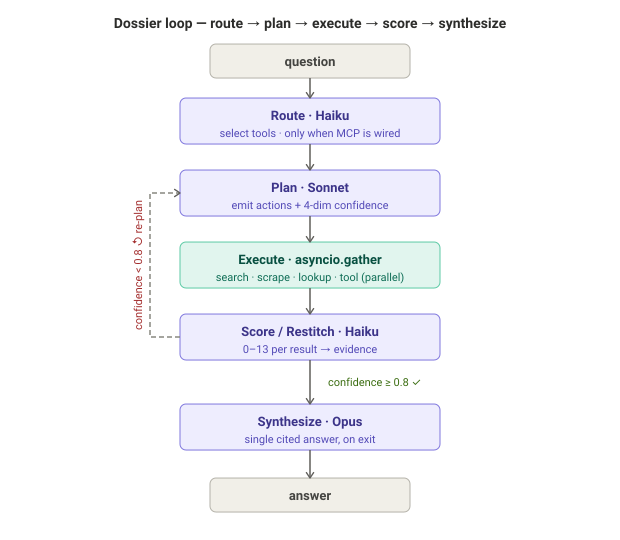
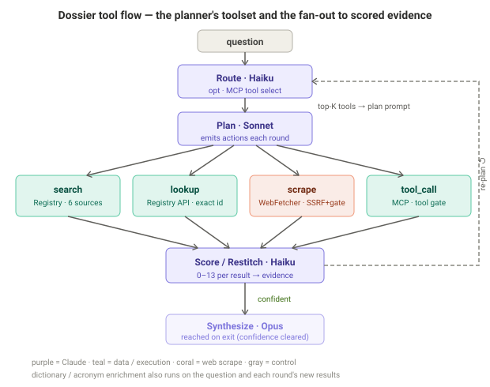
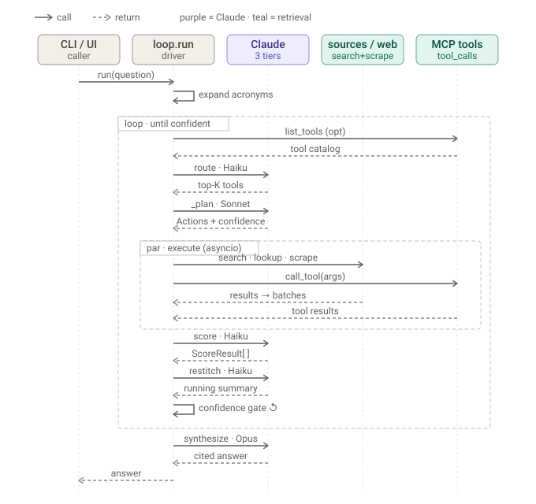
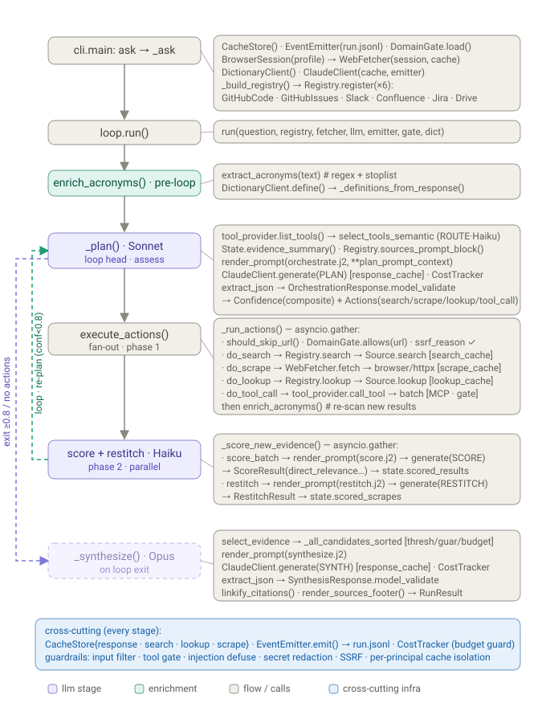
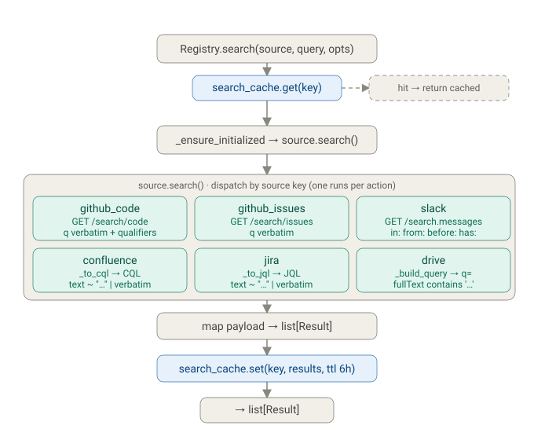
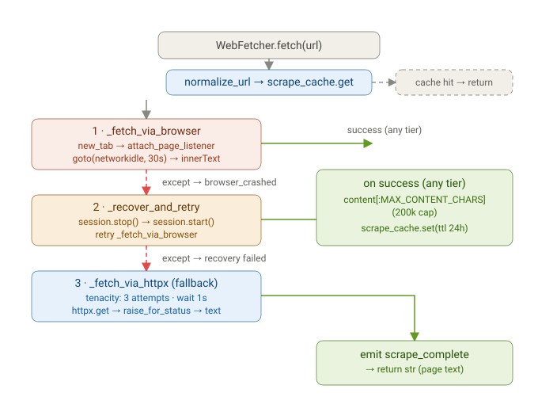
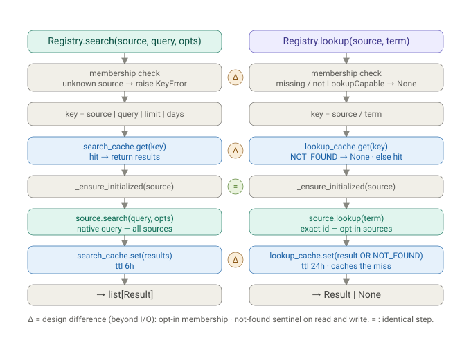
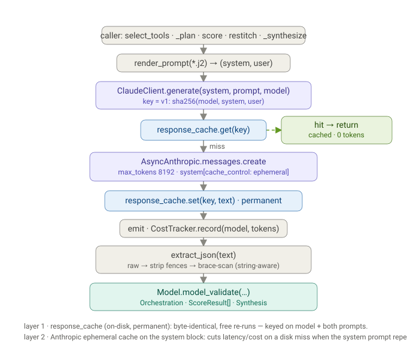
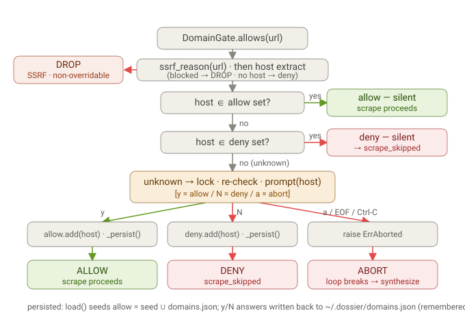
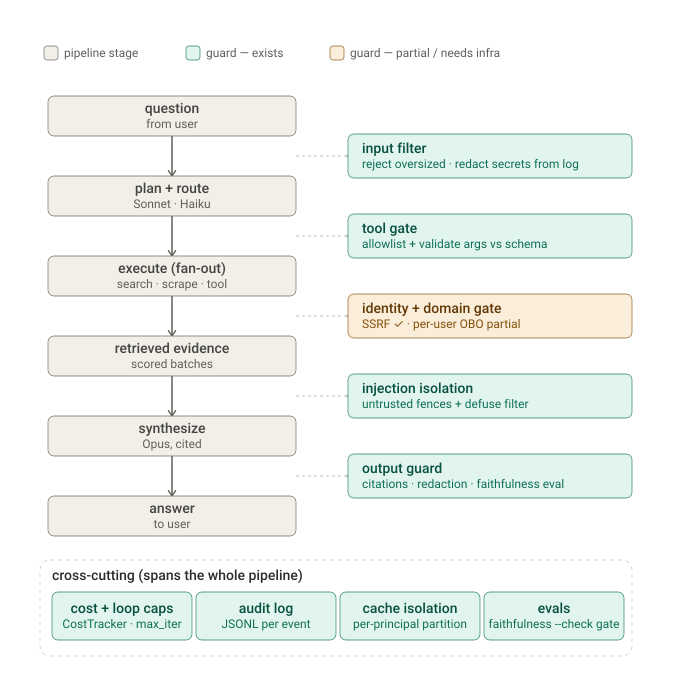

# Columbo

A command-line agent for an enterprise knowledge base spread across Slack,
Confluence, GitHub, Google Drive, and Jira. Given a natural-language
question, Columbo iteratively searches sources, scrapes referenced pages,
scores all retrieved evidence, and synthesizes a cited answer using Claude.

- **No service accounts.** Every source authenticates with a credential the
  user already owns (a GitHub personal access token, an Atlassian API token,
  a Google or Slack OAuth consent grant, or - as a Slack fallback - the user's
  own logged-in browser session). Nothing is provisioned centrally.
- **Self-terminating.** The orchestrator loop stops as soon as its own
  confidence estimate clears a threshold, or when an iteration/cost cap is
  hit - never "runs until someone kills it."
- **Deterministic re-runs.** Identical question + identical accumulated state
  hits four layers of on-disk cache (LLM responses, searches, lookups,
  scrapes) instead of re-querying live sources. The response cache is
  permanent (so re-runs are byte-identical and free); the search/lookup/scrape
  caches carry TTLs so live data doesn't go stale forever.
- **Observable.** Every pipeline step emits a structured JSON event to a
  per-run log that `columbo devtools bench`/`compare` parse directly.
- **Guarded scraping.** Before any page is fetched, its URL passes a skip
  filter (drops open-in-app / meeting / auth-walled links) and a domain gate:
  known hosts pass, unknown hosts trigger a one-time y/N prompt whose answer is
  remembered, and aborting ends the run cleanly.

Non-goals: this is not a real-time UI, does not maintain its own search
index/vector store, and is not a public-facing service - it runs under the
user's own browser profile and credentials only.

## How it works

Columbo runs a **(route →) plan → execute → score → synthesize** loop, using a
different Claude model at each tier so cost tracks the stakes:



- **Route (Haiku, only with MCP tools).** When an MCP tool server is configured
  and its catalog is larger than the shortlist size, a cheap routing call picks
  the tools most relevant to the question so hundreds of tool schemas never
  bloat the plan prompt — degrading to lexical selection if the call fails. Runs
  only when an MCP provider is wired; otherwise the loop starts at plan.
- **Plan (Sonnet).** Each iteration the planner reads a digest of everything
  gathered so far plus each source's query guide, then emits the next batch of
  searches/scrapes/lookups and a **four-dimension confidence** score:
  explicit evidence, implicit signals, cross-source consistency, and answer
  specificity (each 0–13, against anchored rubrics). Overall confidence is
  their mean over 13; `>= 0.8` ends the loop.
- **Execute (concurrent).** Every search/scrape/lookup from one plan step runs
  in parallel (`asyncio.gather`). Each source is queried in its **own native
  syntax** — CQL for Confluence, JQL for Jira, code-search qualifiers for
  `github_code`, issue qualifiers for `github_issues`, search modifiers for
  Slack — as documented by that source's guide in the plan prompt.
- **Score (Haiku).** Every new result and scraped page is scored 0–13 on
  direct-relevance / answer-potential / context / source-quality by a cheap
  model, in parallel; only what clears the bar becomes evidence.
- **Synthesize (Opus).** When the loop ends, the highest-scoring evidence —
  sorted into a deterministic order so identical state yields an identical
  prompt (and cache hit) — is handed to a single Opus call that writes the
  cited answer.

The loop is self-terminating and cost-bounded: it stops on confidence, an
iteration cap, an empty plan (nothing left to try), or a dollar budget — and
every LLM call (route/plan/score/restitch/synthesize) counts against that budget.

## Tool Flow

Here's the agent's toolset and how a single question flows through it, up to (but not including) synthesis:

The tools split into four categories:

- **Data-source tools** (teal) — `search` and `lookup`, both routed through the `Registry` over the 6 sources (github_code, github_issues, slack, confluence, jira, drive), plus the `dictionary` (allacronyms) which runs once up front on the question and again on each round's new results.
- **Web-fetch tool** (coral) — `scrape` via the Playwright-backed `WebFetcher` (httpx fallback), the only tool that reaches arbitrary hosts.
- **LLM tools** (purple) — `plan` (Sonnet, the hub that emits actions and judges confidence every round), `score`/`restitch` (Haiku) that turn raw results/pages into scored evidence, and — when MCP tools are wired — a `route` (Haiku) call that shortlists the relevant tools before planning.
- **Guard / flow** (gray) — the skip filter + domain gate (with an SSRF precheck) that every scrape URL must clear before fetching, plus the tool gate that vets any MCP `tool_call`.

Two things the diagram encodes that are easy to miss:
- The **fan-out is genuinely parallel** — search, scrape, and lookup all fire under one `asyncio.gather`, then scoring/restitch fan out under a second one.
- The **loop returns to `plan`**, not to synthesis — the agent re-plans and re-assesses confidence each iteration; synthesis (dimmed) is the boundary, reached only when confidence clears 0.8 (or the loop otherwise terminates).

Not drawn (they're cross-cutting infra, not tools the planner picks): the **4-namespace cache** guarding every leaf call, and the **event emitter** writing the JSONL run log.



#### Sequence Diagram of the flow of the calls from Question to Answer

Now a call-flow (sequence) view — same system, but tracing the actual calls in time from `run(question)` down to the returned answer.



Same system as the master diagram, but now as a **call trace** — five lifelines, time running top to bottom, solid arrows = calls, dashed = returns.

**The trace, step by step**
1. `CLI/UI` calls `loop.run(question)`.
2. `loop` self-call: expand acronyms (dictionary) before planning.
3. **`loop` frame begins** — everything inside repeats until confident (or `max_iterations`):
   - *(only when MCP tools are wired)* `loop → MCP` **`list_tools`**, then `loop → Claude` **`route · Haiku`** returns the top-K relevant tool names — so only those tools' schemas enter the plan prompt.
   - `loop → Claude` **`_plan · Sonnet`**, returns `Actions` + a confidence estimate.
   - **`par` frame** — the `asyncio.gather` fan-out: `loop` fires `search/lookup/scrape` at sources/web *and* `call_tool(args)` at MCP tools concurrently; both return into the batch list. The two calls overlap in real time — that's why they share one frame.
   - `loop → Claude` **`score · Haiku`** → `ScoreResult[]` per evidence item.
   - `loop → Claude` **`restitch · Haiku`** → the running summary that carries into the next iteration.
   - `confidence gate ↺` — the self-call that decides loop-again vs. exit.
4. On exit, `loop → Claude` **`synthesize · Opus`** → the cited answer.
5. `loop` returns the `answer` to the caller.

**The two things this view makes obvious that the pipeline diagram couldn't:**
- **Concurrency** — the `par` frame shows search and tool calls are genuinely simultaneous, not sequential.
- **What repeats vs. what runs once** — plan/execute/score/restitch are *inside* the loop frame; synthesize sits *outside* it, so Opus is called exactly once per question regardless of iteration count.

Note the single lifeline for `Claude` is hit up to five times with three different model tiers — Haiku to route (only with MCP tools), Sonnet to plan, Haiku to score and restitch, Opus to synthesize — which is the cost/latency strategy in one glance.

A more elaborate version — the orchestration spine on the left (actual functions in call order), with each stage's concrete class/method calls expanded on the right, plus the loop/exit edges and cross-cutting infra:



This expands each stage into the actual classes and methods it calls. How to read it: the **left spine** is the call order (`ask → _ask → run → enrich_acronyms → _plan → execute_actions → score/restitch → _synthesize`); the **right panel** on each row lists what that stage invokes; the **teal back-edge** is the re-plan loop, the **purple edge** the exit to synthesis; the **blue band** is the infra threaded through every stage.

A few call-chains worth calling out, since they cross layers:

- **`_plan`** is the only place that reads *and* writes the loop's control: it renders `orchestrate.j2` from `State.evidence_summary()` + `Registry.sources_prompt_block()`, calls `ClaudeClient.generate(PLAN)`, and returns an `OrchestrationResponse` = `Confidence` (drives the loop edge) + `Actions` (drives `execute_actions`).
- **`execute_actions`** is two gathers, not one: `_run_actions` (search/scrape/lookup + the domain-gate/skip guards) fully completes, then `enrich_acronyms` re-scans, then `_score_new_evidence` runs. Each leaf (`Registry.search`, `WebFetcher.fetch`, `Registry.lookup`) is wrapped by its own cache namespace.
- **`ClaudeClient.generate`** appears in three stages (PLAN, SCORE/RESTITCH, SYNTH) and every call is the same path: `response_cache` check → API → `CostTracker.record`. That's why the blue infra band connects to all of them.
- **The only two edges that leave the loop** are `select_evidence` (data → synthesis) and the confidence/no-actions break (control → `_synthesize`), converging on the one `generate(SYNTH)` call that produces `RunResult`.

Below diagrams are even deeper — exploding `Registry.search` into the per-source native-query builders (`_build_query`/CQL/JQL), the `BrowserSession` recovery/retry path inside `WebFetcher.fetch`

First — **`Registry.search`**: cache-guarded dispatch into each source's *native* query language and endpoint.
Second — **`WebFetcher.fetch`**: the three-tier fallback ladder (browser → recover-and-retry → httpx), where any tier that succeeds jumps to the shared success path.

the `Registry.search` → per-source native-query path


**`Registry.search` (diagram 1):**
- The cache key is `source|query|limit|days` and the **cache check happens before `initialize()`** — a cached source never even authenticates. `_ensure_initialized` is idempotent (guarded by a `set`), so the first `search`/`lookup` on a source triggers its lazy auth, later ones skip it.
- Only one source runs per search action — the planner already picked the `source` key. The six boxes are the dispatch table, and the real divergence is the **native-query translation**: `github_*` pass the query verbatim (the planner writes qualifiers), Slack passes modifiers through `search.messages`, while Confluence/Jira run `_to_cql`/`_to_jql` — which *detect* whether the planner already wrote CQL/JQL (via the operator-hint regex) and only wrap bare keywords as `text ~ "…"` otherwise. Drive builds `fullText contains '…' and trashed = false`.
- `lookup` uses the same shape but caches a `_NOT_FOUND_SENTINEL` for misses, so a known-absent handle isn't re-queried within the TTL.


the `WebFetcher.fetch` recovery chain.



Both sub-diagrams are grounded in the code. Quick notes on the non-obvious bits:

**`WebFetcher.fetch` (diagram 2):**
- It's a **fall-through ladder, not a retry-in-place**: tier 1 renders in the shared Playwright session; any exception emits `browser_crashed` and drops to tier 2, which *restarts the whole browser session* and retries once; if that also throws, tier 3 is a plain `httpx.get` wrapped in tenacity (3× / 1s, on `HTTPError`) with `_html_to_text` to keep the fallback's output shape close to the browser's `innerText`.
- **Any tier that succeeds converges on the same tail** — truncate to `MAX_CONTENT_CHARS` (200k), `scrape_cache.set` (24h TTL), emit `scrape_complete`, return. So the cache and event log don't care which tier produced the text.
- The `scrape_cache` write means a URL fetched once (even via the expensive tier-1 path) is free on any later scrape of the same normalized URL.

If you want, I can do one more at this depth for the **plan/synthesis LLM path** (`ClaudeClient.generate` → Anthropic prompt-cache + on-disk response-cache + `extract_json` recovery), or the **`DomainGate.check` decision tree** (allow/deny/prompt/abort) — both have branchy logic worth its own picture.

### why lookups is excluded?

Lookup is a genuine fourth leaf path, parallel to search — I just kept it out of the *native-query* diagram because it has no query language. Its distinct shape:




Diagram 1 was titled/scoped to **native query-language translation**, and that's exactly the thing `lookup` *doesn't* do: `Registry.lookup → source.lookup` resolves an exact handle/id, so there's no CQL/JQL/qualifier translation to show — nothing would go in those boxes. It also differs in two concrete ways I left in prose rather than the picture: only sources implementing `LookupCapableSource` participate (an `isinstance` filter, vs. *all* sources for search), and its cache stores a `_NOT_FOUND_SENTINEL` so a known-absent handle isn't re-queried. So it was a scoping choice, not that lookup is unimportant. I'll fold it into the mental model at the end.

```
Registry.lookup(source, term)
  ├─ isinstance(source, LookupCapableSource)?  ── no ─→ return None   # not all sources do lookup
  ├─ lookup_cache.get(key)  ── hit ─→ (None if _NOT_FOUND_SENTINEL else cached)
  └─ source.lookup(term)                    # exact-id resolve, e.g. Slack conversations.list, Drive files.get
       └─ lookup_cache.set(key, result or _NOT_FOUND_SENTINEL, ttl 24h)   # caches the miss too
```

The two things that make it *not* just another search: the `isinstance` gate (search is universal, lookup is opt-in per source) and the **negative caching** (`_NOT_FOUND_SENTINEL`) so a handle that doesn't exist isn't re-queried within the TTL. If you'd like it as a proper side-by-side diagram against `Registry.search`, I can draw that pair next.

### Plan Flow


The **`ClaudeClient.generate`** — the two cache layers + parse-and-validate tail every LLM stage shares:

**`ClaudeClient.generate` (two-layer cache):**
- The two caches serve *different* purposes and stack. **Layer 1** (on-disk `response_cache`) is about **determinism** — keyed on `sha256(model + system + user)`, permanent, so an identical run returns byte-identical text with **0 tokens** and no API call. **Layer 2** (Anthropic `cache_control: ephemeral` on the system block) only matters *on a layer-1 miss*, cutting latency/cost when many calls share a system prompt — exactly the score/restitch batch, which reuses one system prompt across every result.
- **`extract_json` is defensive, not naive** — it tries raw → fence-stripped → a string-aware brace/bracket scan, so chatty preamble or ```json fences don't break parsing, and braces *inside* a JSON string (like a `thinking` field discussing `{code}`) don't prematurely close the object. Only then does Pydantic `model_validate` enforce the schema.

### Domain Gate



The **`DomainGate.allows`** decision tree — SSRF precheck, then allow / deny / prompt / abort, with persistence:


**`DomainGate.allows` (decision tree):**
- An **SSRF precheck runs first and is non-overridable** ([`ssrf_reason`](columbo_py/infra/domaingate/gate.py)): a non-http(s) scheme or a private/loopback/link-local/metadata host is **DROP**ped before the allow/deny list is even consulted — so a URL planted in evidence can't point the scraper at the intranet or `169.254.169.254`.
- Three interactive terminal outcomes, not two: **ALLOW** (scrape proceeds), **DENY** (`scrape_skipped`), and **ABORT** (`ErrAborted` → the loop breaks cleanly and synthesizes from whatever's gathered — a user pressing `a` or Ctrl-C doesn't crash the run).
- The **lock + re-check** matters under concurrent fan-out: several scrapes hitting the same unknown host in one iteration won't each prompt — the first resolves it, the rest re-read the now-updated set inside the lock.
- Answers **persist** to `domains.json`, so a host is asked about once ever, across runs; `load()` seeds `allow` from the built-in seed set ∪ the saved file.


### Scrape vs LookUp
Fair — both end up giving the agent the *content* of one specific thing. But they get there through completely different mechanisms, and the gap matters. Let me show the actual lookup body so the distinction is concrete, not asserted.

Confirmed — `lookup("#sso-support")` calls Slack's `conversations.list` **API**, paginates, matches the channel by name, and returns a structured `Result` (the channel's purpose/topic). No URL, no browser anywhere in it. That's the whole difference.

| | **scrape** | **lookup** |
|---|---|---|
| Starts from | a **URL** already in the evidence | a **name/handle/id** (`#sso-support`, a file id, an issue key) |
| Mechanism | browser renders the page → `innerText` (Playwright→httpx) | authenticated **REST API** call to the source |
| Returns | a blob of page **text** (needs a Haiku restitch pass) | a structured **Result** — title, content, permalink, author, timestamp |
| Auth/guards | domain gate + skip filter, depends on the browser being logged in | the source's own token; no gate, no browser |

## Why scrape *can't* just do it

1. **You don't have a URL yet.** A `#channel` name, a Drive file id, a Jira key — none of those are URLs. To scrape one you'd first have to resolve the id → its canonical URL... which is exactly the API call `lookup` already makes. Scrape's own contract is "fetch a URL *found in the evidence*" — lookup exists precisely for when the thing *isn't* a URL in the evidence, just a handle you know.

2. **The web UIs for these objects are the ones scrape refuses.** Slack channels/messages render as JavaScript auth-SPAs — and `app.slack.com/...` / `*.slack.com/archives/` are literally on the scrape **skip list** ([actions.py `_URL_SKIP_PATTERNS`](columbo_py/engine/orchestrator/actions.py:49)) because they come back as empty shells or login walls. So scraping the Slack channel URL would return *nothing useful* even if you had it. The API returns clean structured fields instead.

3. **Structured data vs. rendered mush.** Lookup hands the scorer a proper Result with a real permalink and metadata (citable immediately). Scrape hands it raw `innerText` that then needs an extra Haiku restitch call to extract anything — heavier and lossier.

4. **Reliability & cost.** Lookup = one authenticated API call → deterministic JSON. Scrape = spin a browser tab, wait for networkidle, extract text, run restitch — fragile (depends on login/render) and far more expensive, for something the API answers directly.

## The clean mental model

- **scrape** = "go fetch this **arbitrary web page** at this **URL**" — for external/linked content you have *no API for* (a wiki page, a design-doc link, a blog post surfaced in results).
- **lookup** = "go get this **specific object** by its **id** from a system I *do* have an API for" — straight to the structured source of truth, skipping its (often un-scrapeable) web UI.

Scrape is the fallback for the open web; lookup is the front door to your own systems. Using scrape for a `#channel` would mean scraping an auth-walled SPA that the pipeline already blocks — to get worse data, more slowly, than a single API call.

## Evidence Maintenance
For every iteration in plan, until - a hard limit on number of iterations or  needed confidence score reached or no actions planned - we never filter out any evidence even if it is of extremely low score

During the loop, **evidence is never evicted, no matter how low it scores.** Accumulation is monotonic: every search/scrape/lookup result gets scored and *stays* in `state` (`state.batches`, `state.scrapes`, `state.lookups`, with scores in `state.scored_results` / `state.scored_scrapes`). Scoring assigns a number; it never deletes. State only grows until the loop ends.

But "never filtered" needs one precise qualification — the score isn't ignored, it just acts at two points that aren't eviction:

**1. What the planner *sees* each iteration is already top-N, not everything.** The digest is built by `evidence_summary(top_scored=5)` ([state.py:66](columbo_py/engine/orchestrator/state.py:66)) — it lists all the searches/scrapes done, but the "top evidence by score" section shows only the **best 5**. So a rock-bottom-scored item is retained in state but effectively invisible to the next plan/confidence call. It contributes nothing to the confidence estimate and won't tempt the planner. It's just dead weight in memory.

**2. The only actual filter runs once, at synthesis.** `select_evidence` ([state.py:169](columbo_py/engine/orchestrator/state.py:169)) is where low score finally excludes something — via three knobs:
- `score_threshold` (≈ 4/13 ≈ 0.31 composite) — below this, drop it…
- `min_guarantee` (8) — …**unless** it's in the top-8 by score, which are always included *regardless of threshold*.
- `char_budget` (50k) — a total-size cap.

So the loop is pure gather-and-score; the sieve is deferred to the end.

## Two implications worth noting

- **A below-threshold item can still reach the final answer.** Because `min_guarantee` forces the top-8 in even if they're under the 0.31 bar — so on a run with uniformly weak evidence, the synthesizer still gets *something* instead of an empty context. "Low score" guarantees exclusion only if the item is *also* outside the top-8.
- **Nothing bounds state growth mid-run except the iteration/cost caps.** There's no running "prune everything under X" step. That's fine at this scale (a handful of iterations × a few results each), but it does mean the accumulated state and the plan digest's underlying candidate set only ever grow — the score decides *visibility* and *final selection*, not *retention*.

If you wanted true mid-loop pruning (e.g., drop anything scoring near-zero so it never occupies memory or risks surfacing), that'd be a small change in `_score_new_evidence` — but it'd trade determinism-simplicity for marginal memory savings, and you'd lose the ability to re-rank a previously-weak item as context accumulates. The current design deliberately keeps everything and filters last.


## Guardrails

Columbo reads RBAC-walled internal content, scrapes URLs it finds in that
content, and calls MCP tools with model-authored arguments — so its risk surface
isn't a chatbot's. The design puts **a guard at every trust boundary**, each one
implemented as a **wrapper over an existing Protocol seam** (not inline in the
loop) and driven by one policy block, `[guardrails]`, in
[`config/defaults.toml`](columbo_py/config/defaults.toml). Two failure
philosophies, chosen per boundary: **fail-closed** on safety/authz (when in
doubt, block), **fail-open-with-degradation** on quality (a failed router falls
back to lexical, a failed source is skipped — the run never crashes). The full
build reference — request-flow diagram, per-guard mechanics, config, and the
"add a guard" pattern — is in [docs/guardrails.md](docs/guardrails.md).



| Boundary | Guard | Where it lives | Status |
|---|---|---|---|
| Question in | **input filter** — reject oversized questions before any LLM call; redact secrets from the run log | [`loop.run`](columbo_py/engine/orchestrator/loop.py) + [`redaction.py`](columbo_py/infra/redaction.py) | ✅ |
| Plan → tool call | **tool gate** — allowlist (blocked tools hidden from the planner *and* refused) + validate arguments against each tool's input schema | [`GuardedToolProvider`](columbo_py/sources/mcp/guarded.py) | ✅ |
| Execute → scrape | **SSRF guard** — drop non-http(s) schemes and private/loopback/link-local/metadata hosts; non-overridable, precedes the allow/deny list | [`ssrf_reason`](columbo_py/infra/domaingate/gate.py) | ✅ |
| Retrieved content → LLM | **injection isolation** — fence evidence as untrusted data in every prompt; defuse forged fence markers so content can't "escape" its region | [`_defuse`](columbo_py/engine/prompts/render.py) + templates | ✅ |
| Synthesis out | **output guard** — enforce inline citations (existing) + redact secrets that surfaced in evidence from the answer | [`_synthesize`](columbo_py/engine/orchestrator/loop.py) | ✅ |
| Data access | **identity + domain gate** — per-user OBO so every source query runs as the *user*; interactive scrape gate | domain gate ✅ · OBO ⚠️ | partial |
| Runaway | **cost + loop caps** — dollar budget, iteration cap, named exit reasons | [`CostTracker`](columbo_py/engine/orchestrator/cost.py) + `max_iterations` | ✅ |
| Multi-tenant | **cache isolation** — partition every cache namespace by principal so content can't leak across identities | [`CacheStore(scope=…)`](columbo_py/infra/cache/store.py) | ✅ |
| Audit | **event log** — every search/scrape/tool/LLM call + cost, one JSONL line each | [`EventEmitter`](columbo_py/infra/events/emitter.py) | ✅ |
| Regression | **faithfulness gate** — `devtools eval --check` fails CI when mean faithfulness drops below the floor | [`devtools eval`](columbo_py/cli/devtools.py) | ✅ |

Two worth calling out:

- **Injection isolation is two layers.** Untrusted evidence is wrapped in
  `<<UNTRUSTED_BEGIN>>…<<UNTRUSTED_END>>` fences with a `SECURITY:` clause telling
  the model to treat the region as data, and the `| defuse` filter inserts a
  zero-width break into every `<<` in the content so a malicious result **can't
  forge** a closing marker to break out. It's defense-in-depth, not a proof — the
  hard stop is that even if content did steer the planner, the **tool gate** won't
  let it reach a non-allowlisted or malformed tool call.
- **Cache isolation is a physical partition, not key-rewriting.** With a
  `scope` set, all four namespaces nest under `scopes/<hash>/` — different
  principals get different directories, so a cached search/scrape/tool result
  *cannot* be served across identities. The single-user CLI passes no scope and
  behaves exactly as before; a hosted deployment sets `COLUMBO_PRINCIPAL` per
  authenticated request. The scope is hashed so a raw principal id never lands on
  disk as a folder name.

**Two guards stay conceptual — they need infrastructure, not code in this repo:**

- **Per-user OBO / token-exchange.** The MCP path already sends a per-user
  bearer so the downstream platform enforces the *caller's* RBAC (never a confused
  deputy). Extending that to every source needs an identity platform Columbo can
  exchange tokens with — an integration, not a wrapper.
- **DNS-rebinding protection.** The SSRF guard is static: it blocks *literal*
  private IPs and metadata names but does not resolve DNS, so a public hostname
  that resolves to a private IP is out of scope here. That defense belongs at the
  socket layer of the HTTP client performing the fetch.

## Documentation

Deeper design notes live in [`docs/`](docs/index.md):

- **Architecture** — [call tree](docs/call_tree.md), [request trace](docs/request_simulation.md), [libraries used](docs/libraries-used.md), [guardrails](docs/guardrails.md), [permalinks](docs/permalinks.md)
- **Auth** — [auth from first principles](docs/auth-basics.md), [per-deployment auth flows](docs/columbo-auth-flow.md)
- **Scaling & integration** — [MCP / A2A adoption](docs/mcp-a2a-adoption.md), [enterprise scale](docs/enterprise-solution.md), [CLI → microservice](docs/cli-to-microservice.md)

These render as a browsable site via [MkDocs](https://www.mkdocs.org/) (Material theme):

```bash
pip install -e ".[docs]"
mkdocs serve       # live preview at http://127.0.0.1:8000
mkdocs build       # static site into ./site
```

Pushing to `main` auto-publishes to GitHub Pages via
[`.github/workflows/docs.yml`](.github/workflows/docs.yml) — one-time setup: repo
**Settings → Pages → Source = "GitHub Actions"**.

## Project layout

```
columbo_py/
├── cli/                 # Typer app: ask, interactive, devtools (compare/bench/smoke/demo)
├── config/              # defaults.toml (all tunable knobs) + typed loader (SETTINGS)
├── engine/
│   ├── orchestrator/     # loop.py (plan/execute/score loop), actions.py (fan-out),
│   │                     # state.py (evidence selection), models.py (LLM JSON shapes)
│   ├── llm/               # LLMClient Protocol, ClaudeClient (real), MockLLMClient (tests)
│   ├── prompts/templates/ # Jinja2 prompt templates (select_tools/orchestrate/score/restitch/synthesize)
│   └── search/            # SearchSource Protocol, Registry (with caching), Result/Options
├── sources/               # slack, confluence, github (code + issues), drive, jira;
│                          # each ships a GUIDANCE.md query guide injected into the plan prompt
├── infra/
│   ├── browser/           # Playwright persistent-context session + WebFetcher
│   ├── cache/              # diskcache-backed CacheStore (4 namespaced caches, per-principal scope)
│   ├── domaingate/         # SSRF precheck + allow/deny + interactive prompt before any scrape
│   ├── redaction.py        # secret redaction for the input filter + output guard
│   └── events/             # structlog JSON event emitter + Playwright CDP listener
└── tests/
```

## Setup

Requires Python 3.11+.

```bash
python3 -m venv .venv
source .venv/bin/activate
pip install -e ".[dev]"
playwright install chromium   # only needed for scraping/Slack token extraction
```

### Credentials

Set only the env vars for the sources you actually want to query - each
source raises a clear error naming the missing variable the first time it's
used, rather than failing at startup.

| Source | Env vars | Notes |
|---|---|---|
| Claude (required) | `ANTHROPIC_API_KEY` | Used by every route/plan/score/restitch/synthesize call. |
| GitHub | `GITHUB_TOKEN` | Personal access token, `repo` + `read:org` scopes. Registered as two sources the planner picks between: `github_code` (file contents via code search) and `github_issues` (issues/PRs). |
| Slack | `SLACK_CLIENT_ID` + `SLACK_CLIENT_SECRET` (native OAuth), or `SLACK_USER_TOKEN` (+ `SLACK_D_COOKIE` for an `xoxc-` token) | Preferred: register a Slack app with the `search:read` user scope and set the client id/secret — first run opens an OAuth consent screen and caches the `xoxp-` user token to `~/.columbo/slack_token.json` (like Drive). Alternatively paste a user token directly. If none are set, Columbo falls back to extracting an `xoxc-` token from an already-logged-in Slack tab in the shared browser profile. |
| Confluence | `CONFLUENCE_BASE_URL`, `CONFLUENCE_EMAIL`, `CONFLUENCE_API_TOKEN` | API token from `id.atlassian.com/manage-profile/security/api-tokens`. |
| Jira | `JIRA_BASE_URL`, `JIRA_EMAIL`, `JIRA_API_TOKEN` | Same Atlassian API token works for both. |
| Google Drive | `GOOGLE_CLIENT_SECRETS_PATH` | OAuth client secrets JSON (Desktop app type) from the Google Cloud console; first run opens a browser consent screen and caches the refresh token to `~/.columbo/drive_token.json`. |
| Testing Platform (MCP) | `COLUMBO_MCP_TESTING_URL`, `COLUMBO_MCP_TESTING_TOKEN` (optional) | Needs the `[mcp]` extra (`pip install ".[mcp]"`). When the URL is set, the planner can call the server's MCP **tools** directly via structured `tool_calls` — the relevant tools are selected per question from the catalog (so hundreds of tools never bloat the prompt), and each call's results become scored evidence. The token is sent as a per-user bearer so the platform enforces the caller's RBAC. (An alternative `MCPTestingPlatformSource` search-adapter also ships for the simpler single-tool style.) |
| Dictionary | `COLUMBO_DICTIONARY_URL`, `COLUMBO_DICTIONARY_DOMAIN`, `COLUMBO_DICTIONARY_TOKEN` (optional) | Acronym lookup at `GET {url}/{abbreviation}/{domain}` (default `https://www.allacronyms.com/{abbreviation}/computing`). `COLUMBO_DICTIONARY_DOMAIN` (default `computing`) restricts results to one field so an acronym resolves to its computing sense; set it empty to query every field. Columbo auto-detects acronyms in the question and search results, resolves them here, and feeds the definitions into later plan prompts. The endpoint may return multiple senses per acronym (expansions, paragraphs, links) — all are kept (numbered, length-bounded) so the planner picks the one that fits. Point the URL at your own service; leave empty to disable. |

### Configuration (optional)

Every tunable default — model tiers, cost pricing, loop/iteration caps,
evidence-selection thresholds, plan-prompt numbers, cache TTLs, HTTP timeouts,
source API endpoints, seed scrape-allow hosts — lives in one shipped file,
[`columbo_py/config/defaults.toml`](columbo_py/config/defaults.toml), loaded
through `columbo_py.config.SETTINGS`. Secrets/credentials are deliberately
**not** in that file; they stay in the env vars from the table above.

Two ways to override the defaults, in increasing precedence:

1. **A user TOML file.** Point `COLUMBO_CONFIG` at your own `.toml` containing
   just the keys you want to change — it is deep-merged over the shipped
   defaults (everything you don't set keeps its default). e.g.
   ```toml
   # my-columbo.toml
   [loop]
   max_iterations = 10
   max_cost_usd = 5.0
   ```
   ```bash
   COLUMBO_CONFIG=~/my-columbo.toml columbo ask "..."
   ```
2. **Environment variables** (below) win over both files, so the overrides
   documented here keep working unchanged.

| Env var | Default | Purpose |
|---|---|---|
| `COLUMBO_CONFIG` | _(unset)_ | Path to a user TOML overriding any key in `defaults.toml` (deep-merged). |
| `COLUMBO_CACHE_DIR` | `~/.columbo/cache` | Root for the four on-disk caches. `rm -rf` a namespace to bust just that layer, or use `columbo devtools clear-cache [namespace]`. |
| `COLUMBO_SEARCH_TTL_S` | `21600` (6h) | Freshness TTL for cached search results. |
| `COLUMBO_LOOKUP_TTL_S` | `86400` (24h) | Freshness TTL for cached lookups. |
| `COLUMBO_SCRAPE_TTL_S` | `86400` (24h) | Freshness TTL for cached scraped pages. |
| `COLUMBO_PRINCIPAL` | _(unset)_ | Authenticated caller id in a multi-user deployment; partitions every cache namespace per user so content can't leak across identities. Unset on the single-user CLI → shared cache. |

The `[guardrails]` block in `defaults.toml` tunes the safety guards (see
[Guardrails](#guardrails)): `tool_allowlist` / `validate_tool_args` (MCP tool
gate), `max_question_chars` (input filter), `redact_answers` (output guard), and
`min_faithfulness` (the `devtools eval --check` CI floor).

Scrape approvals persist to `~/.columbo/domains.json` (`{"allow": [...],
"deny": [...]}`); edit or delete it to reset which domains Columbo may fetch.

Run knobs (`--max-iterations`, `--max-cost-usd`, `--headless`) are flags on
`columbo ask` / `columbo interactive`; the cost cap defaults to `$2.00` per run.

## Usage

```bash
columbo ask "How does our auth flow handle token refresh?"
columbo desktop              # native desktop window (needs the [desktop] extra: pip install ".[desktop]")
columbo ui                   # same chat UI in the browser (needs the [ui] extra: pip install ".[ui]")
columbo interactive          # keeps one browser session + cache warm across questions
columbo devtools smoke       # full pipeline sanity check - no credentials, no network
columbo devtools plan "..."  # just the initial plan call (needs only ANTHROPIC_API_KEY)
columbo devtools demo        # real pipeline against a canned question
columbo devtools bench       # aggregate metrics across ~/.columbo/runs/*.jsonl
columbo devtools compare RUN_A.jsonl RUN_B.jsonl
columbo devtools clear-cache          # clear all four on-disk caches
columbo devtools clear-cache search   # clear just one namespace
columbo devtools eval                 # LLM-as-judge eval on the sample dataset (needs only ANTHROPIC_API_KEY)
columbo devtools eval mine.jsonl      # ...on your own {question, answer, contexts} samples
```

## Desktop app

`columbo desktop` opens the chat UI in a **native OS window** (not a browser
tab): it runs the Chainlit UI headless on a local port and displays it via
[pywebview](https://pywebview.flowlib.org/) — the system WKWebView on macOS,
Edge WebView2 on Windows, GTK/Qt WebKit on Linux. It reuses the engine
unchanged (same `run()` loop, browser-backed scraping, and live "thinking"
steps as the CLI).

```bash
pip install ".[desktop]"     # pywebview + chainlit
columbo desktop
```

To ship a **literal double-click `.app`/`.exe`**, wrap the entrypoint with
PyInstaller (bundling Chainlit's frontend assets), e.g.:

```bash
pip install pyinstaller
pyinstaller --name Columbo --windowed \
  --collect-all chainlit \
  --add-data "columbo_py/ui/app.py:columbo_py/ui" \
  -c "from columbo_py.ui.desktop import run; run()"   # or a 2-line launcher module
```

The UI glue is deliberately split so the engine stays untouched:
`ui/events.py` (tees engine events to the window), `ui/session.py` (warm
browser+cache session), `ui/app.py` (the only Chainlit code), `ui/desktop.py`
(the native-window launcher).

## Evaluation

Beyond the runtime **self**-confidence score (the agent grading its own work),
Columbo ships a separate, offline **LLM-as-judge** harness — an *independent*
grader for regression-testing prompt/model changes. It reuses Columbo's own
Claude client and response cache (so re-runs are deterministic and free) rather
than pulling in an external eval framework; there are no extra dependencies and
nothing runs inside `ask`.

`columbo devtools eval [samples.jsonl]` scores each sample on three
reference-free metrics, each 0–1:

- **faithfulness** — are the answer's claims grounded in the contexts? (the
  independent hallucination check)
- **answer_relevancy** — does the answer address the question that was asked?
- **context_precision** — is the retrieved+selected evidence actually relevant?
  (a direct check on the Haiku scorer's top selection)

A sample is the reference-free triple the judges need — question, answer, and
the evidence contexts — one JSON object per line:

```json
{"question": "...", "answer": "...", "contexts": [{"source": "slack", "id": "1", "content": "..."}]}
```

Contexts may also be bare strings. An optional `"reference"` field is accepted
for future label-based metrics (context-recall, answer-correctness). The judge
model is configurable via `[models].judge` in
[`config/defaults.toml`](columbo_py/config/defaults.toml) (default Sonnet) or
the `--model` flag. A starter dataset ships at
[`columbo_py/evals/sample_dataset.jsonl`](columbo_py/evals/sample_dataset.jsonl).

As a **regression gate**, `columbo devtools eval --check` exits non-zero when
mean faithfulness falls below `[guardrails].min_faithfulness` — wire it into CI
to catch a prompt/model change that quietly worsens grounding. Because it calls
the judge model it needs `ANTHROPIC_API_KEY`, so it's an opt-in CI job, separate
from the hermetic, network-free `pytest` gate.

## Testing

```bash
pytest columbo_py/tests    # all against MockLLMClient + in-memory fakes - no network
ruff check columbo_py
mypy columbo_py
```

`columbo devtools smoke` is the fastest way to confirm the whole
plan → execute → score → synthesize pipeline is wired correctly without any
of the above credentials.

## Known limitations in this environment

This project was scaffolded and tested without live API keys or SaaS
credentials on hand:

- The orchestrator loop, evidence selection, caching, and event log are
  verified end-to-end against `MockLLMClient` and in-memory fake sources
  (see `columbo_py/tests/` and `columbo devtools smoke`).
- The GitHub integration (`github_issues` / `github_code`) targets the real
  GitHub search APIs; query strings are passed through as the planner writes
  them, and result mapping is unit-tested against captured API payloads.
- Slack, Confluence, Jira, and Google Drive integrations are implemented
  against each service's real REST API and their auth flows are standard,
  well-documented patterns, but have not been exercised against a live
  workspace/instance - set the credentials above and run
  `columbo ask "..."` to validate them against your own tenant.


## Is this agentic?


**Yes, Columbo is agentic — but deliberately on the constrained end of the spectrum.** Here's the honest breakdown.

### What makes it agentic

- **It decides its own next actions.** The planner (Sonnet) reads a digest of everything gathered so far and *emits* the next batch of searches/scrapes/lookups. Nothing hardcodes "search Slack, then Confluence." The model chooses sources, writes queries in each source's native syntax (CQL/JQL/code qualifiers), and picks what to scrape.
- **It runs a genuine perceive→decide→act loop.** plan → execute → score → re-plan, iterating on new evidence. Each iteration's plan is conditioned on the results of the last — that feedback loop is the core of agent behavior, not a fixed pipeline.
- **It self-assesses and self-terminates.** It scores its own confidence (four dimensions) and *decides when it's done* rather than running a fixed number of steps.
- **It uses tools/environment.** Federated search APIs, a real browser for scraping, a dictionary for acronym enrichment — it acts on the outside world, not just text-in/text-out.

### What makes it *deliberately not* fully autonomous

This is where the design is opinionated, and it's a feature:

- **Bounded, never open-ended.** Every exit path is a named, logged reason — confidence reached, iteration cap, empty plan, or dollar budget. The spec explicitly rules out "runs until someone kills it." A fully autonomous agent would self-set its own budget; Columbo's is a hard ceiling.
- **Human-in-the-loop at the risky edge.** Before scraping an unknown host, it stops and asks (the domain gate). It doesn't autonomously reach arbitrary destinations.
- **No self-modification, no persistence of goals.** It doesn't rewrite its own prompts, spawn sub-agents, or carry goals across runs. One question → one bounded investigation → a cited answer.
- **Constrained action space.** It picks *among* a fixed menu of actions (search/scrape/lookup) with a fixed set of sources. It can't invent new tools at runtime.

### The one-line verdict

Columbo is an **agentic workflow / bounded research agent** — model-directed control flow with tool use and self-termination — rather than an *autonomous* agent. On the common "workflow ↔ agent" axis (Anthropic's own framing: workflows orchestrate LLMs through predefined paths; agents direct their own process), Columbo sits clearly on the agent side because the LLM drives the loop, but it's an agent on a short, auditable leash by design: cost-capped, human-gated for scraping, and deterministic on re-runs.

So if someone asks "is it agentic?" — yes. If they ask "is it an autonomous agent?" — no, and intentionally so, because the whole value proposition is a trustworthy, cost-bounded, reproducible investigator rather than a free-running one.


## Is there a need to use Google ADK(or LangGraph, or CrewAI, or AutoGen) to build such a tool?

Short answer: **no, you don't need ADK (or LangGraph, or CrewAI, or AutoGen) to build Columbo — and for this particular tool, hand-rolling it was arguably the better call.** But that's a judgment, not an absolute. Here's the reasoning.

### What ADK-style frameworks actually give you

Agent frameworks (Google ADK, LangGraph, LlamaIndex, CrewAI, etc.) bundle roughly these things:

1. **A control loop** — the plan/act/observe cycle.
2. **Tool abstractions** — a schema + dispatch layer so the model can call functions.
3. **State/session management** — memory across steps.
4. **Multi-agent orchestration** — sub-agents, handoffs, routing.
5. **Model & tracing plumbing** — provider adapters, retries, callbacks, eval hooks.

The question is: how much of that does Columbo need, and how much does it already have better-fitted versions of?

### Why Columbo didn't need one

- **The loop is the easy part.** Columbo's core is ~a `while` loop with a confidence check. That's 40 lines. A framework's loop abstraction saves you almost nothing here and *costs* you the ability to express Columbo's specific exit conditions cleanly (named/logged termination reasons, dollar-budget guard checked *before* each call, empty-plan detection). Those are precisely the "self-terminating, cost-bounded" guarantees in the spec — and they're easier to enforce in your own loop than to bend a framework's loop around.

- **"Tools" here aren't generic function-calling.** Columbo doesn't let the model call arbitrary tools; it plans a *batch* of typed actions (search/scrape/lookup) that then fan out concurrently via `asyncio.gather`, get scored by a cheap model, and filtered. That batch-plan-then-parallel-execute shape is unusual — most frameworks assume sequential single-tool calls per turn. You'd be fighting the abstraction.

- **The hard parts are domain-specific and framework-neutral.** The actual engineering value in Columbo is: per-source query guides (CQL/JQL/code qualifiers) injected into the prompt, four-dimension confidence rubrics, deterministic evidence sorting for byte-identical cache keys, the domain gate, native-syntax source adapters, cost tracking. **No framework ships any of that.** You'd write all of it yourself regardless.

- **Determinism is a first-class requirement, and frameworks fight it.** Columbo's whole caching story depends on identical (system, user, model) → identical prompt → cache hit. Frameworks inject their own prompt scaffolding, hidden reasoning steps, and non-deterministic orchestration that make byte-identical re-runs hard. Owning the prompt string end-to-end is a feature here, not tech debt.

- **It's single-agent.** The biggest reason to reach for ADK/CrewAI/AutoGen is multi-agent coordination — routers, sub-agents, handoffs. Columbo is one agent with tiered models (Sonnet/Haiku/Opus by cost). Model tiering is a one-liner, not an orchestration problem.

### When you *would* reach for ADK

To be fair — a framework earns its keep when:

- **You're going multi-agent** — several specialized agents negotiating, a supervisor routing, parallel researchers with handoffs. That coordination is genuinely tedious to hand-roll and easy to get wrong.
- **You want the ecosystem** — ADK's built-in tracing/eval, Vertex deployment, a big library of prebuilt connectors, guardrail components. If you're already all-in on GCP/Vertex, ADK's deployment story is real leverage.
- **You're prototyping fast and don't care about determinism/cost-control** — frameworks get you to a demo quicker.
- **Team familiarity** — if everyone knows LangGraph, the shared vocabulary can outweigh the abstraction cost.
- **Standardized tool interop (MCP, etc.)** — if you want to plug into a growing set of external tool servers, a framework that speaks those protocols saves integration work.

### The honest verdict for Columbo

The dependencies Columbo *did* pick are the right granularity: `httpx` (async I/O), `pydantic` (typed LLM JSON), `diskcache` (persistence), `structlog` (events), `jinja2` (prompts), Playwright (browser), the Anthropic SDK. Those are **libraries** — they do one thing well and get out of the way. An agent **framework** is a different bet: it wants to own your control flow. For a tool whose core requirements are *determinism, auditable termination, and cost bounds*, owning the control flow yourself is the point.

So: a framework would have added a dependency, an abstraction to fight, and a determinism headache — in exchange for a `while` loop you can write in an afternoon. Rational to skip.

The moment that calculus flips is **multi-agent**. If Columbo grows a supervisor dispatching specialized per-source sub-agents that hand off to each other, that's when the boilerplate of doing it by hand starts to exceed the cost of adopting ADK or LangGraph — and I'd revisit the decision then, not before.
