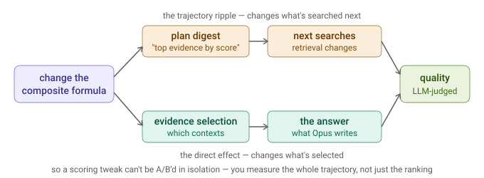
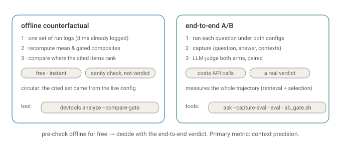
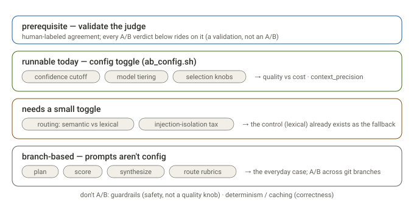

# A/B testing a scoring change

How to decide whether a change to the scorer — like the [relevance
gate](scoring-and-confidence.md#mean-or-multiplication-gate-prerequisites-average-contributors)
— actually produces better answers, using the [eval harness](evaluation.md) and
`devtools analyze`.

## First principles

The trap: **a scoring change is not local.** The composite feeds two things — the
plan digest ("top evidence by score", which shapes what the planner searches *next*)
and the evidence selection (which contexts reach synthesis). So changing the formula
ripples into *retrieval*, *selection*, and the *answer*:



That means you can't isolate "did the new ranking help?" from "did it change what got
retrieved?" — and that's fine, because when you *ship* the change you ship the whole
trajectory. But it shapes how you test: a fair A/B holds the **question set** constant
and lets everything downstream of the formula vary.

## Two ways to test

There's a cheap check and a real one — use the first to pre-screen, the second to
decide:



### 1 · The offline counterfactual — free, from existing logs

Because every run logs all four dimensions per scored item (`score_complete`,
`restitch_complete`) and the ids the answer cited (`synthesize_complete`), you can
recompute *both* composites — mean and gated — from **one** set of logs and compare
where the cited items rank. No re-run.

```bash
dossier devtools analyze ~/.dossier/runs --compare-gate
```

It even infers which formula produced the logs (by matching the logged composite), so
you read the counterfactual column correctly. **But it's a sanity check, not a
verdict** — the cited set came from whichever config was live, so judging both
formulas against it is circular. Use it to catch regressions ("does the gate badly
demote things the answer used?"), not to declare a winner.

### 2 · The end-to-end test — the real verdict

Run the same question set under both configs, capture each run as an eval sample, and
judge both arms with the LLM-as-judge. The gate is a one-line config toggle
(`[evidence].relevance_gated`), and [`ask --capture-eval`](evaluation.md) records the
`{question, answer, contexts}` sample:

```bash
scripts/ab_gate.sh questions.txt      # runs both arms, captures samples, judges each
```

Under the hood, per question: `DOSSIER_CONFIG=mean.toml dossier ask … --capture-eval
samples-mean.jsonl` (gate off), then `dossier ask … --capture-eval samples-gate.jsonl`
(gated default), then `devtools eval` on each. Compare the two aggregates.

## Hygiene that matters

- **Primary metric: `context_precision`.** It most directly measures "is the selected
  evidence relevant?" — exactly what the scorer controls. `faithfulness` and
  `answer_relevancy` are downstream, secondary signals.
- **Pair the comparison.** Same questions, both arms, look at *per-question deltas*.
  This is where the LLM judge's weakness becomes a strength: its self-preference and
  verbosity biases are roughly constant across arms, so they **cancel in a paired
  diff** — the relative signal is far more trustworthy than the absolute scores.
- **Sample size = distinct questions, not re-runs.** Everything is deterministic per
  config, so re-running the same question adds no information. You need *more
  questions* (dozens+) for the noisy judge to separate the arms.
- **No cache leakage.** The two arms produce different prompts (different digests and
  evidence) → different response-cache keys → they can't contaminate each other.
  Within an arm the cache makes re-runs free and identical; nothing to clear.

## What it can and can't tell you

- The **counterfactual** answers "would the gate rank the cited evidence
  differently?" — cheaply, but circularly. A pre-check.
- The **end-to-end test** answers "do the final answers get better?" — the question
  that matters — but it measures the *total* effect of shipping the change (the
  trajectory ripple included). There is no "freeze retrieval, swap only the ranking"
  mode, so you can't cleanly attribute the delta to selection alone. For a ship
  decision that's the right thing to measure; for root-causing *why* it moved, it's a
  limitation to keep in mind.

The rule of thumb: **pre-check offline for free, decide with a paired end-to-end eval
on a fixed question set, and read `context_precision` first.**

## The general tool — A/B any config change

The relevance gate is just the first use. Because the harness holds the *question set*
fixed and varies one config override, **any config knob is A/B-able with one command** —
[`scripts/ab_config.sh <override.toml> <questions.txt>`](https://github.com/siddartham/federated-knowledge-discovery-tool/blob/main/scripts/ab_config.sh)
runs the default vs. your override, captures both, and judges each:

```bash
# does a lower confidence cutoff hurt quality (and save iterations)?
printf '[loop]\nconfidence_cutoff = 0.7\n' > cut.toml
scripts/ab_config.sh cut.toml questions.txt

# is Opus actually needed for synthesis, or is Sonnet close?
printf '[models]\nsynthesis = "claude-sonnet-4-6"\n' > synth.toml
scripts/ab_config.sh synth.toml questions.txt
```

`ab_gate.sh` is now a thin wrapper that calls it with `relevance_gated = false`.

## Other tests worth running

The same test applies to any change that can move answer quality and is an *empirical*
judgment, not something you can derive. Prioritized by leverage and how testable each
is today:



**Do this first — validate the judge.** Every A/B verdict is only as good as the LLM
judge, and the judge inherits [known biases](evaluation.md#where-llm-as-judge-is-weak-the-honest-review).
A small **human-labeled set** — do the judge's faithfulness / precision verdicts agree
with a human's? — underpins everything else. It's not an A/B (there's no arm to
compare), it's a validation, but a mis-calibrated judge makes every result below
meaningless.

**Runnable today (config toggle, via `ab_config.sh`):**

- **The confidence cutoff (`0.8`).** *The* cost/quality dial, currently a guess — too
  high wastes iterations, too low answers prematurely. Metric: faithfulness / relevancy
  **vs. iterations and cost**. (This is the calibration experiment from
  [Scoring & confidence](scoring-and-confidence.md).)
- **Model tiering (`[models]`).** The biggest cost lever, and "cost tracks stakes" is
  asserted, not measured. The sharp questions: does **synthesis** fall off Opus→Sonnet?
  does **scoring** rank better Haiku→Sonnet (→ higher `context_precision`)? Metric:
  quality delta vs. dollar delta.
- **Evidence-selection knobs** — `score_threshold`, `min_guarantee`, `char_budget`. The
  precision/recall of the synthesis context; more evidence can *hurt* via
  lost-in-the-middle. Metric: `context_precision` + faithfulness.

**Needs a small toggle (like `relevance_gated`):**

- **Semantic routing vs. lexical.** The router was built *with a lexical fallback*, so
  the control arm already exists in code — it just needs a "force lexical" flag. Only
  matters when MCP tools are configured. Metric: tool-citation rate / quality on
  tool-heavy questions. The cleanest A/B on the list.
- **Injection-isolation's quality tax.** The `SECURITY:` preamble and fences are always
  on; a *one-time* A/B (fenced vs. unfenced on benign questions) confirms they don't
  degrade normal answers. You keep them regardless — but worth quantifying.

**Branch-based (prompts aren't config):** plan / score / synthesize / route rubrics,
coverage rules, anchors. The most *frequent* quality lever and what the harness is
really for — but A/B'd across **git branches**, not `DOSSIER_CONFIG`.

**Don't A/B:** guardrails (safety is not a quality knob you optimize away) and
determinism / caching (correctness). Injection-isolation you measure *once*; you don't
tune it away for a small quality gain.

