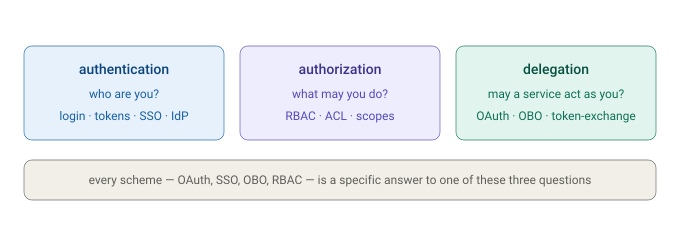
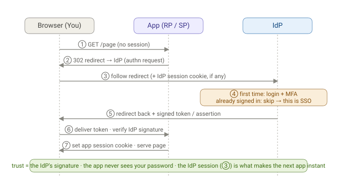
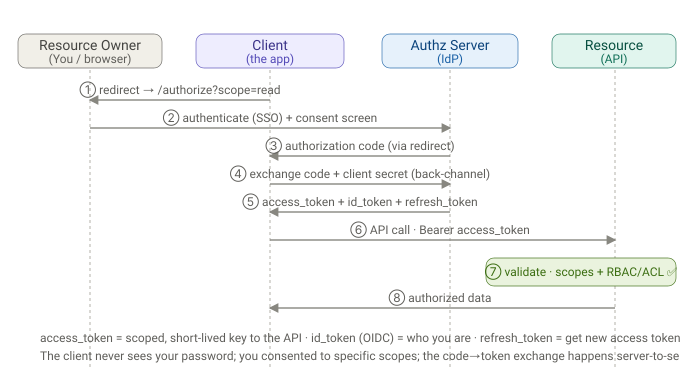
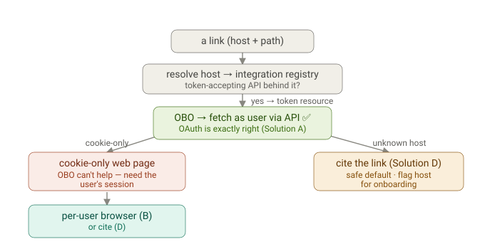
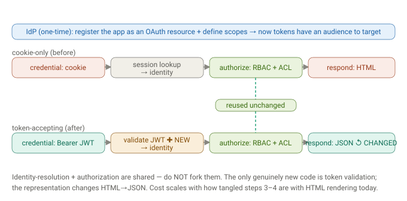
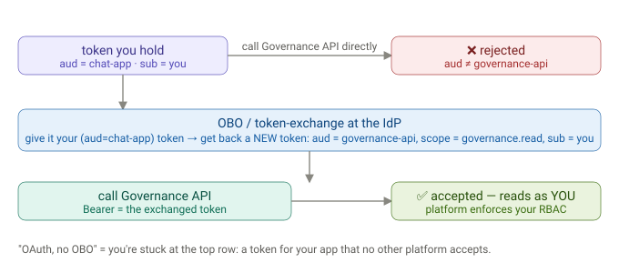

# Auth from first principles

## First principles

All of auth reduces to three questions: who are you (authentication), what may you do (authorization), and can a service act on your behalf without becoming you (delegation). OAuth, SSO, OBO, RBAC — each is a specific answer to one of these.



---

>> Q: Explain from first principles the foundation of auth - What is OAuth, What is SSO, What is IdP and all the other terminology involved. If needed, use flow diagrams to explain. From my knowledge, typically in an enterprise, there will be many internal websites with different services and articles to different resources, that are mentioned in the conversations in slack threads or in confluence articles, which are typically accessed using SSO, RBAC, and docs with Access Control Lists for specific docs.


Let me build this from the ground up — start with the one problem all auth exists to solve, then introduce each term exactly when the problem forces it into existence.

## The foundation: every request asks two questions

An internal website (a "resource server") receives a request and must decide, before responding:

1. **Authentication (authN) — *who are you?*** Proven with a **credential**.
2. **Authorization (authZ) — *what are you allowed to see?*** Decided by policy at the resource.

Everything below is machinery to answer those two safely, for thousands of users, across dozens of apps. Keep them separate in your head — most confusion comes from blurring them.

## Why we don't just use passwords everywhere (the problem that creates IdPs)

Simplest possible auth: each site stores your username + password. In an enterprise with 50 internal sites that's a disaster:
- 50 copies of your password → 50 breach targets.
- 50 logins to remember.
- Offboarding someone = disabling 50 accounts (miss one → hole).

**First principle → centralize identity in one trusted system.** That system is the **Identity Provider (IdP)** — Okta, Microsoft **Entra ID** (Azure AD), Ping, Google Workspace. It alone stores accounts, group memberships, and runs the actual password/MFA check. Every app *delegates* the "who are you?" question to the IdP instead of checking passwords itself.

The vocabulary that falls out immediately:
- **IdP (Identity Provider)** — the one system that authenticates users and vouches for their identity.
- **Relying Party (RP)** / **Service Provider (SP)** — an app that *trusts* the IdP's word instead of checking credentials itself. (RP is the OIDC term, SP is the SAML term — same idea.)
- **Credential** — the thing that proves who you are. Two kinds matter here: a **session cookie** (carried automatically by your browser) and a **bearer token** (attached explicitly to API calls). Hold that distinction — it's the whole reason "scrape vs API" behaved differently earlier.

## How does an app "trust the IdP's word"? A signed statement

After the IdP checks your password + MFA, it hands the app a **signed statement**: *"This is Alice, authenticated at 10:03, MFA satisfied."* Signed with the IdP's private key. The app verifies the signature with the IdP's public key → trusts it **without ever seeing your password**.

- In **SAML** that statement is an XML **assertion**.
- In **OIDC** it's a **JWT** (JSON Web Token).

**First principle: a cryptographic signature replaces a shared secret.** Trust is *federated* — the app trusts the IdP, not the user directly.

## SSO = the natural consequence of everyone trusting one IdP

If every app trusts the same IdP, then once you've authenticated to the IdP, the IdP can vouch for you to the *next* app without asking again. That's **Single Sign-On**: sign in once (to the IdP), reach many apps. The IdP keeps its own **session cookie** on its domain; when a new app bounces you to the IdP, it sees you're already signed in and issues the token instantly.

SSO isn't a protocol — **it's the *outcome* of federating authN to a shared IdP**. The protocols that implement it are **SAML 2.0** (older, XML) and **OIDC** (modern, JWT, built on OAuth). Here's the redirect dance:



That flow logs *you* into an *app*. But there's a **different** problem SSO doesn't solve: what if an app needs to call *another service's API on your behalf* — without you handing over your password? That's what OAuth is for.

OAuth (Open Authorization) is an industry-standard framework that allows users to grant third-party applications access to their data without sharing their passwords. It powers the familiar "Log in with Google" or "Continue with Facebook" buttons, allowing secure, controlled data sharing via encrypted tokens rather than direct credentials.

## OAuth vs OIDC — the single most-confused distinction

- **OAuth 2.0 = delegated *authorization*.** It lets you grant an app limited access to an API *as you*, by issuing it a scoped **access token** — the app never sees your credentials. OAuth by itself does **not** tell the app *who you are*; it just gives it a key to a door.
- **OIDC (OpenID Connect) = *authentication*, layered on top of OAuth.** It adds an **id_token** that says who you are. OIDC is what modern SSO uses.

One-liner to remember: **OAuth gets a token to *do* something; OIDC gets a token that *says who you are*.** OIDC = OAuth + identity.

Here's the canonical OAuth 2.0 **authorization-code** flow (how a service gets a token to call an API as you):

## The tokens, decoded

A **JWT** is three base64 parts: `header.payload.signature`. The payload is a set of **claims** — assertions the issuer signs:

```
{ "iss": "https://idp.acme.com",   // issuer (who minted it)
  "sub": "alice@acme.com",         // subject (who it's about)
  "aud": "governance-api",         // audience (who it's for)
  "exp": 1712345678,               // expiry
  "scope": "docs.read",            // what it may do
  "groups": ["Governance-Readers"] // claims used for authZ
}
```

- **access token** — bearer key to call an API; scoped (`scope`), short-lived. *A hotel key card that opens only certain doors, for a day.*
- **id token** — proves who you are to the app (OIDC). *Your ID badge.*
- **refresh token** — long-lived; trades for new access tokens so you don't re-login constantly.
- **scopes** — *what* the token may do (`drive.readonly`). Consented to at login.
- **claims** — facts inside the token (subject, groups, email) the resource uses to decide.

## Authorization: RBAC vs ACL vs ABAC (the "what may you see" half)

Once the resource knows it's Alice (from the token's `sub`/`groups`), it applies its **own** policy:

| Model | Permission attached to | Example | Granularity |
|---|---|---|---|
| **RBAC** (role-based) | **roles/groups** users hold | "Governance-Readers may read Governance docs" | coarse, scales well |
| **ACL** (access control list) | the **specific object** | "This doc is shared with Alice + Bob only" | fine, per-resource |
| **ABAC** (attribute-based) | **attributes/context** via policy | "Allow if dept=Finance AND on-corp-network AND business-hours" | most flexible |

Real enterprises use **RBAC for broad tiers + ACLs for per-document exceptions** (exactly your Confluence-doc-shared-with-specific-people case). The critical property: **authZ is enforced at the resource, per request, against your identity** — there is no central "who-can-see-what" table the resource outsources to. This is why, in the earlier discussion, an entitlements list wasn't enough: it holds *roles* (RBAC input) but not each doc's *ACL* — only the resource has that.

## Delegation across services: OBO / token exchange

One more piece for enterprise chains. When service A (holding your token) must call service B *as you*, it can't reuse A's token (wrong audience). It performs **On-Behalf-Of / token exchange** at the IdP: trade your token for a new one scoped to B, still `sub=you`. That's how identity **propagates** through a chain of services while RBAC stays yours at every hop.

## Session cookie vs bearer token — why it keeps mattering

| | Session cookie | Bearer token |
|---|---|---|
| Carried | **automatically** by the browser, per-domain | **explicitly**, in an `Authorization: Bearer` header |
| Used for | loading **web pages** (human browsing) | calling **APIs** (machine-to-machine) |
| Who attaches it | the browser | the calling code |

This single row explains the whole desktop-vs-service saga: a **browser** carries your **cookie** to any internal page automatically (so it reads everything you can); a **server** calling an **API** must be *handed a bearer token minted as you* — which is exactly what OAuth/OBO provide, and exactly what a cookie-only web page (no API) can't give it.

## Tying it to your enterprise scenario

Your Model / Feature / Governance platforms are each a **Resource Server + RP**. In practice:
- You open the platform (or click its link in a Slack thread / Confluence page) → the app has no session → **redirects you to the corporate IdP** (Diagram 1) → because you already have an IdP session, SSO logs you straight in → the app sets its **session cookie** → the page loads.
- What you can *see* on it = **RBAC** (your groups) **+ ACLs** (per-doc shares), enforced *by that platform*.
- A link in Slack/Confluence is just a URL; your **browser** carries your identity to whatever it points at, so "clicking around" honors your access everywhere with zero friction.
- Any *tool* acting for you must reproduce "carry Alice's identity to each resource" — via **delegated tokens** (OAuth/OBO, for platforms with APIs) or **your browser session** (for cookie-only web pages). That's the entire crux of the desktop-vs-service question.

## One-screen glossary

| Term | Plain meaning |
|---|---|
| **AuthN** | proving *who* you are |
| **AuthZ** | deciding *what* you may do |
| **IdP** | the one system that authenticates users & issues identity tokens |
| **RP / SP** | an app that trusts the IdP for login (OIDC / SAML naming) |
| **SSO** | sign in once to the IdP → reach many apps without re-login |
| **SAML** | older XML SSO protocol (assertions) |
| **OIDC** | modern SSO/authN protocol (JWT id_token), built on OAuth |
| **OAuth 2.0** | delegated *authorization* — give an app a scoped token to an API, no password sharing |
| **Access token** | bearer key to call an API (scoped, short-lived) |
| **ID token** | proves who you are to the app (OIDC) |
| **Refresh token** | long-lived; mints new access tokens |
| **JWT** | signed token format: `header.payload.signature`; payload = claims |
| **Claims / Scopes** | facts in the token / what the token may do |
| **Session cookie** | browser-carried credential for web pages |
| **OBO / token exchange** | swap a user's token for a downstream one, still as the user |
| **RBAC** | permissions via roles/groups |
| **ACL** | permissions on the specific object |
| **ABAC** | permissions via attribute/context policy |
| **Confused deputy** | a privileged service tricked into acting for an under-privileged caller → leak |

**The whole thing in one sentence:** you authenticate **once** to an **IdP** (SSO), which hands apps signed **tokens** proving who you are (**OIDC**) or letting them act for you (**OAuth**), and each **resource** independently decides what you may see using **RBAC + ACLs** against your identity — and any automation must carry *your* identity to each resource to stay both useful and safe.

Want me to go one level deeper on any single piece — e.g., PKCE (why public clients need it), how SAML differs mechanically from OIDC, or how token validation/JWKS signature-checking actually works?


>> Q: So, for a web Q&A application - OAuth/OBO is useless, if the link in the slack thread or confluence - is  a web page in an internal portal - for which all you know is the link at this point?


Half right — and the half you've got right is important, so let me sharpen exactly where OBO helps and where it genuinely can't, because the premise hides one conflation.

## The conflation: "it's a web page" vs "is there a token-accepting resource behind it"

A URL points at a *host*. What sits behind that host determines everything:

- **Pure cookie-only web app** (server-rendered page or SPA that only ever accepts a browser **session cookie**, no token-accepting endpoint). → **You're right: OBO is useless here.** You'd hold a bearer token, but the page has no lock that accepts a bearer token. A key for a lock that doesn't exist. You need the user's **session** (Solution B: per-user browser) or you **cite** it (Solution D).
- **Token-protected resource** (the page is an SPA rendering from `/api/...`, or the same URL returns JSON with `Accept: application/json`, and that API accepts IdP tokens). → **OBO is exactly the right tool** — mint a token with `aud = that portal's API`, call it *as the user*, get the content structured and RBAC-correct. Better than scraping ever was.

So the deciding question isn't "web page or not." It's **"is there a registered OAuth resource behind this host?"** — an *audience* question.

## And here's the thing about real enterprise portals

Most modern internal platforms (Model/Feature/Governance) are **SPAs backed by a token-protected API** registered with the same corporate IdP — precisely so that *services*, not just browsers, can integrate. That link `https://model-platform.acme.com/models/1234` almost always has a sibling `…/api/models/1234` that takes a bearer token. So "all I know is the link" is a **discovery** problem, not a dead end: you resolve the *host* → an integration, once, and reuse it forever.

## Given only a link, the actual decision

## So is OAuth/OBO useless?

- **For a *pure cookie-only* web page (no API): yes** — a bearer token has nothing to present to. That's the case you're pointing at, and you're correct. There you fall back to a per-user browser (B) or cite (D).
- **In general, and for most real internal portals: no** — because the thing behind the link usually *is* a token-accepting API, and then OBO fetches the content *as the user*, structured and RBAC-correct, with no browser at all. That's the primary path, not a fallback.

The reframe that dissolves the "useless" feeling:

**OBO was never a scraping mechanism. It's an *identity-propagation* mechanism for *token-accepting* resources.** Its job is "call an API as the user." Judge it on that:
- Resource speaks **tokens** → OBO is the best tool (better than scraping).
- Resource speaks **only cookies** → OBO is the *wrong* tool; the browser-session path is right.

They're **complementary halves**, not competitors. The layered design from before is exactly this split: **A (OBO)** covers the token half, **B (per-user browser)** covers the cookie half, **D (cite)** covers the tail and unknowns.

And "all you know is the link" isn't a permanent condition — it's a **host-classification** problem you solve once per portal: maintain a small `host → {OAuth resource + scope | cookie-only | cite}` registry, and every future link to that host is instantly routed. In a well-run enterprise the cookie-only, no-API set keeps shrinking (teams front portals with token-accepting API gateways precisely so services can integrate) — but it never hits zero (legacy wikis, dashboards), which is why B and D stay in the toolbox.

**Bottom line:** OBO isn't useless — it's the correct, primary tool *whenever there's a token-accepting resource behind the link*, which is the common case. It simply doesn't cover the pure-web-page case, and was never meant to; that's what the per-user browser (B) or cite-the-link (D) are for. The mistake is expecting one mechanism to cover both "call an API as you" and "render a cookie-gated page as you" — those are genuinely two different problems with two different tools.


>> Q: What does it take to move from a cookie-only web application to token accepting API?


From first principles, a request handler does four things: **(1) accept a credential → (2) resolve it to an identity → (3) authorize (RBAC/ACL) → (4) return a representation.** A cookie-only web app has fused *credential = cookie* and *representation = HTML*. "Accepting tokens" means generalizing steps 1 and 4 while **keeping 2 and 3 identical**. Here's the before/after:



## The concrete checklist

**IdP side (one-time, small):**
1. **Register the app as an OAuth resource / API** in the IdP (Entra/Okta): give it an identifier URI — that becomes the token **audience** (`aud`).
2. **Define scopes** (`models.read`, `docs.read`) and/or app roles, and decide which clients may request them (API permissions / admin consent). This is what lets OBO mint a token *for* this resource.

**App side (the actual work):**
3. **Add a bearer-token path** to your request handling: accept `Authorization: Bearer <jwt>` alongside (not instead of — keep both during transition) the cookie.
4. **Validate the token** — standard middleware: verify the **signature** against the IdP's public keys (**JWKS** endpoint), and check `iss` (issuer), `aud` (this API), `exp`/`nbf` (expiry), and required `scope`/roles. Libraries do ~all of this.
5. **Map token claims → the same internal principal** your session produced (`sub`, `groups`), so everything downstream is identical.
6. **Reuse the exact same authZ** (RBAC + per-object ACL) against that principal. This is the non-negotiable: *don't fork* authorization by auth method.
7. **Expose data as JSON** endpoints — return representations, not HTML pages.
8. **Handle the token-vs-cookie semantic differences:** scopes = least-privilege (a token can be read-only where a session was full-access); decide whether you accept **delegated** tokens (`sub`=user, for RBAC) and/or **app-only** tokens (service acting as itself); drop CSRF for the bearer path (no ambient credential), add **CORS** if browsers call it; short-lived tokens + refresh handled by the client.
9. **Ops:** audit by `sub` + client-id (who called, as whom), rate-limit per client.

## How big is this, really — it's a spectrum

The identity plumbing (steps 1–6) is *standard and small* — days of work with mature libraries. The cost is almost entirely in **step 7 + how coupled steps 3–4 already are to HTML**:

- **Already an SPA calling internal `/api/...` endpoints** → the API *exists*; you're adding token acceptance to endpoints that already return JSON. **Small — days.**
- **Has some API but session-only auth** → add the bearer path beside sessions, register the resource, share authZ. **Weeks.**
- **Monolithic server-rendered HTML, business logic tangled into templates, authZ interleaved with rendering** → you're effectively *extracting an API* and *untangling authZ from the view layer*. **This is a real project — weeks to months.** That's the whole cost, and it's why "just add an API" is trivial for some apps and a rewrite for others.

## Shortcuts that avoid a full rewrite

- **Expose a *minimal read-only* API** for just the resources the Q&A needs — not the whole app. You rarely need to tokenize everything; a handful of `GET` endpoints for readable content, sharing the existing authZ, gets you 90% of the value.
- **An API gateway / BFF in front** — *but with a caveat*: it only helps if it **propagates the user's identity** to the app. A gateway that terminates the token and then talks to the app with a shared/service session just reintroduces the confused-deputy leak. To be correct it must establish a per-user session downstream — which is essentially Solution B wearing a gateway costume, not a free lunch.

## The organizational reality

The team that **owns the portal** has to do this — you can't tokenize someone else's app from the outside. So in practice it's a *roadmap* item you request, not something a Q&A consumer can unilaterally ship. That's exactly why **cite-don't-fetch stays the pragmatic default** for portals you don't own, and why you onboard them to token access one at a time, highest-value first.

## Bottom line

Moving from cookie-only to token-accepting is mostly **one new piece (token validation) + one changed piece (return JSON) + strict reuse of identity and authorization.** The identity/OAuth wiring is boilerplate; the effort is proportional to **how entangled the app's data and authorization currently are with HTML rendering.** A modern SPA-plus-API is a few days; a legacy server-rendered monolith is an API-extraction project. And the decision of *whether* it's worth it is per-portal and owned by that portal's team — which is why a real system tokenizes the high-value sources over time and safely cites the rest.

>> Q: Is it safe to say, a prerequisite for moving this desktop app into web chat interface - converting all the internal portals into token accepting APIs - to meet the bar of - capability parity with desktop app ?

Almost — but I'd not sign off on it as worded, because it overstates in two specific ways. The instinct is right; the phrasing "convert **all** portals into **token APIs** as a **prerequisite** for parity" is too strong on both "all" and "token APIs as the only way." Let me tighten it.

## What "capability parity" actually requires

The desktop's differentiating capability is: *read any internal SSO+RBAC portal page — even ones only known by a link in Slack/Confluence — **as the asking user**, with their RBAC honored.* So parity means the web service can do the same. The essential requirement is **"act as the user against each linked portal."** Token APIs are *a way* to satisfy that, not the definition of it.

## Correction 1 — not "all," just the ones you must read

You only need parity for portals that (a) actually get referenced and (b) whose *content* (not just the link) has to feed answers. Portals never linked, or where **citing the link** is acceptable, need nothing. And it's **incremental** — you tokenize highest-value hosts first, not big-bang. "All internal portals" is a bigger set than parity requires.

## Correction 2 — token APIs are one path, not the only one

There are **two** ways to give the service "read as the user" for a portal:

| Path | Converts the portal? | Mechanism | Cost |
|---|---|---|---|
| **A. Token API + OBO** | yes (tokenize it) | delegated bearer token, `sub`=user | per-portal eng work; clean, scalable, safe |
| **B. Per-user hosted browser** | **no** | the user's own **cookie** session, server-side | zero portal changes; but service custodies live user sessions |

**Solution B is a direct counterexample to "conversion is a prerequisite"** — it reaches capability parity with **zero** portals converted, because it literally reproduces the desktop mechanism (a browser carrying the user's session) on the server. So strictly, token conversion is **sufficient per portal, not necessary.**

## …but here's where your instinct is right

Solution B's price is that the service becomes **custodian of every user's live session** — heavier and, security-wise, *worse* than the desktop (one server now holds everyone's sessions). Most enterprises won't accept that at scale. **So if you rule out B on security/ops grounds — which is reasonable — then token-accepting APIs (+OBO) become the *de facto* prerequisite** for reading those portals cleanly and safely. That's the defensible version of your claim: *conditioned on rejecting per-user session custody, token conversion is the only scalable, safe route to parity.*

## Two more precisions

- **Token API alone isn't sufficient either.** You also need OBO/token-exchange wired per platform, a `host → integration` registry, and the platforms must actually support **delegated** (user-context) tokens. Conversion is necessary-ish but not the whole job.
- **The rest of parity is cheap.** The desktop also scrapes arbitrary *public* pages — httpx covers that on the server with no browser. The only hard tail is exactly the internal SSO+RBAC portals.

## The accurate statement

> Capability parity requires that **for every internal portal the service must read as the user, there exists a per-user identity path — either a token-accepting API (OBO) or a per-user browser session.** Full token-API coverage is the **preferred end-state** (clean, scalable, avoids session custody), and if you reject per-user browsers it becomes the **effective** prerequisite — but it's **incremental and scoped to referenced portals, not a big-bang conversion of everything.**

## Practically

A Q&A web service **launches *below* parity** — token APIs where they already exist, **cite-don't-fetch** for the rest — and **climbs toward parity** as portals get tokenized over time. "All portals tokenized" is a legitimate **north star**, not a launch gate; gating launch on it would keep you from shipping the (large) value that's already reachable via existing APIs.

## Bottom line

Not safe as an absolute ("all portals, token APIs, prerequisite"). Safe as: **"for the portals we must read, we need a per-user identity path; token-accepting APIs are the path we should standardize on — especially since the only alternative (per-user session custody) is one most orgs won't run — but parity is reached portal-by-portal, and we ship below it and cite the tail in the meantime."**


>>Q: Keep it simple, from first principles

>> You have a web based Q&A application, which, when asked a question might search/access articles in  - lets say Confluence, Slack, Pulse Portal, Governance Platform, Model Platform, OnePipeline platform and many others for documentation . What changes are needed to enable OBO for each

A: Simple version. **OBO = your Q&A app carries the *asking user's* identity to a platform, so the platform shows only what that user is allowed to see.** For that to work, the same **three things** must be true for **each** platform — that's the whole story:

1. **The platform speaks tokens** — it's registered in your IdP as an API with a read scope (e.g. `pulse.read`), and it validates incoming bearer tokens.
2. **The IdP trusts your app to bring the user** — your Q&A app is granted that platform's scope, and an admin consents ("this app may read Pulse *on behalf of* users").
3. **Your app does the handoff at query time** — it exchanges the user's login token for a per-platform token and calls that platform's API.

Do #1–#3 once per platform. The only thing that varies is how much work **#1** is.

## Split it into "once" vs "per platform"

**Once, for your whole app (not per platform):**
- Register the Q&A app in the IdP as a client (client id + secret).
- Expose an `access_as_user` scope so the browser hands your app a *user* token — that's the token you'll exchange.

**Per platform (repeat for each):**
- **IdP:** register the platform as a resource + define a `*.read` scope → grant your app that scope → admin consent.
- **Platform:** it must accept & validate IdP tokens (the platform team's job if it doesn't yet).
- **Your app:** add the platform to config (API base + scope) and call the generic exchange → call code with that scope.

The runtime code is the **same** every time; only the IdP registration/consent and the platform's token-acceptance are new each time.

## For your specific platforms

| Platform | Already a token API? | What it takes |
|---|---|---|
| **Confluence, Slack** | Yes (SaaS OAuth APIs) | Config only: register, request their scopes, consent, wire their OAuth. |
| **Pulse / Governance / Model / OnePipeline** (internal) | *Maybe* | If it already accepts IdP tokens → same config-only path. If it's **cookie-only** → the owning team must first make it token-accepting (add bearer validation + a read API), *then* the config path. |

## The one blocker to call out

**OBO cannot target a cookie-only platform.** If Governance/Model/etc. only accept a browser session and expose no token-accepting API, there's nothing for the exchanged token to hit — you must **tokenize it first** (that platform team's work) or fall back to **citing the link** for that one.

**So, in one line:** enabling OBO per platform = *(register it in the IdP + grant your app its scope + consent)* — plus, for any internal platform that isn't already a token API, *(that team makes it accept tokens first)*. Your app's own code stays the same; you're really just onboarding one platform at a time.


**Q: "You also need OBO/token-exchange wired per platform" - what does it take enable this? what does it mean to just have OAuth but not OBO?**

The confusion is exactly the right thing to poke at, because it's the crux of the whole "OAuth vs OBO" distinction. Let me nail it.

## Why "having OAuth" isn't enough: a token is cut for one lock

When the user logs into your chat service via OAuth/OIDC, you receive **a token — but that token's `aud` (audience) is *your app*.** It says "this is Alice, and this token is for the chat service." That's the *only* thing it's valid for.

Now you want to call the Governance Platform API. That API validates incoming tokens and checks `aud == governance-api`. Your token says `aud = chat-app`. **Rejected — wrong audience.** By design: a token minted for one resource is not a skeleton key for others.

So **"OAuth but not OBO"** means: you can log users in, and you can call APIs your app is *directly* granted — but you **cannot take the user's identity and carry it onward to a different platform.** You hold a key to your own front door, not to theirs. Your only bad options without OBO are: don't call the other platform, or call it with the *service's* own identity (the leak).

**OBO (On-Behalf-Of) / token exchange** is the bridge: hand the user's token to the IdP and get back a **new** token — `aud = governance-api`, right scope, and crucially **still `sub = Alice`.** Now you call Governance *as Alice*.




## What it takes to wire OBO — per platform

The **runtime code is generic** (one exchange call, you just vary the requested scope). The **setup is per-platform**, because audiences and permission-grants are per (client, resource) pair. For each downstream platform (Governance, Feature, Model…):

1. **The platform is a registered OAuth resource** with an audience + scopes (`governance.read`). This is the "token-accepting API" step from before — **OBO has nothing to mint a token *for* until this exists.** (So OBO presupposes conversion.)
2. **Your chat service is registered as a confidential client** (client id + secret/cert) that's allowed to perform the exchange grant.
3. **Grant your chat app delegated permission to that platform's scopes.** In Entra: add the Governance API's delegated scope to the chat app's "API permissions." In Okta: an OAuth-service/token-exchange policy allowing that client→resource exchange. **Without this grant, the IdP refuses the exchange.**
4. **Consent** — an admin (or the user) consents to "chat app may access Governance on your behalf." Conditional-access policies (MFA, device) on the resource must be satisfiable in the OBO context.
5. **Expose your chat app's own API scope** (the classic `access_as_user`) so your front-end obtains a *user-context* token for the chat app — that's the token you feed into the exchange. (You can't exchange a token you don't hold in the right form.)
6. **Implement + cache the exchange at runtime:** call the IdP token endpoint with `grant_type = urn:ietf:params:oauth:grant-type:jwt-bearer` (Entra OBO) or `…:token-exchange` (RFC 8693), pass the user token, request the platform's scope, get back the new token; cache it (short-lived), refresh as needed.

**Why "per platform" and not once:** steps 1, 3, and 4 are keyed to the *specific* audience. Adding Feature Platform = a new resource registration, a new API-permission grant on your chat app for `feature.read`, and new consent. Step 6's code is the same; the IdP config and consent are new each time. That's the "wiring per platform."

## The analogy that makes it stick

- **OAuth login** = you get a **visitor badge for Building A** (the chat app).
- **Governance Platform** = **Building B**, with its own badge readers.
- Your Building-A badge **won't open Building B** (wrong building = wrong `aud`). ← *this is "OAuth but no OBO."*
- **OBO** = Building A's front desk, seeing your valid A-badge, is **pre-authorized to issue you a Building-B badge in *your* name** and does so. Now you enter B **as yourself**.
- The **wiring per platform** = someone had to set up the *agreement* between A's front desk and each building ("A may issue badges to B, for these areas"), building by building. No agreement with Building C? A can't get you into C — even though you're standing right there with a valid A-badge.
- The **wrong shortcut** = the front desk using its own **master key** to walk into B for you — that opens B as "the app," not as you. Leak.

## Tie-back

So the chain for reading a portal *as the user* on the service is: **(1) the portal is a token-accepting API → (2) OBO is wired so your app may mint a user-token for it → (3) you exchange and call.** "Having OAuth" only gets the user *into your app*. OBO is the separate, per-platform arrangement that lets your app carry that user's identity *outward* to each other platform — and it's exactly the piece that makes "act as the user across the enterprise" real rather than theoretical.


>>Q: how do **cookie** and **bearer** token differ from one another, **why can't we just use one**, explain from first principles?

From first principles. Both exist to solve the **same** problem, but for **different callers** — and that's why you can't collapse them into one.

## The root problem

HTTP is **stateless** — the server forgets you the instant a request ends. So after you log in, *every* following request has to carry proof that it's still you. Cookies and bearer tokens are two ways to carry that proof. The design splits on two questions:

1. **Who attaches the proof to each request** — the browser automatically, or the calling code deliberately?
2. **Is the proof a *reference* or *self-contained*** — a ticket the server must look up, or a signed statement the receiver can verify on its own?

## Cookie — built for a human browsing pages

- The server sets it (`Set-Cookie`); the **browser stores it per-domain and re-attaches it automatically to every request to that domain.** The page/human does nothing — it's an **ambient** credential.
- Usually it's a **reference** — an opaque session id. The real "who you are" sits in a session store on the server; the cookie is just the claim ticket.
- **Why this shape:** a browser roams many sites and loads pages by *navigation* (clicking links, loading images). You can't ask a human or a plain page-load to hand-attach a credential — so the browser must do it silently. Cookies are that silent mechanism.
- **The costs of "automatic":** because the browser sends it on *any* request to that domain — even ones triggered by a malicious site — cookies enable **CSRF** (hence SameSite/CSRF tokens). And validating a reference means the receiver needs the session store.
- **A safety win:** a cookie can be **HttpOnly** — invisible to JavaScript — so page scripts (and XSS) can't read it.

## Bearer token — built for code calling an API

- The caller **explicitly puts it in the `Authorization: Bearer <token>` header** on each call it *chooses* to make. Nothing attaches it automatically — it's **deliberate**.
- Usually **self-contained** (a JWT): claims + **scope** + **audience** + expiry + signature. The receiver verifies the signature and reads it **without calling home** — no session store.
- **Why this shape:** an API caller is *code* making deliberate calls, often to *other services*. Code can attach headers, and you want a credential that's **portable across independent services** (any party trusting the signer accepts it) and **scoped** (only this API, only read, only 10 minutes).
- **The costs:** "bearer" = *whoever holds it can use it* (like cash) → theft risk, mitigated by short lifetimes + HTTPS. And if you store it where JS can reach it (localStorage), **XSS** can steal it.

## Why not just use one — it fails in *both* directions

**Cookies for everything (incl. cross-service APIs)?** ❌
- Service-to-service calls have **no browser, no cookie jar** — nothing auto-attaches a cookie.
- Cookies are **domain-bound** and usually **references** → Service B can't validate Service A's session cookie without a **shared session store**, which doesn't scale across independent teams/orgs.
- No natural **scope/audience** — a session cookie is all-or-nothing for that app; you can't say "read-only, Governance only, 10 min."

**Bearer tokens for everything (incl. web pages)?** ❌
- A normal **page load / link click has nowhere to put a header** — only JS `fetch`/XHR can. Plain navigation *needs* the browser's automatic mechanism, i.e. the cookie.
- To use tokens in the browser you must store them where **JS can read them** → exposed to **XSS**. A **HttpOnly cookie is safer** for a browser session.

## The clean mapping

| | Cookie | Bearer token |
|---|---|---|
| Attached by | the **browser**, automatically | the **caller's code**, explicitly |
| Scope | a **domain** | an **audience + scope** |
| Content | usually a **reference** (session id) | usually **self-contained** (JWT) |
| Receiver validates by | **looking it up** (session store) | **verifying a signature** (no lookup) |
| Built for | a **human browsing pages** | **code calling APIs** (incl. across services) |
| Main risk | CSRF (auto-send) | theft (holder-usable) / XSS if JS-readable |

**The analogy:** a session cookie is a **coat-check ticket** — meaningless by itself, only the counter that issued it can redeem it. A bearer JWT is a **signed banknote / letter of introduction** — self-contained, and *anyone who trusts the signer* accepts it without phoning home. One is for redeeming at a single counter; the other is for spending anywhere trust reaches.

## The one-line why

They're optimized for **two different callers**: the **browser navigating pages** (needs an ambient, auto-attached credential → cookie) and **code calling APIs across services** (needs an explicit, scoped, self-validating, portable credential → bearer). Neither can do the other's job cleanly — which is *exactly* why "scrape a web page as the user" (cookie world) and "call an API as the user" (bearer world) stayed two separate problems all through this discussion.
