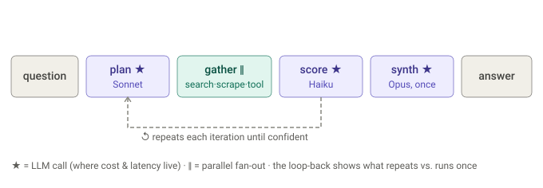

# Dossier call tree — question → answer

Full top‑down call tree, from CLI invocation to returned answer. Annotations:
🧠 LLM · 🔌 source API · 🌐 dictionary HTTP · 🖥️ browser · 🧰 MCP tool · 💾 cache · ⇉ parallel `asyncio.gather` · 🔁 loop · `[opt]` only when an MCP server is configured.

## First principles

A call tree is just the loop unrolled. Reading it well means spotting three things: which leaves call the model (that is where cost and latency live), which fan out in parallel, and which repeat every iteration versus run once.



With that lens, the full tree below reads as one loop with a handful of expensive LLM leaves.

```
dossier ask "<question>"
│
└─ cli/main.py :: ask()                         # Typer command
   └─ _ask(question, headless, max_iterations, max_cost_usd)
      ├─ configure_logging()
      ├─ CacheStore()                           # 💾 opens response/search/lookup/scrape
      ├─ EventEmitter(run_id, log_path)         # JSONL run log
      ├─ DomainGate.load(domains.json, seed)    # scrape allow/deny
      ├─ DictionaryClient()
      ├─ _build_tool_provider(cache)            # [opt] DOSSIER_MCP_TESTING_URL set
      │  ├─ RemoteMCPClient(url, token).connect()          # 🧰 mcp SDK
      │  └─ MCPToolProvider({...}, cache)
      ├─ BrowserSession(...).__aenter__()       # 🖥️ persistent Playwright context
      │  ├─ WebFetcher(session, cache, emitter)
      │  ├─ _build_registry(cache, session)     # registers 6 sources (lazy-auth)
      │  └─ ClaudeClient(cache, emitter)
      │
      └─ engine/orchestrator/loop.py :: run(question, registry, fetcher, llm, emitter, gate, dictionary, tool_provider, …)
         │
         ├─ emit "run_start"
         │
         ├─ enrich_acronyms(state, dictionary, emitter)              # PRE-LOOP  (no LLM)
         │  ├─ extract_acronyms(question)                            # regex
         │  └─ for each new acronym:  dictionary.define(a)           # 🌐 GET allacronyms/…
         │        └─ _definitions_from_response → state.dictionary[…] , dictionary_checked.add
         │
         ├─🔁 while iteration < max_iterations:                      # ← the plan/execute/score loop
         │   │   emit "iteration_start"
         │   │
         │   ├─ _plan(state, registry, llm, emitter, cost, cutoff, iteration, max_iterations, plan_config, tool_provider)
         │   │   ├─ tool_provider.list_tools()                       # [opt] 🧰 aggregate MCP catalog
         │   │   ├─ select_tools_semantic(question, catalog, llm, cost, emitter)   # [opt] only if catalog > K
         │   │   │   ├─ (len ≤ K)  → return whole catalog            # no LLM call
         │   │   │   ├─ render_prompt("select_tools.j2", tools, k)
         │   │   │   ├─🧠 llm.generate(model=ROUTE_MODEL[Haiku], request_type="route")   #💾 + cost.record
         │   │   │   ├─ extract_json → [tool names]  → map back to ToolSpec (drop unknowns)
         │   │   │   └─ on error / empty → select_tools(...)         # lexical FALLBACK; emit "tool_route_fallback"
         │   │   ├─ state.evidence_summary()                         # digest of prior batches/scrapes/lookups + top scored
         │   │   ├─ registry.sources_prompt_block()                  # GUIDANCE.md per source
         │   │   ├─ render_prompt("orchestrate.j2", tools=selected, **plan_prompt_context(plan_config))
         │   │   └─ _generate_validated(OrchestrationResponse, …)
         │   │       ├─🧠 llm.generate(model=PLAN_MODEL[Sonnet], request_type="plan")
         │   │       │     ├─💾 response_cache.get(key=sha256(model\nsys\nuser))  → hit? return
         │   │       │     └─ AsyncAnthropic.messages.create(...) ; response_cache.set ; cost.record
         │   │       └─ extract_json → OrchestrationResponse.model_validate   # thinking, confidence(4-dim), actions
         │   │             └─ on JSON/validation error → reprompt once (deterministic), then raise
         │   │   ▸ returns plan;  confidence = plan.confidence.composite
         │   │
         │   ├─ if confidence ≥ cutoff → terminated="confidence_reached"; break      ┐
         │   ├─ if cost.exceeded()     → terminated="cost_budget_exceeded"; break    ├ exit guards
         │   ├─ if no actions          → terminated="no_actions_proposed"; break     ┘
         │   │
         │   └─ execute_actions(state, plan.actions, registry, fetcher, llm, emitter, cost, gate, dictionary, tool_provider)
         │      │
         │      ├─ _run_actions(...)                                  # PHASE 1  (no scoring LLM)
         │      │   ├─ resolve scrape URLs serially:
         │      │   │     should_skip_url(url, already_scraped)  +  gate.check(host)   # may prompt y/N → ErrAborted
         │      │   └─⇉ asyncio.gather(
         │      │         ├─ do_search(source, query)  →  registry.search()           # 🔌 + 💾 search_cache
         │      │         │        └─ source.search() → [Result]  → state.batches.append(SearchBatch)
         │      │         ├─ do_scrape(url)            →  fetcher.fetch()             # 🖥️ (httpx fallback) + 💾 scrape_cache
         │      │         │        └─ state.scrapes.append(ScrapeResult)
         │      │         ├─ do_lookup(term)           →  registry.lookup()           # 🔌 + 💾 lookup_cache
         │      │         │        └─ source.lookup() → Result → state.lookups (dedup by id)
         │      │         └─ do_tool_call(tc) [:MAX_TOOL_CALLS]  →  tool_provider.call_tool(name, args)   # [opt] 🧰 + 💾
         │      │                  └─ [ToolContent] → state.batches.append(SearchBatch source="tool:<name>")
         │      │      )
         │      │
         │      ├─ enrich_acronyms(state, dictionary, emitter)        # re-run on NEW result text  (🌐, idempotent)
         │      │
         │      └─ _score_new_evidence(state, llm, emitter, cost)     # PHASE 2
         │          └─⇉ asyncio.gather(
         │                ├─ score_batch(b) for b in state.batches       # incl. tool:<name> batches; skips fully-scored
         │                │     ├─ unscored = [r not in scored_results]   # → returns early if none
         │                │     ├─ render_prompt("score.j2", …)
         │                │     ├─🧠 llm.generate(SCORE_MODEL[Haiku], "score")   #💾 + cost.record
         │                │     └─ parse → ScoreResult per result → state.scored_results[id]
         │                └─ restitch_scrape(s) for s in state.scrapes    # skips already-restitched
         │                      ├─ render_prompt("restitch.j2", …)
         │                      ├─🧠 llm.generate(RESTITCH_MODEL[Haiku], "restitch")  #💾 + cost.record
         │                      └─ RestitchResult → state.scored_scrapes[url]
         │             )
         │          ▸ emit "iteration_complete"; iteration++ ─────────────► back to 🔁
         │
         ├─ _synthesize(state, llm, emitter, cost, score_threshold, min_guarantee, char_budget)   # AFTER loop, runs ONCE
         │   ├─ select_evidence(state, …)                            # deterministic pick
         │   │     └─ sort(-score, source, id) → min_guarantee / threshold / char_budget
         │   ├─ render_prompt("synthesize.j2", question, evidence[…])
         │   └─ _generate_validated(SynthesisResponse, …)
         │       ├─🧠 llm.generate(SYNTHESIS_MODEL[Opus], "synthesize")   #💾 + cost.record
         │       └─ extract_json → SynthesisResponse.model_validate      # answer + citations
         │   ▸ linkify_citations(answer, permalinks) + render_sources_footer(...)   # deterministic post-process
         │
         ├─ emit "run_end"
         └─ return RunResult(answer, citations, iterations, final_confidence, terminated_reason, cost_usd)
      │
      └─ finally: tool_provider.aclose() ; fetcher.aclose() ; dictionary.aclose() ; emitter.close() ; cache.close()

   ▸ _print_result(result)   # rich Markdown answer + iterations/confidence/reason/cost
```

## How to read it

- **Three vertical layers do the work:** `run` (the 🔁 loop + termination policy) → `_plan` / `execute_actions` / `_synthesize` (the stages) → the leaf calls (LLM / source / browser / MCP tool / dictionary / cache).
- **Five 🧠 LLM call sites, three tiers:** `route` (Haiku, 1×/iteration, `[opt]`), `_plan` (Sonnet, 1×/iteration), `score_batch` + `restitch_scrape` (Haiku, N×/iteration under one `gather`), and `_synthesize` (Opus, 1× at the end). Everything else — searches, scrapes, lookups, tool calls, acronym enrichment — is I/O, not model calls.
- **Routing is serial, before both fan-outs:** `select_tools_semantic` runs inside `_plan`, so it narrows the MCP catalog to the top‑K *before* the plan prompt is built. It short-circuits (no LLM call) when the catalog already fits within K, and degrades to the lexical `select_tools` on any failure — tool selection never vanishes.
- **Two `⇉ gather` fan‑out points per iteration:** Phase 1 (searches + scrapes + lookups + tool_calls concurrently) and Phase 2 (scoring + restitch concurrently). Phase 1 fully completes before Phase 2 begins, because scoring reads what Phase 1 gathered. Tool results land as ordinary `SearchBatch`es, so they get scored by the same `score_batch` path as text sources.
- **`_plan` is both "plan" and "assess":** confidence is judged at the *top* of every iteration against the evidence from the previous one — which is why the loop can exit before ever running an execute phase (the confidence guard precedes `execute_actions`).
- **Every leaf is cache‑guarded** (💾): the response cache makes re‑runs free/deterministic (routing included — its prompt keys off the question alone); search/lookup/scrape/tool caches are TTL'd. A cache hit prunes the subtree beneath it (no API/LLM call).
- **Two clean exit ramps out of the loop body:** the confidence/cost/empty‑plan guards (`break` → straight to `_synthesize`), and `ErrAborted` from the domain gate (user declines a scrape → synthesize from what's gathered).
