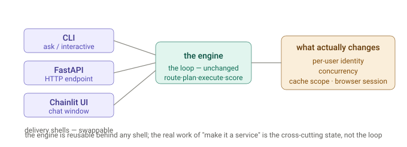

# CLI to microservice

## First principles

The engine (the loop that computes an answer) is separate from delivery (how a request reaches it — CLI, HTTP, UI). Wrapping the CLI as a service swaps the delivery shell but leaves the engine untouched; what actually changes is the cross-cutting state: identity, concurrency, and cache scope.



---

## Wht can't we leverage Entitlements recorded in Identity Platform to build this solution?

Short version: **you *can* use the entitlements platform, but only for what it's actually for — proving who the user is and what claims they carry. It can't stand in for the resource's own access check, for two reasons that compound.**

### Reason 1: knowing the entitlement isn't the same as holding the key

The entitlements store says *"Alice is in Governance-Readers."* That's a **fact about authorization** — it is not a **credential**. The Governance Platform doesn't accept "the identity platform vouches that Alice is allowed"; it demands a token/session presented *as Alice*. So even with perfect entitlement knowledge, the service still can't *fetch* the page as Alice. You'd have to fetch with the **service's** access — which is the leak again.

Deciding "Alice may see it" and *retrieving it as Alice* are two different problems. Entitlements only touch the first. You still need delegation (a per-user token) to do the second.

### Reason 2: coarse entitlements ≠ the resource's real access rule

This is the deeper one. The identity platform holds **roles/groups/entitlements** — a *coarse projection*. The actual authorization on a specific document is usually **finer** and lives *at the resource*:

- per-page ACLs ("restricted to these 4 people")
- individual shares ("shared with Alice specifically," not via any group)
- inheritance, ownership, deny rules, time-bounded or context/attribute rules (ABAC)

**Attribute-Based Access Control (ABAC)** is an authorization model that grants or denies access to resources by evaluating dynamic rules against the characteristics (attributes) of the user, the resource, and the environment. It provides highly granular security, making it easier to scale permissions without managing endless lists of individual users


* **Subject Attributes (User)**: Characteristics of the user making the request (e.g., job title, department, security clearance level, or project team).
* **Resource Attributes (Object)**: Properties of the data or object being requested (e.g., file classification, creation date, project status, or associated tags).
* **Action Attributes**: The specific operation being attempted (e.g., read, write, edit, delete).
* **Environment Attributes**: Contextual conditions surrounding the request (e.g., current time of day, location, IP address, or security threat level).


"Alice ∈ Governance-Readers" is **necessary but not sufficient** — a given Governance page might be restricted *below* that group. The entitlements store doesn't know the page↔rule binding; only the platform does. So if your service adjudicates from entitlements, it will be **wrong in both directions**: leak pages restricted below the group, and falsely deny pages shared to Alice directly.

To do it right from entitlements, you'd have to **mirror every platform's full ACL model inside your Q&A service** and keep it perfectly in sync — a distributed, always-stale copy of authorization logic. That's the thing you must never build: one drift or bug = a breach, in the system *least* equipped to own that decision.

### The LLM twist that makes "fetch broadly, filter later" especially unsafe

Even if you fetched with service access and *then* filtered by entitlement before showing Alice — for an LLM pipeline that's already too late. The unauthorized content has entered the **model's context**. The model can leak it indirectly — a summary, an inference, "based on related docs…" — even if you never display the raw page. **Least privilege has to happen at *fetch* time, not *display* time.** So the only safe design is: never retrieve what the user isn't entitled to in the first place — which means fetching *as the user*.

### So what *is* the identity platform's correct job here

Exactly the standard one:

1. **Authenticate** the user (SSO) → establish who's asking.
2. **Issue a token with claims/scopes** for that user.
3. The service uses **delegation (OBO/token exchange)** to turn it into a per-user token for each downstream platform.
4. Each **resource enforces its own full policy** against that token — groups *and* per-object ACLs *and* context.

The entitlements platform is the **authority that mints identity**, consumed *at the resource*. It is not a **gatekeeper the service queries to self-adjudicate.** Push the decision to whoever owns the data; carry the user's identity there; don't re-decide in the middle.

### The one-line correction to the fundamentals

- ✅ Use the identity platform to **know who the user is and mint a token as them.**
- ❌ Don't use it to **decide, in your service, what they can see** — because (a) knowing ≠ a credential to fetch, (b) its entitlements are coarser than the resource's real ACLs, and (c) for an LLM, anything you fetch has already contaminated the context.

Your desktop tool never had to think about any of this because it *was* Alice — her session hit each resource, and each resource applied its own full rule. The service's whole task is to reproduce that **"the resource sees the actual asker"** property via delegated tokens — not to reconstruct the resources' authorization from an entitlements list, which is both insufficient (coarse) and unsafe (you become the enforcement point).


## Three things the "just use AD" idea quietly merges

1. **Identity** — who someone is, what groups they're in. AD/Entra has this.
2. **Credential** — a *token/session a downstream system will accept*. AD knowing "Alice ∈ Governance-Readers" is **not** a credential the Governance Platform will honor. You still need a token minted *as Alice, for that platform*.
3. **Enforcement point** — RBAC is decided **at each resource, per caller, at request time**. There's no central vault where "the service holds everyone's access and doles out slices." The resource checks the identity *presented to it*.

The gap is between (1) and (2): **knowing the user's identity is not the same as holding a credential to act as them.** Bridging that is the entire problem.

### The mechanism you're reaching for has a name: delegation (OBO)

This is the part where your instinct pays off. Modern IdPs (Entra ID / Azure AD, Okta) support **On-Behalf-Of / token exchange**:

- The user signs into the Q&A service (SSO).
- The service takes the user's token and **exchanges it at the IdP** for a *downstream* token scoped to the target platform — *still as the user*.
- The service calls the platform with that token; the platform sees **Alice** and enforces **Alice's** RBAC.

No leak is possible, because you never substituted the service's identity — you **propagated the user's**. That *is* "leveraging AD," done correctly. Notice what it does: it pushes the authorization decision back to each platform instead of the service trying to make it.

### The catch that scraping specifically runs into

OBO hands you a **bearer token for an API**. Scraping a web UI needs a **browser cookie/session**, not a bearer token. So:

- If a platform is a **token-addressable API** → OBO works beautifully, and you wouldn't *scrape* it at all — you'd add it as a proper Dossier *source* and call it as the user. Cleaner than scraping ever was.
- If a platform is **only a human web UI behind SSO, with no API** → OBO can't target it. To read it *as the user* you're back to driving an **authenticated browser carrying that user's session** — the per-user hosted browser. AD doesn't make cookie-scraping RBAC-correct; it only helps where an API/OAuth audience exists.

So AD closes the gap exactly where there's an API, and not where there's only a login page.

### The trap to avoid: "give the service broad access and let it filter by AD groups"

Tempting, and wrong. To filter correctly you'd have to **re-implement every platform's authorization logic inside your service** — mirror each platform's RBAC rules, keep the group mappings perfectly in sync, per resource, forever. That mirror is always slightly stale, and *one* mismatch = a leak. The whole point of delegation is you **don't** reimplement authZ — you present the user's identity and let the resource decide, which it already knows how to do perfectly.

### Bottom line — the fundamentals, corrected

- You're right that identity federation (AD/Entra) is the answer — but the object is the **user's** identity, *propagated*, never the **service's**, *substituted*.
- "AD knows what the service controls" is real, but it's the service's authority, useful only for resources the service legitimately owns for everyone — not as a proxy for user-scoped content.
- **Identity ≠ credential ≠ enforcement.** AD gives identity; **delegation/OBO** turns it into a per-user credential; the **resource** enforces. Miss the middle step and you either leak (use service access) or fail (present no usable credential).
- Delegation solves the **API** case (and there you stop scraping — you add a source). The **web-UI-only** case still needs a **per-user authenticated browser**; that's the irreducible bit AD can't wave away.

The neat way to see it: your desktop tool already does perfect identity propagation — it literally *is* you, so every resource sees you and applies your RBAC for free. The service's whole job is to **reconstruct that "the resource sees the actual asker" property** for many users at once. Entra/OBO reconstructs it for APIs; a per-user browser reconstructs it for cookie-only web pages. What you can't do — the one thing that feels like a shortcut but is the actual bug — is let the *service's* identity stand in for the *user's*.


>> **Q: Suppose I want it to read several other platform docs (e.g. For Enterprise Model Platform, Enterprise Feature Platform, Enterprise Governance Platform and several others) pages which are auth walled by SSO( and you get access based on your RBAC), if they are linked in a Confluence/Slack conversations, those can't be scraped anymore, if it is a webservice?**

Short answer to your literal question: **a naive web service — yes, those SSO-walled platform links go dark.** An anonymous HTTP client hits the SSO redirect and gets a login page, not the Governance Platform doc. On desktop your browser is logged in *as you, with your RBAC*, so it reads exactly what you're cleared to read. That capability doesn't survive the move by default.

But the important thing is *why* it doesn't survive — because the real problem isn't "can a browser run on the server," it's **whose identity is doing the reading.** And once you see that, you realize it's bigger than scraping.

### The desktop version is safe *because* it's single-user

On your laptop, the only person who ever sees an RBAC-gated Governance page is **you** — the person whose RBAC unlocked it. The tool acts as one identity (yours), so "what it can read" and "who's allowed to see the answer" are the *same person*. That's why it's both powerful and safe.

### On a service, that coupling breaks — and the tempting fix is a security bug

The obvious move is "give the server a headless browser logged into a **service account**." Watch what happens:

- User A (in the Model Platform team, *not* cleared for Governance) asks a question.
- A Slack thread links a Governance Platform page.
- The service-account browser *can* see it (it's broadly privileged), scrapes it, and puts it in A's answer.
- **You just leaked RBAC-gated content to someone not authorized for it.**

That's the classic *confused deputy* problem. A shared browser/service-account isn't a smaller version of the desktop capability — it's a **hole in your access-control model.** So "you can't just scrape it on a service" is partly a *feature*: it stops you from accidentally building a data-leak machine.

And note this same trap applies to the **API sources too** (Confluence/Jira via one service token would over-share the same way). The moment you go multi-user, *per-user authorization of every piece of retrieved evidence* becomes the central design problem — browser or not.

### The real ways to keep those pages, ranked

To read RBAC-gated platforms on a service *correctly*, the service must act **as the asking user**, not as itself:

1. **Delegated per-user auth (best, if the platforms have APIs/OAuth).** User signs into the service via SSO; the service does an OAuth on-behalf-of / token-exchange to get a *per-user* token for each platform, and fetches as that user. RBAC is enforced by the platform itself — no leak possible. This is the enterprise-correct pattern. Cost: each platform needs an API/OAuth endpoint and you wire up token exchange. (Ideally you'd add these platforms as first-class Dossier *sources*, like Slack, and skip scraping entirely.)
2. **Per-user authenticated browser (general, heavy).** The service runs a browser session *keyed to each logged-in user*, carrying *their* SSO session — essentially "Dossier desktop, hosted, one context per user." Preserves arbitrary auth-walled scraping with correct RBAC, but you're now custodian of users' live sessions (real security/ops burden) and it's memory-heavy (a browser per active user).
3. **Cite, don't scrape (safe, degraded).** If you can't get per-user identity for a platform, the safe behavior is: **don't fetch it — surface the link with a note** ("relevant: <Governance Platform page> — behind SSO, open it yourself"). Dossier already has a "linkify sources" step, so this fits naturally. The answer is less complete, but it leaks nothing and stays honest.

### Bottom line

- Naive service: correct, those links can't be scraped.
- The reason is **identity/RBAC**, and it applies to *all* retrieval on a multi-user service, not just scraping.
- The "obvious" shared-browser fix is a **cross-user leak**, so avoid it.
- To truly keep those pages: make the service act **as the user** — delegated OAuth per platform (cleanest) or a per-user hosted browser (heaviest). Otherwise, **cite the link and let the user open it** — safe and honest.

So it's not that the service is inferior — it's that the service is *forced to solve the identity problem the desktop got to ignore*. On your laptop, "read as me" is free. On a service, "read as the right person, for each person" is the whole ballgame — and doing it properly is what separates a real enterprise service from a data-leak waiting to happen.


>> Q:  If I have to host it as a webservice, can you reuse this tool and wrap a FastAPI - with no changes to the tool ?


Great question — and the answer hinges on how the engine was built, so let me verify the injection seams rather than assert them.

Confirmed the seams — and they're exactly what makes this clean. Three facts decide it:

1. `orchestrator_loop.run()` is a **plain dependency-injected async function** returning a `RunResult` dataclass — zero CLI/stdin/stdout coupling. The CLI's `_ask` is just one caller; FastAPI can be another.
2. `fetcher: Fetcher` is a **`@runtime_checkable` Protocol with one method** (`async def fetch(url) -> str`) — so you can inject *any* fetcher.
3. `gate` and `dictionary` are **optional**, and crucially `_run_actions` guards with `if gate is not None and not await gate.allows(url)` — so `gate=None` fully disables the interactive `input()` prompt.

## Verdict: yes — for a single-tenant service, with no edits to `dossier`

The three things that would otherwise break on a server (browser, interactive prompt, OAuth) are all sidestepped by *injection*, not by changing the tool:

| Server problem (in the CLI) | Fixed by injection — no tool change |
|---|---|
| Playwright persistent-profile browser (single-instance, can't share across concurrent requests) | Inject an **httpx-only `Fetcher`** (satisfies the Protocol) instead of `WebFetcher` |
| `DomainGate` calls `input()` on a TTY | Pass **`gate=None`** (or `DomainGate(prompt=lambda h: "n")`) |
| First-run OAuth opens a browser + localhost redirect | **Pre-provision creds** (env / cached token files) so the interactive path never fires |
| CLI creds are per-user | Server runs as **one identity** (fine for an internal single-tenant API) |

## The whole wrapper (a new file — the tool is untouched)

```python
# server/app.py  — nothing in dossier/ changes
import httpx
from fastapi import FastAPI
from pydantic import BaseModel
from dossier.engine.orchestrator import loop as orch
from dossier.engine.llm.claude import ClaudeClient
from dossier.engine.search.registry import Registry
from dossier.infra.cache.store import CacheStore
from dossier.infra.browser.fetcher import _html_to_text     # reuse the fallback parser
from dossier.infra.events.emitter import EventEmitter
from dossier.sources.github import GitHubCodeSource, GitHubIssuesSource
from dossier.sources.slack import SlackSource
from dossier.sources.confluence import ConfluenceSource
from dossier.sources.jira import JiraSource
from dossier.sources.drive import DriveSource
from dossier.sources.dictionary import DictionaryClient

class HttpxFetcher:                       # ← satisfies the Fetcher Protocol, no browser
    def __init__(self): self._c = httpx.AsyncClient(follow_redirects=True, timeout=20.0)
    async def fetch(self, url: str) -> str:
        r = await self._c.get(url); r.raise_for_status()
        return _html_to_text(r.text)

app = FastAPI()
cache = CacheStore()                                  # diskcache: safe to share across requests
registry = Registry(cache)
for s in (GitHubCodeSource(), GitHubIssuesSource(),
          SlackSource(),                              # no browser_session → uses env creds (xoxp/token)
          ConfluenceSource(), JiraSource(), DriveSource()):
    registry.register(s)
fetcher = HttpxFetcher()
dictionary = DictionaryClient()

class Ask(BaseModel): question: str

@app.post("/ask")
async def ask(req: Ask):
    emitter = EventEmitter(run_id=req.question[:32])  # per-request log
    llm = ClaudeClient(cache, emitter)                # cheap; wraps AsyncAnthropic + cache
    r = await orch.run(req.question, registry, fetcher, llm, emitter,
                       gate=None, dictionary=dictionary)
    return {"answer": r.answer, "citations": r.citations,
            "confidence": r.final_confidence, "iterations": r.iterations,
            "terminated": r.terminated_reason, "cost_usd": r.cost_usd}
```

`uvicorn server.app:app` and you have `/ask`. `run()` is `async`, FastAPI is `async` — they compose directly.

## Where it's genuinely *more* than a wrapper (so you don't get surprised)

- **Multi-tenant / per-user auth.** The engine assumes one identity (env creds), so serving different users *as themselves* is still largely an authorization redesign rather than a wrapper. Two pieces have since landed, though: cache is partitioned per principal (`CacheStore(scope=DOSSIER_PRINCIPAL)`, so one user's cached content can't reach another), and the MCP source carries a per-user bearer token. Full per-user OBO across *every* source remains the open piece.
- **Long requests.** `run()` returns only when finished (tens of seconds to minutes with real sources). For production you'd want **SSE/streaming or a job queue** (submit → poll). The engine already emits structured events, so streaming progress is a matter of giving `EventEmitter` a sink you tap for SSE — wrapper-side work, still no engine change.
- **Weaker scraping.** The httpx fetcher can't render JS/auth-walled pages the way Playwright does. If you truly need browser scraping under concurrency, you'd add a **browser-context pool** (real infra) — the persistent single-profile model doesn't fan out.
- **No scrape cache with the plain httpx fetcher** (that lived in `WebFetcher`). Easy to add in the wrapper by wrapping `cache.scrape_cache` around `fetch`, or subclass — again, wrapper-side.

So: **yes, reuse it as-is behind FastAPI for an internal single-tenant service** — the DI Protocols were the thing that made it possible. The moment you need per-user identity, live progress streaming, or concurrent browser scraping, those are additive layers around the engine, still not edits to it.

Want me to drop that `server/app.py` (plus a `/ask` streaming variant that tails the event emitter over SSE) into the repo as a new, optional module?

>> **Q:** Won't it mess with the playwright flow, if the application runs on a server, how does it handle the invocations of browser to scrape?

Let me read the actual `BrowserSession` so I describe the real mechanics, not a generic answer.

Right — and this is the real limitation my earlier answer glossed by saying "inject httpx." Running the tool's browser *as-is* on a concurrent server genuinely conflicts with the Playwright flow. Here's why, straight from the code.

## Why `BrowserSession` doesn't translate to a server

`BrowserSession.start()` uses `launch_persistent_context(user_data_dir=...)` ([session.py:35](https://github.com/siddartham/federated-knowledge-discovery-tool/blob/main/dossier/infra/browser/session.py#L35)), and its own docstring states the constraint:

> *"Only one BrowserSession should be live per user_data_dir at a time (Chromium locks the profile directory); concurrent fetches share one session and get their own tab."*

That model is built for **one desktop process, one human-logged-in profile**. Three concrete things break under a server:

1. **Profile-dir lock → no multi-worker.** Chromium locks `~/.dossier/browser-profile`. `uvicorn --workers 4` means 4 processes all trying to open the same profile → lock error. You're pinned to a single process for the browser.
2. **Crash-recovery restarts the *shared* browser.** `WebFetcher._recover_and_retry` calls `session.stop()` then `session.start()` — it tears down and relaunches the entire context. In the CLI that's fine (one run at a time). On a server where concurrent requests share one session, **one request's browser crash yanks the browser out from under every other in-flight scrape**. That's the "messes with the flow" you're sensing — it's a genuine cross-request hazard.
3. **No one is logged in server-side.** The persistent profile's whole point is carrying the user's Slack/Confluence/Jira SSO cookies so auth-walled pages render. A headless server profile is empty → those pages return login walls (which the skip-filter already drops). Plus `webbrowser.open`, the Slack `xoxc` token interception, and first-run OAuth consent all assume a human at a desktop.

So "reuse `BrowserSession` unchanged behind FastAPI" is **not** actually viable for a real service — you were right to push on it.

## How a server actually handles it — three honest options

**A. Don't invoke the browser at all (what my sketch really did).** Inject the httpx-only `Fetcher` via the Protocol seam. No Playwright, no profile lock, concurrency-safe. **Cost:** you lose JS-rendered and auth-walled scraping — you keep only the source APIs (which already return most content) + plain-HTML fetches. For an internal Q&A service this is usually the right trade.

**B. Keep headless Playwright, but replace the browser layer** (a *new* Fetcher, not `BrowserSession`):
- Launch one shared browser with `chromium.launch()` (**not** `launch_persistent_context`).
- Give each scrape an **ephemeral `browser.new_context()`** (isolated, concurrency-safe), closed after use.
- Gate concurrency with a **semaphore** (browsers are memory-heavy; unbounded tabs OOM).
- Do **per-context** recovery, never a global `stop()/start()`.
- Runs fine headless on Linux (needs the browser binaries — use the `mcr.microsoft.com/playwright` Docker image).
- **Still** can't see auth-walled pages (ephemeral context = no cookies) unless you inject stored session cookies, which cuts against the tool's "user-owned creds" design.

**C. Externalize the browser.** Run a separate browser service (browserless, or a Playwright server) and have the Fetcher `chromium.connect(ws://...)` to it. Browser lifecycle is decoupled from the API workers and scales independently — the cleanest for real load, most infra.

## The bottom line

- The **engine** (`run`, sources, scoring, synth) ports to a server with zero changes — it only knows the `Fetcher` Protocol.
- The **browser** does *not* port unchanged: `BrowserSession`'s persistent-profile + shared-crash-recovery model is desktop-single-user by design. On a server you either **drop the browser** (Option A) or **write a new server-grade Fetcher** (B/C). Either way it's an *additive* new `Fetcher` implementation, still not an edit to the engine — but it's not "reuse the Playwright flow as-is."

A tiny single-worker deployment *can* run `BrowserSession(headless=True)` and serialize scrapes one-at-a-time, but that's a demo, not a service.

Want me to write Option B — a `PooledBrowserFetcher` (shared headless browser + ephemeral contexts + semaphore) that satisfies the `Fetcher` Protocol — as a new module the FastAPI app can inject? It'd give you real browser scraping on the server without touching `dossier`.


>> Q: are there any merits to sticking to browser session for desktop version or can it be also changed?

A: 
Yes — and they're not incidental merits; the persistent-context `BrowserSession` is the *load-bearing* mechanism for the tool's central design promise on desktop. Keep it there.

## The real merits (desktop)

1. **Zero-provisioning auth via the user's *actual* logged-in sessions.** `launch_persistent_context(user_data_dir)` persists cookies/localStorage/SSO state in `~/.dossier/browser-profile`. A user already logged into Slack/Confluence/Jira/Google in that profile *stays* logged in — Dossier "never touches a password or a service-account token" ([session.py:1-8](https://github.com/siddartham/federated-knowledge-discovery-tool/blob/main/dossier/infra/browser/session.py)). That's the spec's core constraint ("multi-source auth w/o provisioning tokens"), and the persistent profile is how it's delivered.
2. **Auth-walled / JS-rendered scraping actually works.** The whole reason `scrape` exists (vs. the source APIs) is content behind a rendered, authenticated page — an internal Confluence page behind SSO, a Google Doc. Only a browser carrying the user's real cookies can reach those. A headless, cookie-less browser cannot.
3. **It's also the Slack fallback path.** The `xoxc` token interception reads the token off an already-logged-in Slack tab in that profile — impossible without a persistent, human-authenticated session.
4. **Visible-by-default is a feature here.** `headless=False` lets the human complete first-time SSO/MFA login and OAuth consent (`webbrowser.open`) in the same profile. On desktop there's a person to satisfy those prompts.
5. **Warm SSO across runs** — log in once ever, not per run; `dossier interactive` keeps the session hot.

The punchline: the *exact* properties that make it wrong for a server — profile-dir lock (single instance), shared crash-recovery, needs-a-human — are precisely what's *right* for desktop (one user, one process, a human present). Desktop and server want opposite things, which is why the clean architecture is **one engine + a swappable `Fetcher`**: desktop injects the persistent `BrowserSession`, server injects httpx/pooled-headless. The Protocol seam already supports that; nothing about the desktop version needs to change to enable the server one.

## Could it be changed on desktop — and should it?

- **Headless / ephemeral / API-only:** technically yes, but each erodes the differentiator. Headless breaks first-time interactive login; ephemeral contexts lose the logged-in cookies; API-only drops auth-walled scraping entirely. So changing the *strategy* is a net loss for desktop.
- **One genuine improvement that preserves every merit — lazy browser launch.** Right now `_ask` opens Chromium unconditionally (`async with BrowserSession(...)` wraps the whole run, [main.py:81](https://github.com/siddartham/federated-knowledge-discovery-tool/blob/main/dossier/cli/main.py#L81)), so *every* `dossier ask` pays the Chromium startup cost even when the planner never scrapes (many questions are answered from source APIs + no scrape). Deferring `session.start()` until the first `fetch()` would make scrape-free runs faster and lighter, with zero change to behavior when scraping *is* needed. That's the one change I'd actually consider for the desktop path.

So: **keep the persistent `BrowserSession` for desktop** — it's the mechanism, not a detail. The only worthwhile tweak is making its startup lazy. Want me to wire that lazy-launch (defer `start()` to first fetch, behind the existing `Fetcher`/session seam) with a test?


