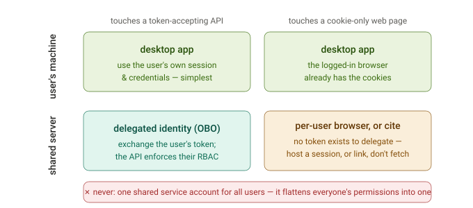
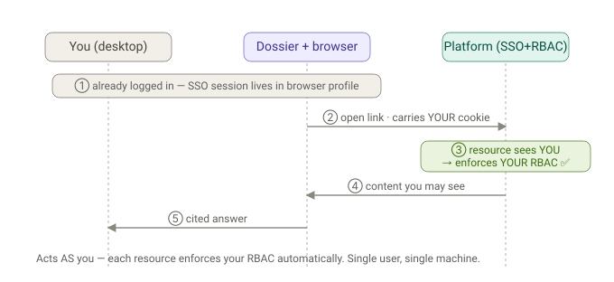
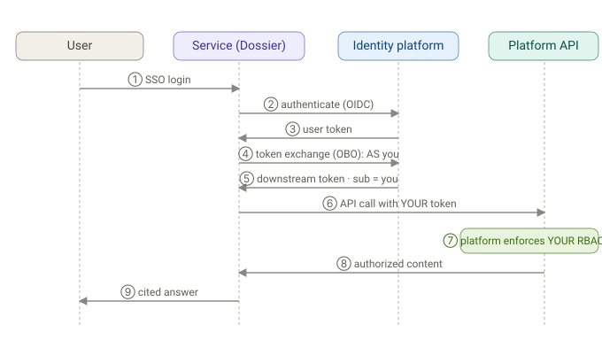
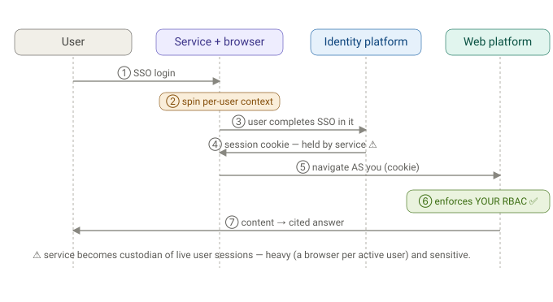
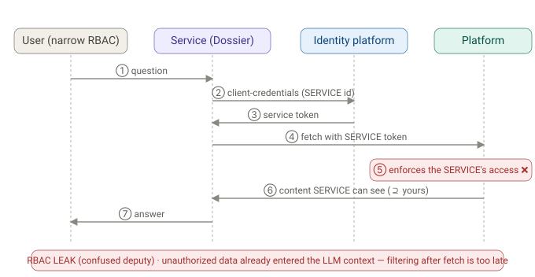
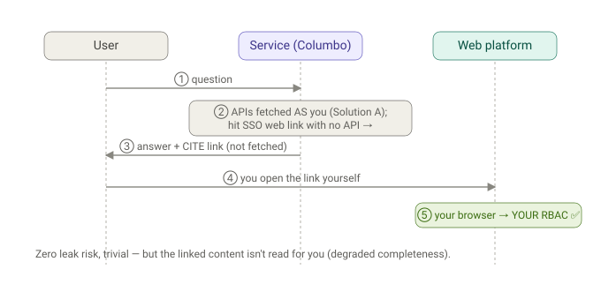

# Per-deployment auth flows

## First principles

The right auth depends on two things: where the code runs (the user's machine versus a shared server) and what it needs to touch (a token-accepting API versus a cookie-only web page). Match the flow to those two axes and the solution falls out.

---

>>Q: Draw the auth flow diagrams for each of the solutions below:

>> 1. **Desktop App**
>>2. **Web Hosted Service - for multiple solutions - auth flow diagram  and the  outcomes, advantages and limitations - for each solution**

>>**Also, a brief overview from first principles - understanding of the basics of different forms for authentication involved here**

A: Let me lay the groundwork first, then give you five auth-flow diagrams (desktop + four web-service variants), each with its outcomes, advantages, and limitations.

## First principles — the auth vocabulary in play

Two different questions, always kept separate:
- **Authentication (authN)** — *who are you?* Proven by a credential.
- **Authorization (authZ) / RBAC** — *what may you see?* Decided **at the resource**, per caller.

And four things people constantly conflate:
- **Identity** — a fact ("Alice ∈ Governance-Readers"). Lives in the identity platform.
- **Credential** — a *thing a resource accepts* as proof of identity. Two flavors here: a **session cookie** (what a browser carries after SSO login) and a **bearer token** (what an API accepts).
- **Enforcement point** — the resource itself evaluates its *full* policy (groups **and** per-object ACLs **and** context) against the credential presented.
- **Delegation** — turning *the user's* identity into a credential the service can use to act **as the user** downstream (OAuth **On-Behalf-Of / token exchange**). The opposite is a **service principal / client-credentials** token — the service acting **as itself**.

The forms of auth each solution uses:

| Form | Credential | "Acts as" |
|---|---|---|
| Browser SSO session | cookie | the logged-in user |
| API token / PAT | bearer token | whoever owns the token |
| OAuth auth-code (user consent) | bearer token | the user |
| OAuth OBO / token exchange | bearer token minted from the user's token | the user (delegated) |
| Client-credentials / service account | bearer token | the **service** |

**The golden rule everything below is graded against:** *the credential that reaches the resource must represent the **asking user**, so the resource applies **that user's** RBAC.* Do that → correct. Substitute the service's identity → leak.

---

### 1. Desktop app — "be the user"

The browser is already SSO-logged-in; Columbo drives *that* session, so every resource sees the actual user.

* **Outcomes:** the resource sees the real user; RBAC is enforced *by the platform*, for free.
* **Advantages:** simplest *correct* model; reads anything you can (incl. auth-walled/JS pages); no server ever holds your credentials; per-object ACLs honored because the platform decides.
* **Limitations:** one user, one machine; needs a human for first login/MFA; no concurrency/scale; not a service.

---

### 2. Web service, Solution A — Delegated identity (OAuth OBO / token exchange)

The user logs into the service; the service **exchanges the user's token** for a downstream token *as the user* and calls each platform's **API**. Correct and scalable — but only works where the platform is a token-addressable API.

* **Outcomes:** the platform sees the real user; RBAC (incl. per-object ACLs) enforced by the platform; no leak possible.
* **Advantages:** secure, multi-user, scalable, auditable (per-user tokens), least-privilege by construction, no browser; you'd add each platform as a proper *source* and stop scraping it.
* **Limitations:** each platform must expose an **API/OAuth audience** and support token exchange; integration work per platform; **cannot** reach cookie-only web UIs or do arbitrary scraping.

---

### 3. Web service, Solution B — Per-user hosted browser

For platforms that are **web-UI-only** (no API), run a browser *per user session*, carrying **that user's** cookies, and scrape as them. General, but heavy and custody-sensitive.

* **Outcomes:** preserves arbitrary auth-walled/JS scraping *with* correct RBAC, because the browser carries the user's own session.
* **Advantages:** general (works for web-only platforms with no API); RBAC-correct; the desktop capability, hosted.
* **Limitations:** the service becomes **custodian of live user sessions** (a serious security/ops responsibility); memory-heavy (a browser context per active user); session lifecycle/refresh complexity; hardest to run at scale.

---

### 4. Web service, Solution C — Shared service account *(anti-pattern — shown so you can recognize it)*

The service fetches with **its own** broad credential and hands results to the user. Easiest to build; it is a **cross-user data leak**.

* **Outcomes:** over-shares — returns content gated to the service, not the user.
* **Advantages:** trivial to build; the only option when a platform offers *only* a service credential; legitimate **only** for genuinely org-wide, non-user-scoped resources (a shared index the whole org may read).
* **Limitations:** **security hole** — cross-user RBAC leak; forces you to re-implement each platform's authZ to "filter," which is brittle and always stale; and for an LLM, the unauthorized data has already entered the model's context, so filtering at display time is too late. **Don't use for user-scoped content.**

---

### 5. Web service, Solution D — Cite, don't fetch *(safe degrade)*

For auth-walled links with no API, the service **doesn't fetch** — it cites the link and lets the user open it in *their own* browser.

* **Outcomes:** nothing gated is ever fetched by the service; the user reads it themselves under their own RBAC.
* **Advantages:** zero leak risk; trivial; works everywhere; honest ("here's the source, open it").
* **Limitations:** the service doesn't read the linked content, so answers are less complete; relies on the user following the link.

---

## Putting it together — what you'd actually build

These aren't mutually exclusive; the real enterprise design is a **layered combination**:

| Solution | Acts as | Reaches | RBAC | Verdict |
|---|---|---|---|---|
| **1 Desktop** | the user (browser session) | everything you can | ✅ automatic | perfect for personal use, doesn't scale |
| **A Delegated OBO** | the user (delegated token) | platforms **with APIs** | ✅ at platform | **primary** for a service |
| **B Per-user browser** | the user (their cookie) | web-only platforms | ✅ at platform | fallback for critical no-API pages; heavy |
| **C Service account** | the **service** | broad | ❌ leaks | **avoid** for user content; OK only for org-wide data |
| **D Cite-don't-fetch** | nobody (user opens it) | — | ✅ user does it | safe default for the long tail |

**Recommended stack:** make **A** the backbone — onboard Model/Feature/Governance platforms as OAuth-delegated *sources* so RBAC is enforced per user (and you stop scraping them). Use **D** as the safe default for any remaining SSO-only web links. Reserve **B** for the few high-value platforms that are web-UI-only *and* worth the operational cost of hosting per-user browsers. Use **C** *only* for genuinely org-wide, non-user-scoped content — never as a shortcut for user-gated pages.

The through-line from first principles: **desktop got RBAC for free by literally being you; a service has to *reconstruct* "the resource sees the actual asker" for every user** — via delegated tokens (A/D) or per-user sessions (B). The one move that looks like a shortcut but is actually the bug is letting the *service's* identity stand in for the *user's* (C).