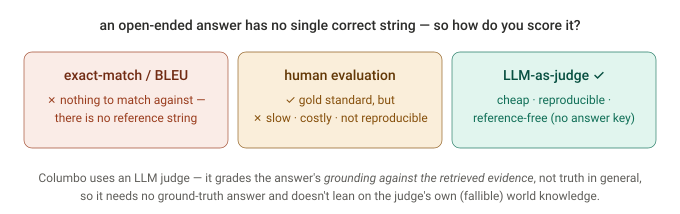
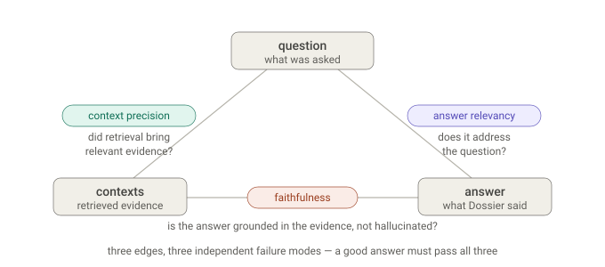
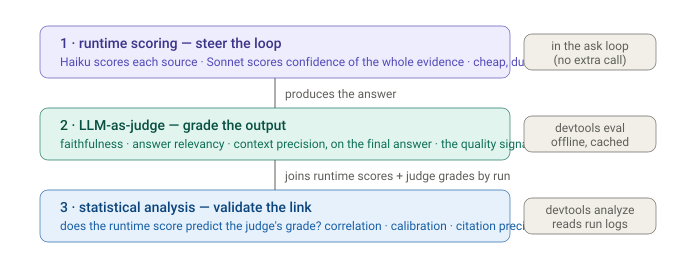

# Evaluation & validation

How Columbo knows whether an answer is any good — a native **LLM-as-judge**
harness (`columbo_py/evals/`, driven by `devtools eval`), and how it connects to
the runtime scorers documented in [Scoring & confidence](scoring-and-confidence.md).

## First principles

The problem is that a good enterprise answer is *open-ended* — there is no single
correct string to compare against. That rules out exact-match / BLEU. Human
evaluation is the gold standard but slow, costly, and not reproducible. So Columbo
uses an **LLM as the judge**:



The load-bearing design choice: the judge grades the answer's **grounding against
the retrieved evidence**, not its truth in general. That makes every metric
**reference-free** — it needs no ground-truth answer, and it never leans on the
judge's own (fallible) world knowledge. The question the judge answers is "is this
claim supported by *these contexts*?", which an LLM can do far more reliably than
"is this claim true?".

## Why an LLM judge — and what it doesn't need

- **No labels.** The eval sample is a reference-free triple — `question`, the
  `answer` Columbo produced, and the `contexts` it was grounded in. (An optional
  `reference` answer is carried for future label-based metrics but the three judges
  don't use it.) You can validate a run *without ever writing a correct answer*.
- **Deterministic and free on re-run.** The judges call the same `LLMClient` as the
  pipeline, so they hit the same permanent response cache — a re-run is byte-identical
  and costs nothing. Determinism is what lets the eval double as a CI gate.
- **Same scale, same renderer.** Judges score on the same `0–13` Fibonacci scale and
  render through the same Jinja templates as the runtime scorers — one scoring
  vocabulary across the whole system. (Why that scale is shaped the way it is:
  [Scoring & confidence](scoring-and-confidence.md#why-the-scale-is-fine-at-the-bottom-coarse-at-the-top).)
- **Offline only.** The judge is driven by `devtools eval`, never the `ask` hot path,
  so it can't perturb the runtime loop's determinism or cost.

## Three metrics, three failure modes — the RAG triad

A retrieval-augmented answer can fail in exactly three independent places, so there
are three metrics — one per edge of the question / contexts / answer triangle:



- **context precision** — the *question ↔ contexts* edge. Of the evidence the
  retrieval + scoring pipeline promoted, how much is actually relevant? Low precision
  means the scorer is admitting noise.
- **faithfulness** — the *contexts ↔ answer* edge. Are the answer's claims supported
  by the evidence, or did it hallucinate beyond it?
- **answer relevancy** — the *question ↔ answer* edge. Does the answer address the
  question that was asked, or a different (or vaguer) one?

These are chosen for the same first-principles reason the scoring dimensions are:
**they're orthogonal.** Retrieval can be clean while generation hallucinates; the
answer can be perfectly grounded yet answer the wrong question. Each metric isolates
a distinct failure, so a low score points at *which stage* broke — precision at
retrieval/scoring, faithfulness and relevancy at synthesis.

## How the judge scores — decomposed, not holistic

The judges don't emit a single vibe-score; they **decompose**, which is what keeps an
LLM judge honest and auditable:

- **faithfulness** — the judge breaks the answer into its distinct factual claims and
  checks each against the contexts, explicitly ignoring generic framing / common
  knowledge. It returns a `0–13` score **and the list of `unsupported_claims`** — so a
  low score comes with the receipts, not just a number.
- **context precision** — one `relevant: true/false` verdict *per context*, judged
  independently, then precision = fraction relevant. It normalizes against the number
  of contexts *shown to the judge*, not the number of verdicts returned — so a judge
  that drops a verdict can't accidentally inflate the score.
- **answer relevancy** — a single `0–13` on whether the answer addresses the question
  (this one needs only the question and answer, not the contexts).

All three run **concurrently** per sample (`asyncio.gather`), on the configured judge
model (`[models].judge`, Sonnet), and each `0–13` is normalized to `[0, 1]` for
reporting.

## Where LLM-as-judge is weak (the honest review)

An LLM judge is an approximation of human judgment, and it inherits known biases:

- **Self-preference.** The judge (Sonnet) grades output from the same model family
  (Sonnet plans, Opus synthesizes). A judge can favor text that looks like its own.
- **Verbosity / position bias.** LLM judges tend to reward longer answers and can be
  swayed by ordering.
- **Miscalibration.** The `0–13` anchors constrain it, but the judge's absolute scale
  is not guaranteed to track a human's.

The harness mitigates the worst of these by construction: **decomposition** (per-claim,
per-context verdicts) blocks a single holistic impression from dominating; the
**anchored rubric** pins the scale; and the **reference-free, grounding-relative** framing
sidesteps the judge's world-knowledge gaps — it only ever checks claims against the
provided evidence. What it does *not* remove is self-preference; treating these scores
as a *relative* signal (did this change help or hurt?) rather than an absolute truth is
the safe reading.

## The three-layer validation stack

The eval harness is the middle of three layers, and the point is how they connect:



1. **Runtime scoring** *steers* the loop — the Haiku scorer ranks sources and the
   planner's confidence decides when to stop. Cheap, internal, during the run.
2. **The LLM judge** *grades* the final answer — the external quality signal.
3. **Statistical analysis** (`devtools analyze`) *validates the link* — does a high
   runtime score actually predict a high judge grade? It joins the run logs
   (per-dimension scores + exit confidence) with the judge's faithfulness by run, and
   [A/B tests scoring changes](ab-testing.md) before they ship.

That's the payoff: layer 1 is *argued*, layer 2 *measures the output*, and layer 3
checks that layer 1 predicts layer 2 — confidence-vs-faithfulness calibration, and
whether the scorer ranked the cited evidence highly.

## Running it

```bash
# grade the sample answers; --check turns it into a CI gate (fails below the floor)
columbo devtools eval --check

# score your own answers and hand the labels to the analyzer
columbo devtools eval --out faithfulness.jsonl
columbo devtools analyze ~/.columbo/runs --evals faithfulness.jsonl
```

`devtools eval` reads a JSONL of `{question, answer, contexts[, reference]}`
(`columbo_py/evals/sample_dataset.jsonl` by default), needs only `ANTHROPIC_API_KEY`
— no sources, no browser — and `--check` fails if mean faithfulness drops below
`[guardrails].min_faithfulness`, so a prompt or model change that quietly worsens
grounding is caught in CI.
