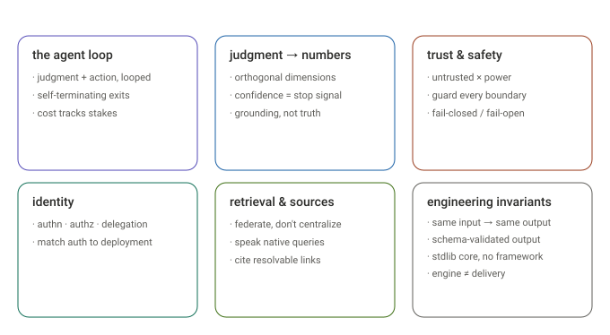

# First principles

Every part of Dossier is a design decision with a *why*. This page is the map:
each aspect of the system, the principle that governs it, and where it's explained
in depth. It also **captures the principles that don't have a page of their own** —
model tiering, self-termination, determinism, native queries, and output validation.

The recurring meta-principle underneath all of them: **take an open, fuzzy problem
and turn it into a bounded, deterministic, self-checking pipeline — cheap where it
can be, careful where it must be.**

A one-page map: every aspect of Dossier → its governing principle → the doc that explains it, grouped into six clusters:

| Cluster | Principles | Home |
|---|---|---|
| **The agent loop** | judgment+action looped; **self-terminating**; **cost tracks stakes** | call tree, request trace |
| **Judgment → numbers** | orthogonal dims / coarse scale; confidence = stop signal; grounding not truth | scoring, evaluation |
| **Trust & safety** | untrusted × power; fail-closed/open | guardrails |
| **Identity** | authn × authz × delegation; match auth to deployment | auth pages |
| **Retrieval & sources** | federate not centralize; **speak native queries**; cite resolvable links; MCP vs A2A | enterprise, permalinks, mcp-a2a |
| **Engineering invariants** | **determinism via cache**; **schema disposes**; stdlib core; engine ≠ delivery | libraries, cli-to-microservice |

## The agent loop

- **Judgment coupled to action, in a loop.** An agent isn't a chatbot — it decides,
  acts, observes, and re-decides until done. → [Call tree](call_tree.md), [Request trace](request_simulation.md)
- **Self-terminating — never "runs until killed."** *(no page of its own)* Every exit
  is a **named, logged reason**: `confidence_reached`, `cost_budget_exceeded`,
  `no_actions_proposed`, `aborted`, `input_rejected`, `max_iterations`. An autonomous
  loop that can't explain why it stopped is a bug, not a feature — so there is no
  silent timeout anywhere.
- **Cost tracks stakes (model tiering).** *(no page of its own)* Each call uses the
  Claude tier its consequence warrants: **Haiku** for high-volume grading (route,
  score, restitch), **Sonnet** for planning, one **Opus** call for the final answer,
  Sonnet again as the offline judge. A `CostTracker` caps the total spend. Spending
  Opus on per-result relevance would be as wrong as synthesizing the answer with
  Haiku. → the tiers per stage: [Scoring & confidence](scoring-and-confidence.md)

## Judgment — turning fuzzy into numbers

- **Decompose a fuzzy judgment into orthogonal dimensions, grade coarsely, average.**
  You can't branch on a vibe; the loop needs a number. → [Scoring & confidence](scoring-and-confidence.md)
- **Confidence is a *stop* signal, not a *truth* signal.** High confidence ends the
  loop; it never claims the answer is correct. → [Scoring & confidence](scoring-and-confidence.md)
- **Validate grounding, not truth (there is no answer key).** The judge checks whether
  claims trace to the evidence, so it needs no ground-truth answer. → [Evaluation & validation](evaluation.md)

## Trust & safety

- **Danger = untrusted influence × power; put a guard at every trust boundary.** → [Guardrails](guardrails.md)
- **Fail-closed on safety, fail-open on quality.** Block when a security check is
  unsure; degrade (don't crash) when a quality component fails. → [Guardrails](guardrails.md)

## Identity

- **Auth = authentication × authorization × delegation.** Who are you, what may you
  do, and may a service act as you. → [Auth from first principles](auth-basics.md)
- **Match the auth flow to where the code runs and what it touches.** → [Per-deployment auth flows](dossier-auth-flow.md)

## Retrieval & sources

- **Federate, don't centralize.** Search each source where it lives, live, under the
  user's own access — don't copy the org into one stale index. → [Enterprise scale](enterprise-solution.md)
- **Speak each source's native query language.** *(no page of its own)* The `Registry`
  dispatches every search to the source's own dialect — **CQL** for Confluence, **JQL**
  for Jira, code-search qualifiers for GitHub, search modifiers for Slack, `fullText`
  for Drive — instead of flattening to a lowest-common-denominator keyword query. The
  planner is taught each dialect and writes in it, because a lossy query wastes the one
  round-trip you get.
- **A citation is only as good as its link.** Reliability varies by source; None-guard
  every permalink. → [Permalinks](permalinks.md)
- **MCP is a protocol; A2A is delegation.** Adopt the one that removes work you'd
  hand-roll. → [MCP / A2A adoption](mcp-a2a-adoption.md)

## Engineering invariants

- **Same input → same output: determinism via caching.** *(no page of its own)* The
  response cache is **permanent** and keyed by `(model, system, user)`; evidence is
  sorted into a **canonical order** before it enters any prompt, so identical state
  yields a byte-identical prompt and a cache hit. The search/lookup/scrape caches are
  TTL'd so live data doesn't go stale forever. Determinism is what makes re-runs free,
  tests hermetic, and the [eval / analyze](evaluation.md) harness meaningful.
- **The model proposes, the schema disposes.** *(no page of its own)* Every LLM output
  is JSON, parsed tolerantly (code-fence stripping, string-aware brace scan,
  trailing-comma repair) and validated by a **Pydantic** model (0–13 ranges, required
  fields); a parse or validation failure **reprompts once, then fails loud**. A score
  of `47` or `"high"` errors here instead of silently becoming `0`.
- **Mostly your own control flow; libraries are single-purpose leaves.** The
  orchestration core is standard library; every dependency does one thing. → [Libraries used](libraries-used.md)
- **Engine ≠ delivery: wrap the shell, not the loop.** The same engine runs behind the
  CLI, a desktop window, a chat UI, or a FastAPI service. → [CLI → microservice](cli-to-microservice.md)

## What this page added

Five principles were *practiced everywhere in the code but written down nowhere* —
[self-termination](#the-agent-loop), [model tiering](#the-agent-loop),
[determinism](#engineering-invariants), [native queries](#retrieval-sources), and
[output validation](#engineering-invariants). They're captured above; if any grows
past a paragraph, it earns its own page.

1. **Self-termination** — the six named exit reasons; no silent timeout.
2. **Model tiering** — Haiku (route/score/restitch) · Sonnet (plan/judge) · Opus (synthesize); *"cost tracks the stakes"* (the config comment literally says this).
3. **Determinism via caching** — permanent response cache keyed by `(model, prompts)` + canonical evidence ordering → byte-stable prompts; TTL'd content caches.
4. **Native queries** — the Registry dispatches CQL/JQL/code-qualifiers/Slack-modifiers rather than a lowest-common-denominator query.
5. **Output validation** — JSON → tolerant parse → Pydantic (0–13 ranges) → reprompt-once → fail loud.

