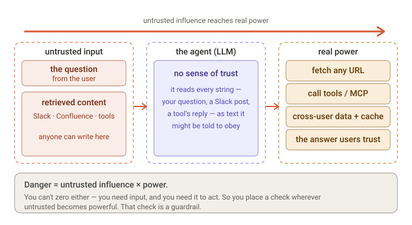
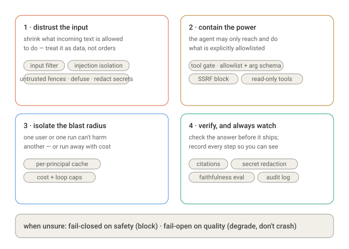

# Columbo guardrails

How Columbo keeps a retrieval agent that reads RBAC-walled content, scrapes URLs
it finds, and calls tools with model-authored arguments from doing something it
shouldn't. This is the build reference: the design principle, the flow, and a
guard-by-guard breakdown of what fires where, what it costs, and how it fails.

## First principles

Strip an agent to its essence and the need for guardrails becomes unavoidable.
An agent couples **untrusted influence** to **real power** through a model that
can't natively tell data from instructions:



An attacker who can write one Slack message — or a user who pastes something
malicious — is trying to push influence across that whole chain. You can't remove
either side (you need input, and you need the agent to act), so the only move is
to insert checks at the crossings.

That single idea yields **exactly four moves** — because danger has two factors
(influence × power) and two time-phases (before it happens / after it happens).
Shrink the influence, shrink the power, contain what leaks, verify what ships:



Every concrete guard below is one of these four applied at a specific boundary,
governed by one rule: **fail-closed on safety** (block when unsure),
**fail-open on quality** (degrade, don't crash).

## Design principle

A guard sits at **every trust boundary**, and each one is a **wrapper over an
existing Protocol seam** (`ToolProvider`, `CacheStore`, `DomainGate`, the prompt
renderer) rather than logic scattered through the loop. Columbo already
dependency-injects those seams, so a guard is a drop-in wrapper the rest of the
code never notices. All of them are toggled by one policy block — `[guardrails]`
in [`config/defaults.toml`](https://github.com/siddartham/federated-knowledge-discovery-tool/blob/main/columbo_py/config/defaults.toml).

Two failure philosophies, picked per boundary:

- **Fail-closed** on safety / authorization — if a check is uncertain, block.
  (tool gate, SSRF, input filter, cache isolation)
- **Fail-open-with-degradation** on quality — if a component fails, degrade
  rather than crash. (semantic tool router → lexical fallback; a failed source
  is skipped; one blocked tool never cancels its siblings)

## Trust-boundary map

Guards attached to each boundary of the pipeline. Teal = already built,
amber = needs infrastructure beyond this repo.


## Request flow

The same guards along a single request from `question` to `answer`, with each
outcome. `[BLOCK]` = fail-closed stop; `[DEGRADE]` = fail-open fallback.

```
QUESTION
  │
  ▼  ── input filter ────────────────────────────────────────────────
  │     len(question) > max_question_chars  ──► [BLOCK] no LLM call, terminated=input_rejected
  │     redact_secrets(question)            ──► clean text to the run log
  ▼
PLAN + ROUTE   (Sonnet plan · Haiku route)
  │     actions validated by Pydantic; per-action counts capped
  │     route: select_tools_semantic  ── on failure ──► [DEGRADE] lexical select_tools
  │
  ▼  tool_calls ── tool gate ─────────────────────────────────────────
  │     name not on allowlist   ──► [BLOCK] hidden from planner + refused
  │     args fail schema check  ──► [BLOCK] GuardrailViolation → logged tool failure
  ▼
EXECUTE  (asyncio.gather fan-out)
  │     search / lookup / tool_call ...
  │     scrape ── SSRF guard + domain gate ───────────────────────────
  │        non-http scheme / private IP / metadata host ──► [BLOCK] non-overridable
  │        unknown public host                          ──► prompt: allow / deny / abort
  ▼
RETRIEVED EVIDENCE
  │  ── injection isolation ──────────────────────────────────────────
  │     wrap in <<UNTRUSTED_BEGIN>> … <<UNTRUSTED_END>> + SECURITY clause
  │     | defuse  breaks forged fence markers in content (zero-width split of "<<")
  ▼
SCORE / RESTITCH  (Haiku)      ── same untrusted-content framing applied
  ▼
SYNTHESIZE  (Opus)
  │  ── output guard ───────────────────────────────────────────────
  │     enforce inline [source:id] citations (deterministic linkify + footer)
  │     redact_secrets(answer)  ──► strip credentials that surfaced in evidence
  ▼
ANSWER ──► user

┌ cross-cutting (span the whole pipeline) ──────────────────────────────────────┐
│  cost + loop caps        CostTracker(max_cost_usd) · max_iterations · named exits │
│  cache isolation         CacheStore(scope=COLUMBO_PRINCIPAL) → scopes/<hash>/     │
│  audit log               EventEmitter → one JSONL line per search/scrape/tool/LLM │
│  regression gate         devtools eval --check → mean faithfulness ≥ floor        │
└───────────────────────────────────────────────────────────────────────────────┘
```

## Guards

| # | Boundary | Guard | File | Config | On violation |
|---|----------|-------|------|--------|--------------|
| 1 | question in | input filter | [`loop.run`](https://github.com/siddartham/federated-knowledge-discovery-tool/blob/main/columbo_py/engine/orchestrator/loop.py) · [`redaction.py`](https://github.com/siddartham/federated-knowledge-discovery-tool/blob/main/columbo_py/infra/redaction.py) | `max_question_chars` | reject (no LLM call); secrets redacted from log |
| 2 | plan → tool | tool gate | [`GuardedToolProvider`](https://github.com/siddartham/federated-knowledge-discovery-tool/blob/main/columbo_py/sources/mcp/guarded.py) | `tool_allowlist`, `validate_tool_args` | `GuardrailViolation` → logged tool failure |
| 3 | execute → scrape | SSRF guard | [`ssrf_reason`](https://github.com/siddartham/federated-knowledge-discovery-tool/blob/main/columbo_py/infra/domaingate/gate.py) | — (static) | drop URL, non-overridable |
| 4 | content → LLM | injection isolation | [`_defuse`](https://github.com/siddartham/federated-knowledge-discovery-tool/blob/main/columbo_py/engine/prompts/render.py) + templates | — | forged markers defused; content stays fenced |
| 5 | synthesis out | output guard | [`_synthesize`](https://github.com/siddartham/federated-knowledge-discovery-tool/blob/main/columbo_py/engine/orchestrator/loop.py) | `redact_answers` | secrets replaced with `«redacted»` |
| 6 | data access | identity + domain gate | [`DomainGate`](https://github.com/siddartham/federated-knowledge-discovery-tool/blob/main/columbo_py/infra/domaingate/gate.py) | seed allow-list | domain: allow/deny/abort · OBO: partial |
| 7 | runaway | cost + loop caps | [`CostTracker`](https://github.com/siddartham/federated-knowledge-discovery-tool/blob/main/columbo_py/engine/orchestrator/cost.py) | `[loop]` caps | loop exits with a named reason |
| 8 | multi-tenant | cache isolation | [`CacheStore`](https://github.com/siddartham/federated-knowledge-discovery-tool/blob/main/columbo_py/infra/cache/store.py) | `COLUMBO_PRINCIPAL` | separate on-disk partition per principal |
| 9 | audit | event log | [`EventEmitter`](https://github.com/siddartham/federated-knowledge-discovery-tool/blob/main/columbo_py/infra/events/emitter.py) | — | every action logged to JSONL |
| 10 | regression | faithfulness gate | [`devtools eval`](https://github.com/siddartham/federated-knowledge-discovery-tool/blob/main/columbo_py/cli/devtools.py) | `min_faithfulness` | `--check` exits non-zero below floor |

### 1 · Input filter

At the top of `run()`, before any model call: `redact_secrets` scrubs the
question for the run log, and a question longer than `max_question_chars` is
rejected outright with `terminated_reason="input_rejected"` — a cost/abuse guard
that spends nothing. The real question still flows into the prompts intact; only
the on-disk log sees the redacted form.

### 2 · Tool gate

`GuardedToolProvider` wraps any `ToolProvider`. `list_tools` filters the catalog
to the allowlist so blocked tools never reach the planner; `call_tool` re-checks
the allowlist (defense in depth) and validates the arguments against the tool's
own JSON input schema — required keys present, no unexpected keys, top-level
types — via a small dependency-free checker. A read-only allowlist means an
answering agent can never trigger a mutating tool (`deploy`, `delete`). A
violation raises `GuardrailViolation`, which the executor's per-tool try/except
turns into a logged failure, so one blocked tool never crashes the run.

### 3 · SSRF guard

`ssrf_reason(url)` runs **first** inside `DomainGate.allows` and is
**non-overridable** — it precedes and cannot be bypassed by the allow/deny list.
It blocks non-http(s) schemes and any host that is `localhost`, a cloud-metadata
name, or a literal private / loopback / link-local / reserved / multicast IP
(via `ipaddress`). So a URL planted in evidence can't make the scraper reach the
intranet or the `169.254.169.254` metadata service. It is **static** — it does
not resolve DNS (see [Out of scope](#out-of-scope)).

### 4 · Injection isolation

Every prompt that embeds retrieved content (`orchestrate`, `score`, `restitch`,
`synthesize`) wraps that content in `<<UNTRUSTED_BEGIN>> … <<UNTRUSTED_END>>`
fences and carries a `SECURITY:` clause instructing the model to treat the region
as data — never as instructions, role changes, or format overrides. The
`| defuse` Jinja filter inserts a zero-width break into every `<<` in the content
so a malicious result **can't forge** a `<<UNTRUSTED_END>>` marker to escape its
region. Defense-in-depth, not a proof: the hard backstop is guard #2 — even a
steered planner can't reach a non-allowlisted or malformed tool call.

### 5 · Output guard

After synthesis (and the existing deterministic citation linkify + sources
footer), `redact_secrets` strips any credential that surfaced from evidence — an
API key checked into a repo the search returned — before the answer reaches the
user. Redactions are visible (`«redacted:kind»`), so the guard is auditable, not
silent.

### 6 · Identity + domain gate

The domain gate (allow / deny / prompt / abort, persisted to `domains.json`) is
fully built. **Per-user OBO** — every source query running as the *user* so the
platform enforces the caller's RBAC — is wired for the MCP path (a per-user
bearer token) but is **partial** across sources; see [Out of scope](#out-of-scope).

### 7 · Cost + loop caps

`CostTracker(max_cost_usd)` and `max_iterations` bound spend and iteration count;
the loop is self-terminating, and every exit path is a **named, logged reason**
(`confidence_reached`, `cost_budget_exceeded`, `no_actions_proposed`, `aborted`,
`input_rejected`, `max_iterations`) — never a silent timeout.

### 8 · Cache isolation

The response / search / lookup / scrape caches are keyed by content hash — great
for single-user determinism, a leak risk multi-tenant (user A's cached content
served to user B on a hash collision). With `CacheStore(scope=…)` set, all four
namespaces nest under `scopes/<sha256(scope)[:16]>/` — a **physical partition**,
so cross-identity sharing is impossible. The CLI passes no scope (shared root,
unchanged); a hosted deployment sets `COLUMBO_PRINCIPAL` per authenticated
request. The scope is hashed so a raw principal id never lands on disk as a
directory name. Trade-off: cross-user cache sharing is sacrificed for isolation;
determinism *within* a principal is preserved.

### 9 · Audit log

`EventEmitter` writes one structured JSONL line per event — searches, scrapes,
lookups, tool calls, LLM calls, cost, and every guard action (`input_rejected`,
`answer_redacted`, `tool_complete ok=false`, `tool_route_fallback`). This is the
detective layer: guards don't just prevent, they leave a trail.

### 10 · Faithfulness gate

The offline LLM-as-judge harness already scores faithfulness / answer-relevancy /
context-precision. `devtools eval --check` turns faithfulness into a **CI gate**:
it exits non-zero when the mean falls below `[guardrails].min_faithfulness`, so a
prompt/model change that quietly worsens grounding fails the build. It calls the
judge model, so it needs `ANTHROPIC_API_KEY` — an opt-in CI job, separate from
the hermetic `pytest` gate.

## Configuration

```toml
[guardrails]
tool_allowlist     = []     # MCP tools exposed + callable; [] = allow all advertised
validate_tool_args = true   # check each tool call against its input schema
max_question_chars = 4000   # reject longer questions before any LLM call
redact_answers     = true   # strip secrets that surface in the final answer
min_faithfulness   = 0.6    # devtools eval --check floor
```

`COLUMBO_PRINCIPAL` (env var) sets the cache-isolation scope in a multi-user
deployment; unset on the single-user CLI.

## Out of scope

Two guards need infrastructure, not code in this repo:

- **Per-user OBO / token-exchange across every source.** The MCP path already
  sends a per-user bearer so the downstream platform enforces the caller's RBAC
  (never a confused deputy). Extending that to all sources needs an identity
  platform Columbo can exchange tokens with — an integration.
- **DNS-rebinding protection.** The SSRF guard blocks *literal* private IPs and
  metadata names but does not resolve DNS, so a public hostname that resolves to
  a private IP is not caught here. That defense belongs at the socket layer of
  the HTTP client performing the fetch.

## Adding a guard

The pattern is uniform, which is the point:

1. Identify the trust boundary and the Protocol seam that crosses it.
2. Write a wrapper that satisfies the same Protocol and enforces the policy
   (fail-closed for safety, fail-open for quality).
3. Add its knobs to `[guardrails]` and `GuardrailsConfig`.
4. Wire it in where the seam is constructed (e.g. `_build_tool_provider`,
   `CacheStore(...)`).
5. Test the guard by mocking the inner seam and asserting it blocks / degrades.

## Tests

- [`test_guardrails.py`](https://github.com/siddartham/federated-knowledge-discovery-tool/blob/main/columbo_py/tests/test_guardrails.py) — tool gate: allowlist filtering, arg validation, disable switch.
- [`test_cache_isolation.py`](https://github.com/siddartham/federated-knowledge-discovery-tool/blob/main/columbo_py/tests/test_cache_isolation.py) — per-principal partitioning; no-scope backward compat.
- [`test_prompt_safety.py`](https://github.com/siddartham/federated-knowledge-discovery-tool/blob/main/columbo_py/tests/test_prompt_safety.py) — evidence fenced; forged markers defused.
- [`test_ssrf.py`](https://github.com/siddartham/federated-knowledge-discovery-tool/blob/main/columbo_py/tests/test_ssrf.py) — private/loopback/metadata/scheme blocks; not overridable by allowlist.
- [`test_redaction.py`](https://github.com/siddartham/federated-knowledge-discovery-tool/blob/main/columbo_py/tests/test_redaction.py) — secret patterns caught; ordinary text untouched.
- [`test_input_output_guards.py`](https://github.com/siddartham/federated-knowledge-discovery-tool/blob/main/columbo_py/tests/test_input_output_guards.py) — oversized question rejected with no LLM call; secret in answer redacted end-to-end.
