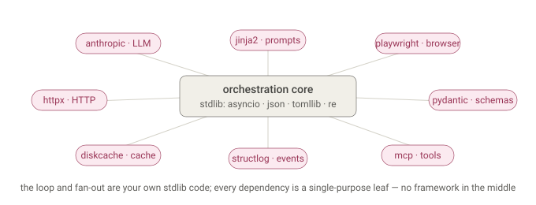
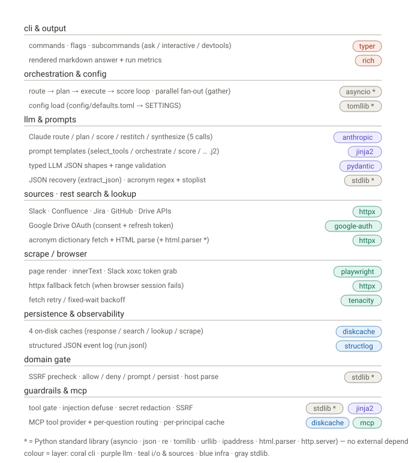
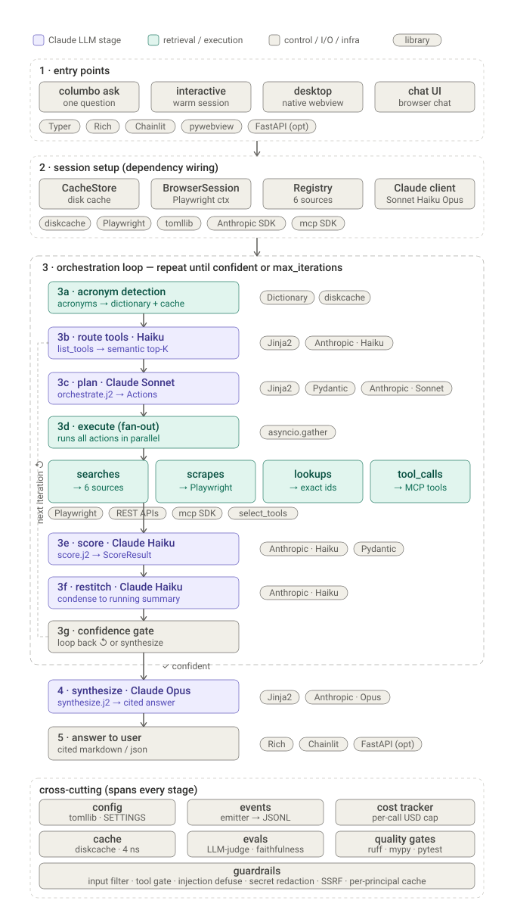

# Libraries used

## First principles

A good agent is mostly your own control flow. The orchestration core — the loop, the fan-out, config — is standard library; every external dependency is a single-purpose leaf at the edge (one for the LLM, one for the browser, one for the cache). There is no framework in the middle.

---

Here's a clean **component → enabling library** map, grouped by layer, using the exact declared dependencies. Stdlib-only pieces are marked `*`.

That's the full dependency map, straight from `pyproject.toml`. The takeaways:

- **`httpx` is the workhorse** — it powers all five source REST clients *and* the acronym dictionary *and* the browser-fetch fallback. Four rows point at it.
- **The heavy stuff is deliberately thin**: one library per concern — `anthropic` (LLM), `playwright` (browser), `diskcache` (cache), `structlog` (events), `jinja2` (prompts), `pydantic` (schemas), `tenacity` (retry), `typer`+`rich` (CLI), `google-auth(-oauthlib)` (Drive OAuth).
- **A surprising amount is stdlib** (the `*` rows): the whole orchestration loop and fan-out (`asyncio`), config (`tomllib`), JSON recovery + acronym detection (`json`/`re`), the dictionary's HTML parsing (`html.parser`), the Slack OAuth redirect server (`http.server`), and the entire domain gate (`asyncio`/`json`/`urllib`) — no dependency at all. That's why the earlier "why not a framework?" answer held up: the orchestration core leans on the standard library, and the external deps are all single-purpose libraries, not framework layers.

## With the Flow

Adding a consistent **pink library badge** to each stage of the master flow (one visual language: pink = enabling library). Full diagram, redrawn:

Reading the badges top to bottom, the picture the earlier map showed now sits *on the flow*:

- **CLI** → `typer · rich`
- **loop / fan-out / scoring** → `asyncio *` (the concurrency is pure stdlib)
- **every LLM stage** (`select_tools_semantic` (route), `_plan`, `generate`, `score/restitch`, `_synthesize`) → `anthropic · jinja2 · pydantic` — the same trio, because they all render a Jinja prompt, call Anthropic, and validate/parse the result (the route stage runs only when an MCP tool provider is wired)
- **the `generate` cache row** additionally → `diskcache`
- **all I/O leaves** (dictionary, search, lookup, re-scan) → `httpx`
- **scrape** → `playwright · tenacity · httpx` (the three-tier ladder)
- **decision / domain gate / state** → `stdlib *` / `dataclass *`
- **infra band** → `diskcache · structlog`

Note `httpx` badges recur four times and `asyncio */stdlib *` several more — that's the visual confirmation of the point from before: the orchestration skeleton is stdlib, and the external deps are single-purpose libraries hung off the leaves.

If it's useful, I can export this (or any of the set) as a standalone zoomable HTML artifact you can keep or share — the inline widget is fixed-width, whereas an artifact lets you pan/zoom the full-height map comfortably.

The master flow above is current — it already includes the semantic tool-routing step that planning now runs before it plans (see also [call_tree.md](call_tree.md) and the README Tool Flow section). What that routing step is:

- **Master diagram** — the loop now has a distinct **`3b · route tools · Haiku`** stage (`list_tools → semantic top-K`) sitting between acronym detection and plan, badged `Jinja2` + `Anthropic · Haiku`. Everything downstream renumbered (plan is now `3c`, gate is `3g`). The `next iteration ↺` arrow loops back to the *routing* box, since re-planning re-routes tools each pass.

- **Sequence diagram** — before `_plan · Sonnet`, the loop now makes two extra round-trips inside the frame: `list_tools (opt)` to the MCP lane (returns the catalog) and `route · Haiku` to Claude (returns the top-K tool names). Both are marked *opt* — they only fire when an MCP server is configured *and* the catalog exceeds K; below that, `select_tools_semantic` short-circuits and neither call appears.

Two things worth noting from the diagrams:
- **Claude is now hit up to five times per question** — route (Haiku), plan (Sonnet), score (Haiku), restitch (Haiku), and once synthesize (Opus). The router rides the cheap tier, so it adds latency but little cost, and it's cached per-question so re-runs skip it.
- The routing round-trip is **inside** the loop frame, so it repeats each iteration; synthesize stays **outside** it, still exactly once — the same once-vs-repeats structure as before, just with routing added to the repeating part.