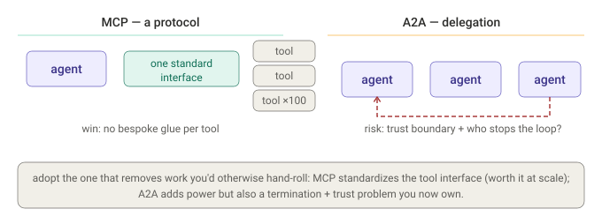
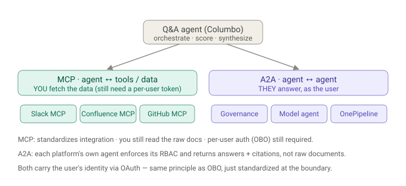
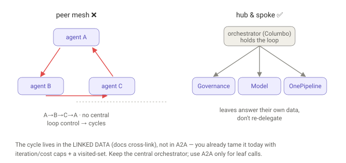

# MCP / A2A adoption

## First principles

MCP and A2A solve different problems. MCP is a protocol — one standard interface so you never hand-roll glue per tool. A2A is delegation between agents — powerful, but it adds a trust boundary and a 'who terminates the loop?' problem. Adopt the one that removes work you would otherwise build yourself.

---

> Q: Are there any benefits to adopting MCP or A2A  for this application?

Yes — but they help with **different** things, and neither erases the auth truths we just worked through. Quick first-principles framing, then the real benefits for *this* app.

## What they are (one line each)

- **MCP (Model Context Protocol)** — a standard for **agent ↔ tools/data**. Instead of hand-writing a Slack/Confluence/GitHub client, you connect to an **MCP server** that exposes tools/resources in a common shape. It's "USB-C for plugging data sources into an LLM app."
- **A2A (Agent-to-Agent)** — a standard for **agent ↔ agent**. Your agent **delegates a sub-question to another team's agent** as a peer, without knowing its internals.

They sit on two different axes:

## MCP — benefits for this app

**What it buys you:** MCP is basically the *standardized* version of Dossier's existing `SearchSource` Protocol. Concretely:
- **Reuse instead of build** — official/vendor MCP servers already exist for Atlassian, GitHub, Slack, Drive, etc. You'd retire bespoke clients and inherit maintenance/updates.
- **Pluggability** — a new source is "drop in an MCP server," no core changes (you already have this pattern; MCP makes it ecosystem-standard).
- **Portability** — the same servers work in Claude Desktop, IDEs, other hosts, so your integration investment isn't Dossier-only.
- **Auth alignment** — MCP's remote-server auth uses OAuth 2.1 with resource indicators, i.e., the *same* per-user token model as OBO. So MCP can be the standardized transport for the tokenized, per-user access we discussed.

**What it does NOT fix:** MCP standardizes the *plumbing*, not the *identity*. "As which user" still has to be answered — a remote MCP server still needs the user's token. And a **cookie-only portal still has no MCP server** unless someone builds one, which then faces the same per-user-auth problem. Plus: running third-party MCP servers is a real supply-chain/prompt-injection surface to vet — now partially addressed in Dossier by the `GuardedToolProvider` tool gate (allowlist + argument-schema validation) plus the prompt-injection isolation and output redaction in the `[guardrails]` layer (see [guardrails.md](guardrails.md)).

**Verdict: low-regret, incremental.** Adopt MCP as a cleaner, standard, maintained form of your source layer — especially for tokenized APIs. It's an integration/ecosystem win, not an auth win.

> **Update — no longer hypothetical.** A first guarded MCP integration has shipped: the Testing Platform, via `MCPToolProvider` (`dossier/sources/mcp/`, behind the `[mcp]` extra), which sends a per-user bearer token so the downstream platform enforces the caller's RBAC. The planner selects the relevant tools per question (a `route · Haiku` call) and emits structured `tool_calls` whose results become scored evidence.

## A2A — benefits for this app

This is the interesting one, because it directly attacks the hardest problem in this whole conversation. **Instead of Dossier reading the Governance Platform's data (OBO, cookies, RBAC, scraping), Dossier asks the Governance Platform's *own agent* the question.** That agent runs *inside* Governance's trust boundary, already has correct access to its own data, and enforces RBAC natively — you pass the user's identity, it answers *as the user*.

- **The RBAC/scraping problem dissolves at the source** — each platform answers about its own data with its own access rules and freshness. You stop reverse-engineering N portals.
- **Ownership lands correctly** — each platform team owns their agent; you're not the central team maintaining fragile integrations.
- **Governance win** — you receive *answers + citations*, not raw documents, so far less sensitive data pools centrally (ties straight back to the desktop-vs-service governance debate).

**What it costs:** a **bigger adoption bar than OBO** — every platform must build *and expose an agent*, not just an API. Identity still has to propagate across the A2A boundary (A2A carries auth, but you wire it). And you're now trusting N independently-built agents' answer quality, which is harder to control than reading evidence yourself. It's also newer/less adopted than MCP.

**Verdict: the best long-term shape for a many-internal-platform enterprise, but a north-star** — adopt where platform teams are willing, not a day-one dependency.

## How it all fits together

- **MCP and A2A are complementary, not either/or.** MCP = how you plug in *tools/data you read*; A2A = how you delegate to *agents that answer*. A mature Dossier-next: **MCP servers** for sources it reads directly (tokenized APIs) **+ A2A** to platform-owned agents for the RBAC-hard internal sites.
- **Neither repeals the auth fundamentals.** Both ride on OAuth; identity must still reach whoever holds the data. MCP standardizes the token path; A2A moves the read *behind* the platform's own boundary. That's the deep connection: **A2A is another way to answer "act as the user" — by not fetching the data at all, but asking its owner-agent, which already is inside the right trust boundary.**

## Bottom line

- **MCP:** worth adopting — it's the standard, maintained version of your source abstraction, and it aligns auth with OBO. An engineering/interop win, not a security shortcut.
- **A2A:** the most promising answer to the exact problem you kept probing — reading RBAC-gated internal platforms — because it **inverts** it: delegate to each platform's agent instead of reading its data. Higher adoption cost, newer, but the cleanest end-state, and a governance win (answers, not raw docs).
- **Both** still stand on the same foundation: propagate the user's identity. They standardize and relocate the work; they don't eliminate it.

If you want, I can sketch what Dossier looks like re-shaped as an **A2A orchestrator** (it stops scraping, and each platform exposes an agent it queries with the user's identity) — that's the version where most of the auth pain you've been circling actually goes away.

>> MCP: For me MCP just sounds like API interface for a source, how is it any different, if a source already has an API .. what is it adding ?

>> A2A: Won't it create infinite loop problem, if we adapt A2A for this, as many documentations have links to other  documentation in  other platforms, instead of having a centralized orchestrator like we currently have?

Two sharp questions. Let me take them separately — your skepticism on MCP is partly right, and your loop worry on A2A has a clean answer.

## Q1 — "MCP is just an API wrapper; if the source has an API, what's added?"

You're right that MCP adds **no new *capability*** the API lacks — it wraps the same API. The value is at a different layer, and it's honest to say: **for a single app you control, it adds little; Dossier already re-invented a private MCP.** What MCP standardizes is three things a raw API leaves to *you*:

1. **Uniform calling convention.** Every REST API is different — its own auth, pagination, schemas, error shapes — so every integration is bespoke glue. MCP is *one* envelope (JSON-RPC), so **one client speaks to all servers**. N sources → one integration pattern instead of N hand-written clients.
2. **Self-description *to the model*.** This is the real one. A raw API can't tell an LLM when or how to call it — a developer must hand-write that (in Dossier, that's your `GUIDANCE.md` injected into the plan prompt). An MCP server **ships its own tool schemas + descriptions**, so the *model* learns the tools from the server, not from your code. The API becomes self-advertising to the agent.
3. **Discovery / hot-plug + standard transport & auth.** The host asks a server "what can you do?" at runtime; new tools appear with no host changes; remote servers plug in over a standard transport with OAuth.

The clean way to see it: **a REST API is a door with its own lock and its own instruction manual you must read and hardwire. MCP is USB-C — one connector, and the device announces what it is when plugged in.** The electricity (capability) is identical; the standardized connector + self-description is the product.

**So concretely for Dossier:** your `SearchSource` client + its `GUIDANCE.md` *is* a private, hand-rolled MCP tool (call convention + self-description). MCP just makes that a **public standard**, so you (a) don't write the client, (b) don't write the guidance — the server ships it, (c) can reuse vendor-maintained servers and run them in other hosts. **The payoff is ecosystem-scale (many sources, reuse across apps, model-driven tool discovery), not single-app.** If you'll only ever wire 5 sources into 1 app you own, your clean abstraction is genuinely about as good — your instinct holds.

## Q2 — "Won't A2A infinite-loop, since docs link to docs across platforms?"

Excellent systems instinct — and the fix is in the premise. **A2A doesn't require you to give up the central orchestrator.** The cycle risk comes from a *mesh* (agents delegating to each other); it disappears in a *hub-and-spoke* (your orchestrator calls platform agents as **leaves** that don't re-delegate).

Three things make the loop a non-issue:

1. **The cycle already exists today — it's in the *data*, not the protocol.** A Confluence page links a Slack thread that links back to the Confluence page. Dossier handles that *right now* with its **iteration cap, cost cap, `already_scraped`/visited sets, and dedup by id/URL**. A2A doesn't *create* cross-links; it only changes *who* walks the edge. So the same defenses apply.

2. **Keep the central orchestrator — that's the whole point.** In the hub model, when you ask Governance-agent a question, it answers about *Governance data only* and may *return* "see this Model doc: `<link>`" — it does **not** recursively call Model-agent. Your orchestrator decides whether to expand to Model next. So a cross-platform link becomes **a new candidate action the central planner considers**, exactly like today — not a recursive agent call. The loop control stays in one place, where it already lives.

3. **If you ever allow true agent→agent hops, use the standard cycle toolkit** (same as web crawlers / distributed tracing):
   - **hop/depth TTL** — each delegation decrements a counter; at 0, stop (like IP TTL).
   - **propagated visited-set / correlation id** — the request carries the chain so an agent that sees itself already in it refuses or returns cached.
   - **idempotency / dedup by resource id** — never re-resolve a doc already in the working set (Dossier already does this for scrapes/lookups).
   - **a shared budget** drawn down across the whole delegation tree (extend your existing cost tracker).

The real danger with A2A isn't "new cycles" — it's **losing central visibility if you go full-mesh**: if agents delegate opaquely, no single place holds the visited-set or budget, so cycles and request-amplification become hard to bound. Which is *exactly* your instinct ("instead of a centralized orchestrator like we have"). The resolution: **don't surrender the orchestrator.** Use A2A as the *leaf-call protocol under* your existing central planner — you get A2A's RBAC-at-source benefit *and* keep the loop control that already prevents runaway traversal.

## Bottom line

- **MCP** over an existing API adds **standard calling + self-description-to-the-model + discovery/reuse**, not new capability. Marginal for your single hand-built app (you already re-invented it as `SearchSource` + `GUIDANCE.md`); valuable when you have many sources or want ecosystem/vendor servers and model-driven tool selection.
- **A2A** doesn't force a loop-prone mesh. The cross-link cycle is inherent to enterprise docs and you already tame it centrally. Adopt A2A as **leaf delegation beneath a central orchestrator** (hub-and-spoke), carry a visited-set/TTL/budget if you allow deeper hops, and you keep both the RBAC-at-source win *and* your loop safety. Your current centralized-orchestrator design is the right backbone to keep — A2A changes what the leaves *are*, not the topology.