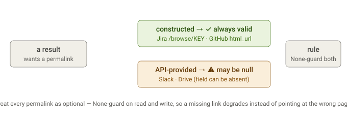

# Permalink reliability

## First principles

A cited answer is only useful if its links resolve. Permalink reliability varies by source — some are constructed and always valid, others come from an API that may omit them — so the safe default is to treat every permalink as optional and None-guard it.

---

The *reliability* of each source's permalink varies, and there are two real per-source caveats. Here's the full picture:

| Source (method) | permalink value | Reliability |
|---|---|---|
| Jira ([:128](https://github.com/siddartham/federated-knowledge-discovery-tool/blob/main/columbo_py/sources/jira/source.py#L128)) | constructed `{base}/browse/{KEY}` | ✅ always valid |
| GitHub issues ([:124](https://github.com/siddartham/federated-knowledge-discovery-tool/blob/main/columbo_py/sources/github/source.py#L124)) | `item["html_url"]` | ✅ API always returns it |
| GitHub code search ([:138](https://github.com/siddartham/federated-knowledge-discovery-tool/blob/main/columbo_py/sources/github/source.py#L138)) | `item["html_url"]` | ✅ |
| GitHub code lookup ([:199](https://github.com/siddartham/federated-knowledge-discovery-tool/blob/main/columbo_py/sources/github/source.py#L199)) | `item["html_url"]` | ✅ |
| Slack search ([:164](https://github.com/siddartham/federated-knowledge-discovery-tool/blob/main/columbo_py/sources/slack/source.py#L164)) | `match.get("permalink")` | ⚠️ None-able if API omits it |
| Drive ([:149](https://github.com/siddartham/federated-knowledge-discovery-tool/blob/main/columbo_py/sources/drive/source.py#L149)) | `file.get("webViewLink")` | ⚠️ None-able for some file types |
| Confluence ([:134](https://github.com/siddartham/federated-knowledge-discovery-tool/blob/main/columbo_py/sources/confluence/source.py#L134)) | `{base}{_links.webui}` else `None` | ✅ emits `None` when `_links.webui` is absent (no misleading root URL) |
| Slack channel lookup ([:145](https://github.com/siddartham/federated-knowledge-discovery-tool/blob/main/columbo_py/sources/slack/source.py#L145)) | constructed `app.slack.com/client/_/{id}` | ⚠️ present but a SPA deep-link, poor scrape target |

So where URLs actually get dropped, and it's not source-specific:

1. **The plan digest** ([`evidence_summary`](https://github.com/siddartham/federated-knowledge-discovery-tool/blob/main/columbo_py/engine/orchestrator/state.py#L61)) drops permalinks for **every** source — the top-evidence line prints `[score] source:id title` and never `e.permalink`. That's the gap from last message; it starves the scrape action equally for all sources.
2. **The score prompt** input ([`score_batch`](https://github.com/siddartham/federated-knowledge-discovery-tool/blob/main/columbo_py/engine/orchestrator/actions.py#L163)) builds `{id, title, source, content}` — no permalink. But that's fine; scoring doesn't need URLs.
3. **Synthesis keeps them** — [`_synthesize`](https://github.com/siddartham/federated-knowledge-discovery-tool/blob/main/columbo_py/engine/orchestrator/loop.py#L190) passes `permalink=e.permalink` and `Citation` carries it. So citations aren't affected.

One per-source point worth keeping in mind (beyond the digest drop):

- **None-ability**: Slack-search, Drive, and Confluence permalinks can legitimately be `None` (Confluence now emits `None` rather than degrading to the wiki root when `_links.webui` is missing), so the digest line — and anything consuming these for scraping — must None-guard, which the `if e.permalink` guard does.

