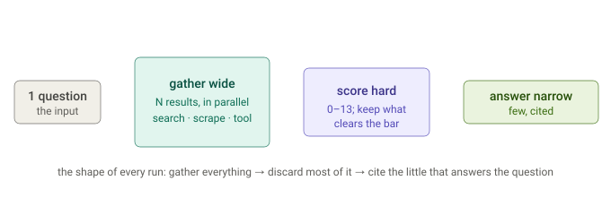

# Question to Answer Flow Simulation

Let me ground the simulation in the actual control flow — I'll read the exact loop sequence (where confidence is checked, where enrichment/scoring happen) so the trace is accurate rather than plausible-sounding.

## First principles

The fastest way to understand a pipeline is to follow one input through it. The shape that emerges is a funnel — gather wide (every source in parallel), score hard (keep only what clears the bar), answer narrow (a few high-value citations).



The trace below is one question walked through that funnel, step by step.

Grounded in the actual control flow ([loop.py:96‑152](https://github.com/siddartham/federated-knowledge-discovery-tool/blob/main/dossier/engine/orchestrator/loop.py#L96) + [actions.py:85‑99](https://github.com/siddartham/federated-knowledge-discovery-tool/blob/main/dossier/engine/orchestrator/actions.py#L85)), here's a full trace. Key thing to keep straight up front: **only three of the four "action" types are LLM calls.** Plan = Sonnet, Score/Restitch = Haiku, Synthesize = Opus. Searches, scrapes, and *lookups* (both acronym-dictionary enrichment and the planner's exact-id `lookups`) are **source/HTTP/browser calls, not LLM calls**. I'll mark every step so the distinction is explicit.

> Note: this trace assumes **no MCP tool provider** is configured. When one is (a Testing Platform, etc.), each iteration adds a fifth LLM call site — a cheap `route · Haiku` selection over the tool catalog *before* plan — and the planner may emit `tool_calls` whose results become scored evidence like any other batch. See [call_tree.md](call_tree.md) for the five-call version.

Legend: 🧠 = LLM call · 🔌 = source API · 🌐 = dictionary HTTP · 🖥️ = browser fetch

---

## Question
> *"How does our SSO handle token refresh when a user's RBAC role changes mid‑session?"*

---

## Pre‑loop — acronym enrichment (no LLM)
`run()` calls `enrich_acronyms` **before** the first plan ([loop.py:90](https://github.com/siddartham/federated-knowledge-discovery-tool/blob/main/dossier/engine/orchestrator/loop.py#L90)):

- 🌐 `SSO` → `GET allacronyms.com/SSO/computing` → "Single Sign-On"
- 🌐 `RBAC` → "Role-Based Access Control"
- → `state.dictionary = {SSO: …, RBAC: …}`; `dictionary_checked = {SSO, RBAC}`

*Events: `run_start`, `acronym_resolved ×2`. LLM calls so far: 0.*

---

## Iteration 1

**🧠 CALL #1 — Plan (Sonnet)** — `_plan`, digest is empty (only the two definitions).
```json
{
  "thinking": "No evidence yet. SSO+RBAC+token-refresh spans code and discussion.
               Cast wide: Slack for incident/discussion, Confluence for the auth
               design doc, github_code for the refresh implementation. Resolve the
               #sso-support channel id so I can scope a later Slack search.",
  "confidence": {"explicit_evidence":2,"implicit_evidence":3,"evidence_consistency":2,"answer_specificity":2},
  "actions": {
    "searches": [
      {"source":"slack","query":"SSO token refresh RBAC role change"},
      {"source":"confluence","query":"text ~ \"SSO token refresh\" AND type = page"},
      {"source":"github_code","query":"refreshToken RBAC role in:file"}
    ],
    "scrapes": [],
    "lookups": ["#sso-support"]
  }
}
```
composite = (2+3+2+2)/52 = **0.173** < 0.8 → don't break, execute.

**Execute — Phase 1 (parallel, non‑LLM)** `_run_actions`:
- 🔌 slack search → 6 hits (titles: *"SSO refresh 401 storm"*, *"role change forces re-login?"*, …)
- 🔌 confluence search → 3 pages (*"Auth Platform: Token Lifecycle"*, *"RBAC Propagation"*, …)
- 🔌 github_code search → 4 files (*`auth/refresh.go`*, *`rbac/middleware.go`*, …)
- 🔌 lookup `#sso-support` → resolves channel id `C0123` (added to `state.lookups` as a citable Result)
- 🌐 enrich_acronyms re‑runs on new result text → finds **`JWT`** → "JSON Web Token" (`dictionary_checked` now has 3; SSO/RBAC not re‑queried)

**Execute — Phase 2 scoring (Haiku, parallel)** `_score_new_evidence`. One `score_batch` coroutine per batch, but each **short‑circuits if all ids already scored** ([actions.py:265](https://github.com/siddartham/federated-knowledge-discovery-tool/blob/main/dossier/engine/orchestrator/actions.py#L265)) — all 3 search batches + the lookup batch are new, so **4 real Haiku calls**:

- 🧠 CALL #2 — score slack batch (6 results) → e.g. direct_relevance/answer/context/quality per result
- 🧠 CALL #3 — score confluence batch (3)
- 🧠 CALL #4 — score github_code batch (4)
- 🧠 CALL #5 — score lookup batch (1) — the `#sso-support` Result

Example scores (composite = mean/13, admit threshold ≈ 0.31, `[loop.py]`):

| evidence | composite | admitted? |
|---|---|---|
| confluence: *Token Lifecycle* | 0.69 | ✅ |
| github: `auth/refresh.go` | 0.62 | ✅ |
| slack: *SSO refresh 401 storm* | 0.54 | ✅ |
| confluence: *RBAC Propagation* | 0.46 | ✅ |
| slack: *role change forces re-login?* | 0.23 | ✅ (min_guarantee top‑8) |
| github: `rbac/middleware.go` | 0.15 | ❌ dropped |

*Events: `iteration_start`, `llm_request/response ×5`, `search_complete ×3`, `lookup_complete`, `score_complete ×4`, `iteration_complete(terminated=false)`.*

---

## Iteration 2 — scrapes from titles + gap‑fill search

**🧠 CALL #6 — Plan (Sonnet)** — now the digest lists the iter‑1 searches, the lookup, and the top scored items (with permalinks).
```json
{
  "thinking": "Token Lifecycle doc and refresh.go are the backbone but I only have
               titles/snippets — SCRAPE both permalinks for the actual mechanism.
               GAP: nothing yet ties refresh to a MID-SESSION role change; the
               '401 storm' thread hints at it. New targeted searches: Jira for the
               incident, and Slack scoped to #sso-support (C0123). Also resolve the
               design-doc file id.",
  "confidence": {"explicit_evidence":7,"implicit_evidence":8,"evidence_consistency":6,"answer_specificity":7},
  "actions": {
    "searches": [
      {"source":"jira","query":"project = AUTH AND text ~ \"RBAC mid-session refresh\""},
      {"source":"slack","query":"in:#sso-support role change token"}
    ],
    "scrapes": [
      "https://wiki.acme.com/auth/token-lifecycle",
      "https://github.com/acme/api/blob/main/auth/refresh.go"
    ],
    "lookups": ["rbac-propagation-design.gdoc"]
  }
}
```
composite = (7+8+6+7)/52 = **0.538** < 0.8 → execute.

**Execute — Phase 1 (parallel, non‑LLM):**
- 🖥️ scrape *token-lifecycle* → full page text (skip‑filter + domain gate passed; `wiki.acme.com` unknown → one‑time y/N, then remembered)
- 🖥️ scrape *refresh.go* → file body
- 🔌 jira search → 2 issues (*"AUTH‑812: stale RBAC claim after role change"*)
- 🔌 slack search (scoped to C0123) → 4 messages
- 🔌 lookup `rbac-propagation-design.gdoc` → Drive file id resolved
- 🌐 enrich_acronyms on new text → no new acronyms (`dictionary_checked` covers them) → **0 dictionary calls**

**Execute — Phase 2 scoring (Haiku, parallel):** iter‑1 batches short‑circuit (already scored); new work = 2 search batches + 1 lookup batch + 2 scrapes → **5 real Haiku calls**:

- 🧠 CALL #7 — score jira batch (2)
- 🧠 CALL #8 — score slack #sso-support batch (4)
- 🧠 CALL #9 — score lookup batch (1 new Drive Result)
- 🧠 CALL #10 — **restitch** scrape *token-lifecycle* ([actions.py:335](https://github.com/siddartham/federated-knowledge-discovery-tool/blob/main/dossier/engine/orchestrator/actions.py#L335)) → selects the passage on refresh‑token rotation + claim re‑issue
- 🧠 CALL #11 — **restitch** scrape *refresh.go* → selects the function that re‑reads RBAC on refresh

The Jira issue + the scraped doc passage now directly connect refresh ↔ mid‑session role change — the gap closes; cross‑source consistency jumps.

*Events: `iteration_start`, `llm_request/response ×6` (1 plan + 5 score/restitch), `scrape_complete ×2`, `search_complete ×2`, `lookup_complete`, `score_complete ×3`, `restitch_complete ×2`, `iteration_complete(terminated=false)`.*

---

## Iteration 3 — confidence clears, exit

**🧠 CALL #12 — Plan (Sonnet)** — digest now has the scraped mechanism + the incident.
```json
{
  "thinking": "The lifecycle doc + refresh.go + AUTH-812 fully explain it: on refresh
               the gateway re-fetches RBAC claims, so a mid-session role change takes
               effect at the next refresh (the 401 storm was the forced re-auth path).
               Cross-source agreement is strong; specific enough to answer.",
  "confidence": {"explicit_evidence":12,"implicit_evidence":11,"evidence_consistency":11,"answer_specificity":12},
  "actions": {"searches": [], "scrapes": [], "lookups": []}
}
```
composite = (12+11+11+12)/52 = **0.885 ≥ 0.8** → `terminated_reason="confidence_reached"`, **break before executing** ([loop.py:106](https://github.com/siddartham/federated-knowledge-discovery-tool/blob/main/dossier/engine/orchestrator/loop.py#L106)).

*Note: this plan call would have short‑circuited anyway via the empty‑actions guard ([loop.py:123](https://github.com/siddartham/federated-knowledge-discovery-tool/blob/main/dossier/engine/orchestrator/loop.py#L123)) — but confidence is checked first.*

*Events: `iteration_start`, `llm_request/response ×1`, `iteration_complete(terminated=true)`.*

---

## Synthesis

`select_evidence` sorts all scored candidates deterministically, applies min_guarantee(8)/threshold/char_budget → the winning set.

**🧠 CALL #13 — Synthesize (Opus)** — one call over the selected evidence → cited answer; then `linkify_citations` + `render_sources_footer` post‑process (deterministic, no LLM).

*Events: `synthesize_complete`, `run_end(iterations=3, final_confidence=0.885, terminated_reason=confidence_reached)`.*

---

## All LLM calls in this run

| # | Stage | Model | What it scored/produced |
|---|---|---|---|
| 1 | Plan (iter 1) | Sonnet | wide fan‑out, conf 0.17 |
| 2–4 | Score searches (iter 1) | Haiku | slack / confluence / github batches |
| 5 | Score lookup (iter 1) | Haiku | `#sso-support` result |
| 6 | Plan (iter 2) | Sonnet | scrapes + gap searches, conf 0.54 |
| 7–8 | Score searches (iter 2) | Haiku | jira / scoped‑slack batches |
| 9 | Score lookup (iter 2) | Haiku | Drive file result |
| 10–11 | Restitch scrapes (iter 2) | Haiku | token‑lifecycle / refresh.go |
| 12 | Plan (iter 3) | Sonnet | conf 0.885 → exit |
| 13 | Synthesize | Opus | final cited answer |

**Total: 13 LLM calls** — **3 Sonnet** (one plan per iteration, each judging confidence), **9 Haiku** (scoring + restitch, batched and parallel), **1 Opus** (synthesis).

**Non‑LLM in the same run:** ~3 dictionary GETs (2 pre‑loop + 1 in round 1), 5 source searches, 2 exact‑id lookups, 2 browser scrapes.

## The counting rules that make this non‑obvious
- **Plan is 1 call/iteration regardless of how many actions it emits** — the fan‑out is parallel *source* work, not LLM work.
- **Scoring is per‑batch, not per‑result** — a 6‑result Slack search is **one** Haiku call, not six.
- **Score/restitch coroutines are created over *all* accumulated batches/scrapes every iteration, but old ones short‑circuit** (filtered by id/url) — so a batch is only ever charged one Haiku call, the iteration it first appears.
- **Restitch is one Haiku call per scraped page.**
- **Lookups add a `lookup` *batch* that costs one Haiku scoring call the round it gains new members** — the resolution itself (channel/file id) is a source call.
- If confidence hadn't cleared, iteration 3 would have executed and added more score/restitch calls; the loop only ever stops on confidence, empty‑plan, iteration cap, cost, or an aborted domain prompt.


Q: what does "state" data structure look like after 4 iterations - show with madeup data - for a query user made - I got this message "Authentication Failed SSO Error" - how do I resolve it ?


Let me pull the exact `State`/`Result`/`ScrapeResult` field definitions so the mock is faithful to the real structure, not invented.

Here's a faithful mock of `State` after 4 iterations for that query — real field names/types, invented contents. (Composites shown as comments: `(dr+ap+cv+sq)/52`.)

```python
State(
  question="I got this message 'Authentication Failed SSO Error' - how do I resolve it?",

  # ── acronyms auto-resolved (dictionary tool); fed to the plan digest, NOT citable ──
  dictionary={
    "SSO":  "Single Sign-On",
    "SAML": "Security Assertion Markup Language",
    "IdP":  "Identity Provider",
    "MFA":  "Multi-Factor Authentication",
  },
  dictionary_checked={"SSO", "SAML", "IdP", "MFA", "JWT"},   # JWT looked up, no def found → still marked

  # ── every search batch, all 4 iterations, nothing removed ──
  batches=[
    # iter 1
    SearchBatch(source="slack", query="Authentication Failed SSO Error resolve", results=[
      Result(source="slack", id="C07AUTH-1699",
             title="thread: 'Authentication Failed SSO Error' after MFA change",
             content="We saw this all morning — turned out to be IdP clock skew...",
             timestamp=datetime(2026,6,30,9,14), permalink="https://acme.slack.com/archives/C07AUTH/p1699",
             metadata={"channel":"#sso-support"}),
      Result(source="slack", id="C05RAND-1420",
             title="anyone else's laptop sso weird today?",
             content="prob just me, rebooted and it's fine",
             timestamp=datetime(2026,6,29,17,2), permalink="https://acme.slack.com/archives/C05RAND/p1420",
             metadata={"channel":"#random"}),
    ]),
    SearchBatch(source="confluence", query='text ~ "SSO authentication failed"', results=[
      Result(source="confluence", id="441",
             title="Runbook: SSO 'Authentication Failed' errors",
             content="Step 1: check the IdP metadata cert expiry. Step 2: verify clock skew < 5m...",
             permalink="https://acme.atlassian.net/wiki/pages/441", metadata={"space":"OPS"}),
      Result(source="confluence", id="442",
             title="What is SSO? (intro deck)",
             content="Single Sign-On lets users authenticate once...",
             permalink="https://acme.atlassian.net/wiki/pages/442", metadata={"space":"IT"}),
    ]),
    SearchBatch(source="github_issues", query='SSO "authentication failed" in:title', results=[
      Result(source="github_issues", id="1287",
             title="SSO login fails intermittently: 'Authentication Failed'",
             content="Root cause: SAMLResponse rejected when IdP clock drifts. Fix in #1291.",
             permalink="https://github.com/acme/gateway/issues/1287", metadata={"repository":"acme/gateway","issue_number":1287}),
      Result(source="github_issues", id="980",
             title="[old] bump saml lib",
             content="closed, superseded",
             permalink="https://github.com/acme/gateway/issues/980", metadata={"repository":"acme/gateway","issue_number":980}),
    ]),
    # iter 2
    SearchBatch(source="jira", query='project = AUTH AND text ~ "SSO auth failed"', results=[
      Result(source="jira", id="AUTH-812",
             title="AUTH-812: SSO 'Authentication Failed' spike after IdP upgrade",
             content="Resolution: enable 5-minute clock-skew tolerance on SAML assertion validation.",
             permalink="https://acme.atlassian.net/browse/AUTH-812", metadata={"status":"Done"}),
    ]),
    # iter 3
    SearchBatch(source="github_code", query="SAMLResponse validateSignature clockSkew", results=[
      Result(source="github_code", id="acme/gateway:auth/saml.go",
             title="auth/saml.go",
             content="func validateAssertion(...) { if now.Sub(notBefore) > 0 ... // no skew allowance",
             permalink="https://github.com/acme/gateway/blob/main/auth/saml.go", metadata={"repository":"acme/gateway"}),
    ]),
    # iter 4
    SearchBatch(source="slack", query="IdP clock skew SAML assertion notBefore", results=[
      Result(source="slack", id="C07AUTH-1712",
             title="fix confirmed: added 300s clockSkewTolerance to saml validator",
             content="deployed to prod, error rate dropped to 0. see AUTH-812 / gateway#1291.",
             timestamp=datetime(2026,7,1,11,40), permalink="https://acme.slack.com/archives/C07AUTH/p1712",
             metadata={"channel":"#sso-support"}),
    ]),
  ],

  # ── exact-id lookups (citable Results), iter 2 & 4 ──
  lookups=[
    Result(source="slack", id="channel:C07AUTH", title="#sso-support",
           content="Purpose: triage SSO/SAML/MFA login issues. Owners: @auth-team.",
           permalink="https://acme.slack.com/archives/C07AUTH", metadata={"channel":"#sso-support"}),
    Result(source="drive", id="file:1AbQ...runbook", title="SSO Incident Runbook (living doc)",
           content="Canonical clock-skew remediation steps + rollback plan...",
           permalink="https://docs.google.com/document/d/1AbQ...", metadata={}),
  ],

  # ── scraped pages (raw text), iter 2 & 3 ──
  scrapes=[
    ScrapeResult(url="https://acme.atlassian.net/wiki/pages/441",
                 content="<28 KB of runbook text: cert expiry, clock skew, IdP metadata refresh...>"),
    ScrapeResult(url="https://github.com/acme/gateway/blob/main/auth/saml.go",
                 content="<full file: validateAssertion, notBefore/notOnOrAfter checks, no tolerance>"),
  ],

  # ── SCORES: everything scored & KEPT, even the junk (note low composites retained) ──
  scored_results={
    "C07AUTH-1699":            ScoreResult(source="C07AUTH-1699", direct_relevance=13, answer_potential=13, context_value=8,  source_quality=8),   # 0.81
    "C05RAND-1420":            ScoreResult(source="C05RAND-1420", direct_relevance=1,  answer_potential=0,  context_value=0,  source_quality=1),   # 0.04  ← kept
    "441":                     ScoreResult(source="441",          direct_relevance=13, answer_potential=13, context_value=13, source_quality=13),  # 1.00
    "442":                     ScoreResult(source="442",          direct_relevance=3,  answer_potential=1,  context_value=2,  source_quality=8),   # 0.27  ← kept
    "1287":                    ScoreResult(source="1287",         direct_relevance=13, answer_potential=13, context_value=8,  source_quality=13),  # 0.90
    "980":                     ScoreResult(source="980",          direct_relevance=1,  answer_potential=0,  context_value=1,  source_quality=3),   # 0.10  ← kept
    "AUTH-812":                ScoreResult(source="AUTH-812",     direct_relevance=13, answer_potential=13, context_value=8,  source_quality=13),  # 0.90
    "acme/gateway:auth/saml.go":ScoreResult(source="acme/gateway:auth/saml.go", direct_relevance=8, answer_potential=8, context_value=13, source_quality=13), # 0.81
    "C07AUTH-1712":            ScoreResult(source="C07AUTH-1712", direct_relevance=13, answer_potential=13, context_value=8,  source_quality=8),   # 0.81
    "channel:C07AUTH":         ScoreResult(source="channel:C07AUTH", direct_relevance=5, answer_potential=2, context_value=8, source_quality=8),   # 0.44 (lookup)
    "file:1AbQ...runbook":     ScoreResult(source="file:1AbQ...runbook", direct_relevance=8, answer_potential=8, context_value=8, source_quality=13), # 0.71 (lookup)
  },

  # ── restitch = select-and-score the scraped chunk (keyed by url) ──
  scored_scrapes={
    "https://acme.atlassian.net/wiki/pages/441":
        RestitchResult(chunk_start=1840, chunk_end=2510, direct_relevance=13, answer_potential=13, context_value=13, source_quality=13),  # 1.00
    "https://github.com/acme/gateway/blob/main/auth/saml.go":
        RestitchResult(chunk_start=620, chunk_end=980, direct_relevance=8, answer_potential=5, context_value=13, source_quality=13),        # 0.75
  },

  # ── append-only audit log of every action across all 4 iterations ──
  actions_taken=[
    "search slack 'Authentication Failed SSO Error resolve' -> 2 results",
    "search confluence 'text ~ \"SSO authentication failed\"' -> 2 results",
    "search github_issues 'SSO \"authentication failed\" in:title' -> 2 results",
    "search jira 'project = AUTH AND text ~ \"SSO auth failed\"' -> 1 results",
    "lookup '#sso-support' -> ok",
    "scrape https://acme.atlassian.net/wiki/pages/441 -> 28104 chars",
    "search github_code 'SAMLResponse validateSignature clockSkew' -> 1 results",
    "scrape https://github.com/acme/gateway/blob/main/auth/saml.go -> 9130 chars",
    "search slack 'IdP clock skew SAML assertion notBefore' -> 1 results",
    "lookup 'sso-runbook.gdoc' -> ok",
  ],

  stats=ActionStats(searches=6, scrapes=2, lookups=2, results=11),
)
```

## Reading it against what we discussed

- **Nothing was evicted.** `C05RAND-1420` (0.04), `442` (0.27), `980` (0.10) are dead-weight low scorers — still sitting in `scored_results` after 4 iterations. The score only decides *visibility* and *final selection*, never retention.
- **What the planner actually saw each round** was `evidence_summary(top_scored=5)` — i.e. the top 5 of these (`441`→1.00, `1287`→0.90, `AUTH-812`→0.90, plus the two 0.81s), never the junk.
- **The filter is still pending.** `select_evidence` hasn't run — it fires once, at synthesis: `min_guarantee=8` forces the best 8 in (so even `channel:C07AUTH` at 0.44 likely makes it), `score_threshold≈0.31` drops the rest (`442`/`980`/`C05RAND` gone), `char_budget=50k` caps total. Note the two scraped chunks enter that selection via `scored_scrapes` (origin `"scrape"`), exactly like scored results.
- **State is append-only and cross-iteration** — `batches`/`scrapes`/`lookups`/`actions_taken` only grew; the four dict/set fields are keyed (by id/url/term) so re-scoring or a repeated lookup updates in place rather than duplicating.

And the answer the synthesizer would land on from this state: the "Authentication Failed SSO Error" is IdP **clock skew** rejecting the SAML assertion — fix is enabling ~300s clock-skew tolerance in the SAML validator (`AUTH-812`, `gateway#1287/#1291`, runbook 441), confirmed deployed in `#sso-support`.
