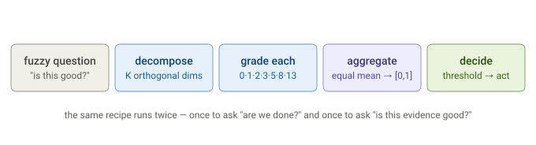
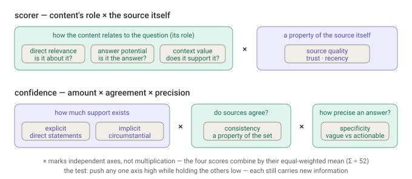
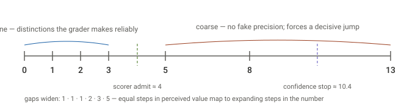
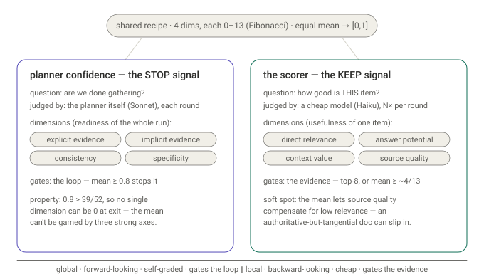
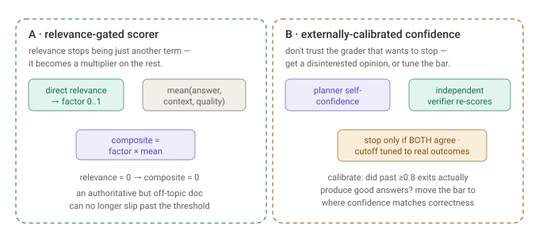
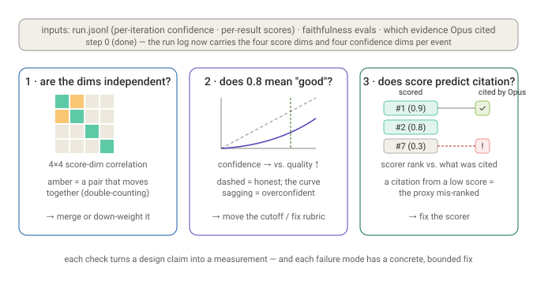

# Scoring & confidence

## First principles

Dossier turns a fuzzy judgment into a number in exactly two places, and both use
the same trick. One number answers **"are we done gathering?"** (the planner's
confidence, which gates the loop); the other answers **"how good is this piece of
evidence?"** (the Haiku scorer, which gates what reaches synthesis).



You quantify because a loop needs a stop condition and selection needs a rank —
you can't `break` on a vibe, and you can't sort by one. The whole design is about
making that number **stable, cheap, and honest**.

## The shared recipe (and why each choice)

Both mechanisms are the same four moves. Every choice is defensible from first
principles:

1. **A few orthogonal dimensions, not one blob.** Asking an LLM for a single
   "score 0–100" yields noise, because it collapses several unrelated judgments
   into one guess. Splitting into 3–4 near-independent axes — each a concrete
   question with its own rubric — is far more stable.
2. **A coarse Fibonacci scale `(0, 1, 2, 3, 5, 8, 13)`.** LLMs grade *consistently*
   on coarse buckets and badly on fine ones. The spacing is non-linear on purpose:
   fine resolution at the bottom (0/1/2/3 separates junk from weak) and coarse at
   the top (5/8/13 separates good/great/definitive). There is no 6 or 7 — the
   model must *commit* to a bucket.
3. **Aggregate into one number in `[0,1]`, deterministically.** No training data to
   learn weights from, and the result must be deterministic (it feeds the response
   cache key) and interpretable. **Confidence** uses the equal-weighted mean of its
   four dimensions (`Σ / 52`). **The scorer** gates on relevance —
   `(direct_relevance / 13) × mean(the other three)` — because relevance is a
   *prerequisite*, not a fungible term ([why](#mean-or-multiplication-gate-prerequisites-average-contributors)).
   Neither multiplies all four dimensions together, and the `×` in the factoring
   below (`role × source`) is a third, distinct use — it denotes "independent axes,"
   not a product of scores.
4. **A threshold turns the number into a decision** — stop the loop, or keep the
   evidence.

That's why the two share most of the recipe:
[`Confidence.composite`](https://github.com/siddartham/federated-knowledge-discovery-tool/blob/main/dossier/engine/orchestrator/models.py#L32)
and
[`ScoreResult.composite`](https://github.com/siddartham/federated-knowledge-discovery-tool/blob/main/dossier/engine/orchestrator/models.py#L82)
share the decompose → grade → aggregate → threshold shape. What differs is the
*question*, the *use*, and the *aggregation* — a plain mean for confidence, a
relevance-gate for the scorer (see [Mean or multiplication?](#mean-or-multiplication-gate-prerequisites-average-contributors)).

### Why the dimensions must be orthogonal

The reason to decompose at all is **variance reduction** — averaging K noisy
estimates cuts the noise by ~√K *only if the errors are independent*. If two
dimensions secretly measure the same thing you double-count one factor and add
cost for no new information, so orthogonality is the precondition that makes
"split, then average" better than one holistic guess. It also forces the model to
*look*: a single 0–13 score lets it anchor on one salient feature and ignore the
rest; four separate questions make it check each facet.

The operational test: can you push one dimension high while holding the others
low? They all pass, because they factor along genuinely independent axes.



- **The scorer** = *how the content relates to the question* (three roles: it's
  **about** the topic / it **is** the answer / it **supports** the answer) × *a
  property of the source itself* (`source_quality`). These cross freely: a stale
  wiki page can be on-topic and answer-bearing (quality low), an authoritative doc
  can be off-topic (relevance zero), a design rationale supports without being the
  answer.
- **Confidence** = *amount of support* (`explicit` + `implicit`) × *agreement*
  (`consistency`, a property of the whole set) × *precision* (`specificity`).
  Quantity, coherence, and resolution are separable — you can have
  much-but-conflicting, little-but-coherent, or abundant-but-vague.

**On that `×`:** it marks "independent axes," not multiplication of scores — the
factoring says the dimensions *vary independently*. How the coordinates are then
*aggregated* is a separate choice: **confidence** averages them, while **the scorer**
gates on relevance (below). The distinction is substantive: a **mean is compensatory**
— a strong dimension offsets a weak one, which is precisely the source of the soft
spots below — whereas a **gate/product is conjunctive**, where a zero on the gated
dimension zeros the whole score (an
`AND`). Turning `direct_relevance` from a mean-*term* into a *gate* is exactly what the
scorer now does by default — see
[Mean or multiplication?](#mean-or-multiplication-gate-prerequisites-average-contributors).

**Honest caveat:** within the scorer's content trio there's a partial implication
chain — if something *is* the answer, it's necessarily relevant — so
`answer_potential`, `direct_relevance`, and `context_value` are not *perfectly*
orthogonal; only `source_quality` is cleanly independent. That residual correlation
is part of why the equal-weight mean has its soft spots: relevance and
answer-potential partly double-count "on-topic-ness," while the truly-independent
`source_quality` gets equal weight and can compensate for low relevance.

### Why the scale is fine at the bottom, coarse at the top

The Fibonacci gaps widen — `1, 1, 1, 2, 3, 5` — so the low end is dense and the top
is sparse. Two reasons, both first-principles:



1. **A scale should only offer distinctions the grader can reliably make.** A model
   can consistently separate *useless (0)* from *a whiff (1)* from *tangential (2)*
   from *solid background (3)*. It cannot reliably separate "strong" from "very
   strong" from "excellent" — offering `9, 10, 11, 12` there just invites two runs
   on the same evidence to scatter randomly. Widening gaps refuse distinctions the
   grader can't make: at the top you commit to `8` **or** `13`. (Agile story points
   use Fibonacci for exactly this reason.)
2. **The decision-relevant differences live at the bottom.** The scorer's keep/drop
   cut is at ~`4/13`; whether an item is a `2` or a `3` flips it. Up top it doesn't
   matter whether it's `8` or `13` — it's kept either way, so resolution there would
   be wasted. Put the tick marks where the cut happens.

Underneath both is **diminishing returns**: "no answer → hints at it → partially
states it" changes everything; "strong → definitive" changes little — so equal
steps in *value* map to expanding steps in the *number*.

**The confidence wrinkle:** its stop cutoff (~10.4/13) sits at the *coarse* end, so
reason #2 doesn't apply — but coarse-at-top still helps, differently: it makes the
stop **decisive**. You can't inch over the line via `9 → 10 → 11`; declaring "done"
requires the big `8 → 13` jump. Coarseness there raises the bar.

## Mechanism 1 — planner confidence (the stop signal)

Each iteration, at the *top* of the plan call, the planner grades the **whole run
so far**: given everything gathered, how ready is the evidence to answer? Four
dimensions, chosen to span the questions a careful analyst asks before declaring
"we have it":

| Dimension | The question it asks | Why it belongs |
|---|---|---|
| `explicit_evidence` | Is the answer **stated directly** anywhere? | presence — the strongest signal |
| `implicit_evidence` | Do **contextual signals** support it? (channel names, service names, URLs) | corroboration — weak but real |
| `evidence_consistency` | Do **sources agree**? | contradiction means *not* ready |
| `answer_specificity` | Can we be **precise**, not vague? | a vague answer isn't done |

Readiness spans four independent axes — *presence, corroboration, agreement, and
precision* — combined, again, by the equal-weighted **mean** (not a product).
(Recency and authority aren't here — they're per-item concerns, handled at scoring,
not in a global readiness judgment.) That mean, normalized, is compared to a **0.8**
cutoff; clearing it ends the loop with `confidence_reached`.

**Why this shape works:**

- **Self-assessment is what makes the loop adaptive.** A fixed iteration count
  either wastes calls or stops early. Letting the model judge readiness *is* the
  termination policy — and the spec forbids "run until killed."
- **The anchored rubric is what makes the self-report mean anything.** Each
  dimension is pinned to ~5 anchor points (`~0 / 4 / 7 / 10 / 13`). 0.8 ≈ **10.4/13
  average** — the "clear statements answering *most* of the question" anchor. A
  deliberately high, conservative bar that prefers another iteration to a
  premature answer.
- **Plan doubles as assess.** Confidence is judged *before* actions are chosen, so
  if the previous round already sufficed, the loop exits without another fan-out —
  one call, two jobs.

**A property worth naming:** the 0.8 cutoff sits *above* what three maxed
dimensions can reach (`13·3 / 52 = 0.75`). So **no single dimension can be zero at
exit** — you literally cannot stop with `explicit_evidence = 0`. The threshold and
the mean are co-designed so three strong axes can't compensate for one empty one.

## Mechanism 2 — the Haiku scorer (the keep signal)

For **each individual result or page**, a cheap model grades how useful *that
item* is. Four dimensions, chosen to span an item's value:

| Dimension | The question it asks | Why it's separate |
|---|---|---|
| `direct_relevance` | Is it **on topic**? | topicality |
| `answer_potential` | Could it **alone** contain the answer? | the payload — distinct from relevance: a doc can be *about* SSO without holding the specific fix |
| `context_value` | Useful **background** even if not the answer? | rewards supporting material instead of discarding it |
| `source_quality` | **Authoritative / current**? | a trust-and-recency prior |

Splitting `direct_relevance` from `answer_potential` is the subtle one: it lets the
scorer reward "on-topic but not the answer" as *context* rather than throw it away.
The composite feeds
[`select_evidence`](https://github.com/siddartham/federated-knowledge-discovery-tool/blob/main/dossier/engine/orchestrator/state.py#L169),
which admits an item if it's in the **top 8** (`min_guarantee`), *or* if its mean
dimension ≥ **~4/13** (`score_threshold`) and it fits the **50k-char budget**.

**Why this shape works:**

- **Cost tracks stakes.** Scoring runs on *N* items *every iteration* — high
  volume, low individual stakes — so it rides Haiku. A mis-rank costs a slightly
  worse context, not a wrong answer.
- **Per-item scoring decouples quantity from quality.** Without it, the planner
  would judge readiness by result *counts*; surfacing per-item scores into the
  digest lets the stop-decision reflect how *good* the evidence is.
- **Three knobs, biased toward recall.** `min_guarantee` guarantees synthesis
  always gets *something* (no empty context on a weak run); the low `~4/13`
  threshold is permissive because synthesis can *ignore* weak evidence but can't
  cite what it never saw; `char_budget` is context-window management. A real
  selection policy, not naive top-k.

## The two, side by side



Same recipe, opposite jobs: confidence is **global, forward-looking, self-graded,
and gates the loop**; the scorer is **local, backward-looking, cheap, and gates the
evidence**. The cheap scorer does the high-volume grunt work; the expensive planner
makes the one global call; the equal-weight mean keeps both deterministic.

## Where the logic is weakest

1. **Confidence is self-graded by the call that also proposes actions.** LLMs are
   poorly calibrated and lean overconfident; a model that "wants" to stop can
   inflate its own readiness. The rubric and high cutoff mitigate but don't remove
   the conflict of interest. This is the biggest theoretical soft spot.
2. **The scorer's mean lets quality compensate for relevance.** Unlike confidence
   (protected by the 0.8-vs-0.75 math), an authoritative-but-tangential doc
   (`direct_relevance = 0`, `source_quality = 13`) can drift over the low
   threshold. Relevance arguably should *gate*, not *average*.
3. **Scoring is a cheap proxy for "will Opus cite it," with no diversity check.**
   Two near-duplicate high-scorers both get admitted and both burn budget; each
   item is ranked in isolation.
4. **Both measure *sufficiency*, never *correctness*.** A confidently-wrong
   direction scores high on all four confidence axes. Catching that is the job of
   the faithfulness eval and citation-grounding — not these two loops.

## Mean or multiplication? Gate prerequisites, average contributors

A natural question, given the composite is an average: should the dimensions be
*multiplied* instead? The honest answer is **neither, globally** — the real choice is
per-dimension. Ask of each: *can a zero here be redeemed by the others?* If **no**,
it's a **prerequisite** → gate it (multiply). If **yes**, it's a **fungible
contributor** → average it.

- **The scorer needs a gate.** `direct_relevance` fails the redemption test: an
  off-topic item is useless evidence *no matter how authoritative or answer-bearing*.
  The other three *are* fungible — a pure-background item (high `context_value`, zero
  `answer_potential`) is still worth keeping, and so is a bare answer with no context.
  So the right shape is `composite = (direct_relevance / 13) × mean(the other three)` —
  a **gate on relevance, a mean over the rest**. A *pure* product would be wrong (it
  would kill a perfect answer that happens to have `context_value = 0`); the *pure*
  mean is the soft spot (authoritative-but-off-topic sneaks in). **Dossier now uses
  the gated form by default** — config `[evidence].relevance_gated = true`.
- **Confidence keeps the mean.** Its four dimensions are closer to fungible, and the
  **0.8 cutoff already does the conjunctive work**: three maxed dims reach only
  `39/52 = 0.75 < 0.8`, so no dimension can be zero at exit. That's "all dims must be
  decent" *without* a product's brittleness — a raw product would let one moderate dim
  tank a genuinely-ready answer. So confidence is left as the arithmetic mean.
- **If you ever go multiplicative, use the geometric mean, not a raw product.** On a
  0–13 scale a raw product ranges `0…13⁴ = 28,561` — wildly off-scale. The geometric
  mean (the 4th root) stays in range, is comparable to the arithmetic mean, and is
  still conjunctive (any zero → zero).

**The rule:** gate the prerequisites, average the contributors; a **high threshold on
an arithmetic mean is a cheap, less-brittle stand-in for conjunctive behavior.** Two
honest counterweights: the scorer's soft spot is *partly* contained downstream
(`min_guarantee` + the synthesizer's citation-grounding absorb a stray admission), and
the plain mean wins on interpretability — so the gate is a real trade, not a slam dunk.
It's a config toggle — so you can measure it rather than argue it. See
[A/B testing a scoring change](ab-testing.md) for the offline pre-check and the paired
end-to-end test.

## Hardening sketches

The sharpest soft spots (#1 and #2) each have a fix. **#2 is now shipped** — the
relevance-gated scorer above. #1 remains a sketch:



**A · relevance-gated scorer — shipped.** `direct_relevance` is now a *multiplier*,
not a term: `composite = (direct_relevance / 13) × mean(the other three)`, so an
off-topic item scores near zero no matter how authoritative. See
[Mean or multiplication?](#mean-or-multiplication-gate-prerequisites-average-contributors)
above; toggle it with `[evidence].relevance_gated`. The cost paid: the clean "all four
equal" symmetry is gone, and the model must still grade the (now more consequential)
relevance dimension consistently.

**B · externally-calibrated confidence.** Stop trusting the grader that wants to
stop. Two independent moves: (1) a cheap **independent verifier** re-scores
readiness from the same evidence, and the loop stops only if *both* clear the bar
— removing the plan call's conflict of interest; and (2) **calibrate the cutoff
against outcomes** — check whether past ≥0.8 exits actually produced good answers
(the faithfulness eval already measures this), and move the bar to where confidence
matches correctness rather than leaving it at a hand-picked 0.8. The cost: an extra
call per iteration, and a calibration loop that needs labelled outcomes.

## Why it's "good enough" as shipped

The current design trades a little rigor for three things it needs more:
**determinism** (equal-weight means are cache-stable), **cost** (one cheap model
does all the per-item work), and **simplicity** (two tiny composites, no learned
weights, no calibration pipeline). The failure modes it *doesn't* catch —
irrelevant-but-authoritative evidence, over-confident stops, plain wrongness — are
backstopped downstream by the synthesizer's citation-grounding and the offline
faithfulness eval. The hardening sketches are where you'd invest if those backstops
started letting real errors through.

## Validating the design, not just justifying it

Everything above is *rationale* — a defensible story for choices made by judgment,
not derived or measured. The claims are testable, though, against the runs Dossier
already logs, and against the answer-quality signal from the
[LLM-as-judge harness](evaluation.md). Three experiments would turn each claim into a number:



**Step 0 — log what's needed (done).** The run log now persists the four score
dimensions on each `score_complete` event and the four confidence dimensions on each
`plan_complete` event; previously it only kept the composites. That was the
prerequisite — richer logging, no new data collection. A
`devtools analyze` command now reads a directory of run logs (and an optional
`--evals` file of `{question, faithfulness}`) and runs the three checks below:

```bash
dossier devtools analyze ~/.dossier/runs                              # checks 1 & 2
dossier devtools eval --out faithfulness.jsonl                        # produce the labels
dossier devtools analyze ~/.dossier/runs --evals faithfulness.jsonl   # adds check 3 (calibration)
```

The correlation set spans all scored evidence — search/lookup results
(`score_complete`) and restitched scrape spans (`restitch_complete`) — and the
citation check resolves both by id and by scrape url.

1. **Are the dimensions actually independent?** Collect every `ScoreResult`
   four-tuple across a batch of runs and compute the 4×4 correlation matrix (Spearman,
   since the scale is ordinal). The design *predicts* `source_quality` is decorrelated
   from the rest and the content trio is only mildly correlated. If a pair like
   `direct_relevance ↔ answer_potential` comes back at, say, ρ > 0.8, they're
   double-counting → **merge them or down-weight the pair.** A dimension with
   near-zero variance (the model always says the same number) carries no signal →
   **drop it.**
2. **Does the 0.8 cutoff mean "good"?** For each completed run, pair the exit
   confidence with the answer's faithfulness eval score, bin by confidence, and plot
   mean quality per bin — a reliability curve. Two things fall out: whether confidence
   *predicts* quality at all (if the curve is flat, the self-report is noise), and
   whether 0.8 is the right bar (if runs exiting at 0.8 have mediocre faithfulness,
   confidence is overconfident). Action: **move the cutoff to where confidence meets
   quality, or fix the rubric anchors** — the empirical version of hardening sketch B.
3. **Does the score predict what synthesis cites?** For each run, compare the scorer's
   ranking against which evidence Opus actually cited (both are in the run log). If
   citations routinely come from low-scored evidence, the scorer is a poor proxy for
   "will be used" → **fix the scorer** (this is where the relevance-gate from sketch A
   would show up as a measurable precision gain).

Each check is cheap (it reads existing logs), turns a design claim into a
measurement, and points at a bounded fix. That's the difference between a design
that's *argued* and one that's *validated* — and it's the natural next step if this
system ever moves from a demonstrator to something whose answers people rely on.
